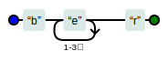
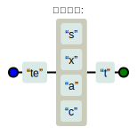

<script setup>
import Read from "@components/Read.vue";
import RegexpTest from "./RegexpTest.vue";
</script>

<ClientOnly>
  <read></read>
</ClientOnly>


# JavaScript中的正则表达式

正则表达式（Regular Expression，简称 Regex或者Regexp）是一种有用于匹配和操作文本的强大工具，它是由一系列字符和特殊字符组成的模式。在JavaScript中正则表达式也有广泛的用途，但很多人都会被那一串串火星文似的语句所困惑。这篇文章将会介绍正则表达式的基本用法，让你远离正则恐惧症。

网上有很多正则表达式的教程，为什么还要多次一举写这篇文章呢？其实我也是读那些优秀的文章学会的，但是过程是非常枯燥的，而且往往是过来一段时间后又会忘记，不得不再次翻阅那些博客，所以我写下此篇文章一是为了巩固正则知识，二是想以一种全新的方式写一篇正则教程，希望帮助到大家。话不多说了，让我们开始吧。

## 正则两种匹配模式

正则表达式有两种匹配模式，一是字符匹配，二是位置匹配。

### 字符匹配

正如正则表达式的作用，它可以匹配字符，当我们想匹配 `hello regexp` 中的 `regexp` 时，表达式为：`/regexp/`。

<ClientOnly>
  <RegexpTest text="hello regexp" answer="regexp" description="在下面输入框输入<b>regexp</b>，匹配下面文本中的<b>regexp</b>。"></RegexpTest>
</ClientOnly>

:::info 提示
为了方便大家加深记忆，我做了一个练习模块。在下方输入框输入正确的正则表达式，目标文本将会可视化显示匹配的内容，点击右下角 `?`
显示答案。

输入框后一个斜杠后面的 `g` 是一个正则修饰符，`global`
的缩写，表示全局匹配，即正则会从左至右匹配所有符合条件的文本，如果不加 `g` 修饰符，则只会匹配第一个符合条件的文本。
:::

上面的例子体现了正则表达式的精准匹配，但正则不仅能够精准匹配，还能够实现模糊匹配。
正则有两个方向上的模糊匹配，横向和纵向匹配。

#### 两种模糊匹配

- 横向模糊匹配

横向匹配指的是，一个正则表达式可匹配字符串的长度不是固定的。

其实现方式是使用量词，譬如表达式 `{m,n}`，这个表达式表示匹配的字符出现次数在 `m` 到 `n` 之间。

比如匹配 `/be{1,3}r/g` 能匹配字符串 `ber beer beeer`中的每个单词，其中每个 `b` 和 `r` 中间的 `e` 出现 1 到 3 次。



<ClientOnly>
  <RegexpTest :text="['ber','beer','beeer']" answer="be{1,3}r" description="在下面输入框输入<b>be{1,3}r</b>，匹配下面每一行文本。"></RegexpTest>
</ClientOnly>

- 纵向模糊匹配

纵向模糊匹配指的是，当正则匹配到具某一位具体字符时，它可以匹配多个字符。

例如要匹配 `test text teat tect`中的每个单词，需要用到字符集合的匹配方式，正则为`\te[sxac]t\`。



<ClientOnly>
  <RegexpTest :text="['test','text','teat','tect']" answer="te[sxac]t" description="在下面输入框输入<b>te[sxac]t</b>，匹配下面每一行文本。"></RegexpTest>
</ClientOnly>

#### 字符集合

当我们要匹配的某个字符有很多中可能时，字符集能实现这种匹配。字符集合语法是用中括号 `[]`
将字符的所有可能包含起来，例如 `[abc]` 匹配 `a`、`b` 或者 `c`。

值得注意的是，虽然叫字符集合，但它只能匹配一个字符，正如上面测试中，`[sxac]` 只能表示 `test text teat tect` 中第三个字母的可能集合。

如果我们想匹配的字符特别多，但是是在某个范围并且连续的，那么可以使用正则里的范围匹配 规则，例如 `[a-z]` 匹配 `a` 到 `z`
之间的任意一个字符，`[0-9]` 匹配 `0` 到 `9` 之间的任意一个字符。

<ClientOnly>
  <RegexpTest :text="['ABCDEFGHIJKLMNOPQRSTUVWXYZ']" answer="[J-S]" description="匹配下面文本中<b>J-S</b>之间所有字符"></RegexpTest>
</ClientOnly>

如果在字符集合中前面加一个 `^`，那么它表示匹配不包含在字符集合中的字符。例如，`[^4-8]` 匹配除了 `4` 到 `8` 之间的任意一个字符。

<ClientOnly>
  <RegexpTest :text="['bear','beor','beer','beur']" :answer="['be[^ou]r','be[^uo]r']" description="匹配下面除<b>beor</b>，<b>beur</b>之外的所有单词。"></RegexpTest>
</ClientOnly>

除了一个范围内的字符集合可以缩写外，正则中还内置了很多字符集的简写：
| 缩写 | 字符集合 | 含义 |
|----|---------------------|-----------------------------------------------------|
| . | [^\n\r\u2028\u2029] | 通配符，匹配除了换行符、回车符、行分隔符和段分隔符以外的任意一个字符 |
| \d | [0-9]               | 数字，`d` 是 `digit` 的简称 |
| \D | [^0-9]              | 除数字外的任意字符 |
| \w | [0-9a-zA-Z_]        | 数字、大小写字母和下划线，也就是单词，`w` 是 `word` 的简称 |
| \W | [0-9a-Z_]           | 非单词字符 |
| \s | [ \t\v\n\r\f]       | 空白字符，包括空格、水平制表符、垂直制表符、换行符、回车符、换页符，`s` 是 `space` 的简称 |
| \S | [^ \t\v\n\r\f]      | 非空白字符 |

#### 量词

量词也称限定符，它们的作用是限定匹配的次数，量词一共有 6 种，分别是 `*`、`+`、`?`、`{n}`、`{n,}` 和 `{n,m}`。

- `*` 表示 0 个或多个。

<ClientOnly>
  <RegexpTest :text="['br','ber','beer']" answer="be*r" description="使用<b>*</b>匹配下面三个单词"></RegexpTest>
</ClientOnly>

- `+` 表示 1 个或多个

<ClientOnly>
  <RegexpTest :text="['br','ber','beer']" answer="be+r" description="使用<b>+</b>匹配<b>ber</b>和<b>beer</b>"></RegexpTest>
</ClientOnly>

- `?` 表示 0 个或 1 个

<ClientOnly>
  <RegexpTest :text="['br','ber','beer']" answer="be?r" description="使用<b>?</b>匹配<b>br</b>和<b>ber</b>"></RegexpTest>
</ClientOnly>

- `{n}` 表示 n 个

<ClientOnly>
  <RegexpTest :text="['br','ber','beer']" answer="be{2}r" description="使用<b>{n}</b>匹配<b>beer</b>"></RegexpTest>
</ClientOnly>

- `{n,}` 表示 n 个或多个

<ClientOnly>
  <RegexpTest :text="['br','ber','beer','beeer']" answer="be{2,}r" description="使用<b>{n,}</b>匹配<b>beer</b>和<b>beeer</b>"></RegexpTest>
</ClientOnly>

- `{n,m}` 表示 n 到 m 个

<ClientOnly>
  <RegexpTest :text="['br','ber','beer','beeer']" answer="be{1,2}r" description="使用<b>{n,m}</b>匹配<b>ber</b>和<b>beer</b>"></RegexpTest>
</ClientOnly>

以上的量词默认都是贪婪匹配模式，即匹配尽可能多的字符，请看下面的例子：

```js
const text = '量词有"贪婪匹配"和"惰性匹配"两种模式'
const reg = /".+"/g

console.log(text.match(reg)) // ['"贪婪匹配"和"惰性匹配"']
```

我们期望正则能将 **贪婪匹配** 和 **惰性匹配**匹配出来，但是事与愿违，造成这种情况是因为当正则匹配到第二个 `"`
时没有结束，它是贪婪的，能匹配到的 `"` 多多益善，直到匹配到最后一个 `"` 返回了结果。要想达到惰性匹配，需要在量词后面加上 `?`：

```js
const text = '量词有"贪婪匹配"和"惰性匹配"两种模式'
const reg = /".+?"/g

console.log(text.match(reg)) // ['"贪婪匹配"', '"惰性匹配"']
```

以可看到，在惰性匹配的模式下，正则一旦匹配到满足的内容，就会返回。

<ClientOnly>
  <RegexpTest text="<-span>正则表达式<-/span>" description="使用<b>惰性匹配</b>匹配出<b><-span></b>和<b><-/span></b>。<br>（由于尖括号会被转义，所以添加了横杠“<b>-</b>”）。" :answer="['<.+?>','<.*?>','<-.+?>','<-.*?>']"></RegexpTest>
</ClientOnly>

#### 分支

类似字符集合可以表示单个字符的多种可能，正则的分支可以用来表示字符串或者表达式的多种可能，比如 `(ab|cd|ef)` 表示 `ab`
或者 `cb`或者 `ef`；`(ab{2,3}c|a[^b]c)` 表示可以是 `ab{2,3}c`模式也可以是 `a[^b]c`模式

<ClientOnly>
<RegexpTest :text="['黄焖鸡','猪脚饭']" description="<b>今天中午吃什么？</b>作为一个选择困难症患者，我表示都可以。请用<b>分支</b>匹配所有食物。" :answer="['(黄焖鸡|猪脚饭)','(猪脚饭|黄焖鸡)','黄焖鸡|猪脚饭','猪脚饭|黄焖鸡']"></RegexpTest>
</ClientOnly>

---

::: info 下面我们针对来前面部分所学内容做一些练习

<ClientOnly>
<RegexpTest text='<-div id="container" class="main"><-/div>' description='请匹配下面HTML标签中的<b>id="container"</b>。<br>（由于尖括号会被转义，所以添加了横杠“<b>-</b>”）。' answer='id=".*?"' :answerType="2"></RegexpTest>
</ClientOnly>

<ClientOnly>
<RegexpTest text="1949-10-01" description="请匹配下面<b>日期</b>（开放题）" answer="\d{1,4}-(0\d|1[0-2])-(0\d|[12]\d|3[01])" :answerType="2"></RegexpTest>
</ClientOnly>

<ClientOnly>
<RegexpTest :text="['#fff','#FFF','#000','#ffffff','#FFFFFF','#000000','#FF0000','#ff0000']" description="请匹配下面<b>所有颜色格式</b>（开放题）" :answer="['#([0-9a-fA-F]{6}|[0-9a-fA-F]{3})']" :answerType="2"></RegexpTest>
</ClientOnly>
:::
