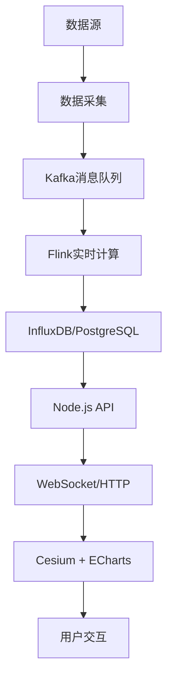

<script setup>
import NavHead from "../components/NavHead.vue";
</script>
<nav-head link="/article/前端面试题合集/read.html">
</nav-head>

# 可视化

## 大屏可视化项目的如何做自适应？

1. **基础布局适配**  
   - **相对单位**：使用 `vw/vh`、`%` 定义容器尺寸，`rem` 结合根字体动态缩放（通过JS按设计稿比例调整 `font-size`）。  
   - **弹性布局**：优先使用 Flex/Grid 实现内容自动排列，避免固定宽高。  

2. **整体缩放策略**  
   - **CSS Transform**：计算窗口与设计稿（如1920x1080）的宽高比例，用 `transform: scale()` 缩放容器，居中处理留白。  
   - **Viewport 缩放**：通过 `<meta viewport>` 动态设置初始缩放比例（需权衡精度）。  

3. **媒体查询断点**  
   - 针对极端分辨率（如超宽屏或移动端），使用 `@media` 微调布局或隐藏次要内容。  

4. **图表与组件适配**  
   - **监听 Resize 事件**：ECharts 等库调用 `resize()`，或使用 `ResizeObserver` 监听容器变化。  
   - **矢量图形**：图标优先使用 SVG，图片设置 `max-width:100%` 防止溢出。  

5. **字体与细节优化**  
   - 文本使用 `clamp()` 函数限制最小/最大值（如 `clamp(12px, 1.2vw, 24px)`）。  
   - 高分辨率屏下使用 `@media (-webkit-min-device-pixel-ratio: 2)` 提供高清资源。  

**示例代码片段：**  
```javascript
// 动态缩放容器（基于设计稿1920x1080）
function adjustLayout() {
  const scaleX = window.innerWidth / 1920;
  const scaleY = window.innerHeight / 1080;
  const scale = Math.min(scaleX, scaleY);
  document.getElementById('container').style.transform = `scale(${scale})`;
}
window.addEventListener('resize', _.debounce(adjustLayout, 200));
```

## 如何用 Canvas/WebGL 实现大数据量实时渲染？

实现大数据量实时渲染的核心是**利用 GPU 并行计算能力，结合数据分块与渲染优化策略**。以下为具体技术方案：

**一、性能优化核心手段**

1. **数据分块与增量渲染**

   - **分块加载**：按视口范围动态加载可见区域数据（如地图瓦片），避免一次性渲染全量数据。
   - **增量更新**：通过差异比对（Diff）仅重绘变化部分（如实时股票 K 线图）。

2. **GPU 加速与渲染优化**

   - **WebGL 着色器**：将计算逻辑移入 GPU（如顶点/片元着色器），并行处理顶点与像素数据。

     ```
     // 顶点着色器示例：批量处理顶点数据
     attribute vec2 position;
     void main() {
       gl_Position = vec4(position, 0.0, 1.0);
     }
     ```

   - **实例化渲染（Instancing）**：单次绘制调用渲染多个相似对象（如 10 万颗粒子），减少 CPU-GPU 通信开销。

   - **合并绘制指令**：将分散的图形合并为单一 VBO（顶点缓冲对象），降低 draw call 次数。

3. **数据结构优化**

   - **压缩数据格式**：使用 `Float32Array` / `Uint16Array` 替代普通数组，减少内存占用。
   - **空间索引**：对静态数据构建 R-Tree 或 Grid 空间索引，加速视锥体裁剪。

**二、Canvas 2D 优化方案（适合中等数据量）**

1. **离屏 Canvas**
   - 预渲染静态内容到离屏 Canvas，通过 `drawImage` 复用，减少重复绘制。
   - 示例：游戏中的背景图层预渲染。
2. **脏矩形算法**
   - 仅重绘屏幕中发生变化的区域（如鼠标交互区域），减少绘制面积。
3. **Web Worker 计算**
   - 将数据预处理（如坐标转换、过滤）移至 Worker 线程，释放主线程。

**三、WebGL 高阶方案（百万级数据）**

1. **层次细节（LOD）**
   - 根据物体与摄像机的距离动态切换细节层级（如 3D 模型远处用低模，近处用高模）。
2. **Compute Shader（WebGL 2.0+）**
   - 使用计算着色器在 GPU 执行通用计算（如粒子运动模拟），避免 CPU-GPU 数据传输瓶颈。
3. **GPGPU 技术**
   - 将非图形计算（如物理模拟、数据排序）映射到 GPU 纹理处理，利用并行能力加速。

**四、实时性保障**

1. **双缓冲机制**
   - 使用两个 Canvas/WebGL 缓冲区交替渲染，避免画面撕裂。
2. **时间分片**
   - 将渲染任务拆解为多个子任务，通过 `requestAnimationFrame` 分帧执行，确保主线程不阻塞。
3. **降级策略**
   - 动态检测设备性能（通过帧率），自动降低分辨率或关闭特效（如抗锯齿）。

**五、工具链与调试**

- **性能分析**：Chrome DevTools → Performance 面板分析帧耗时，WebGL Inspector 调试 GPU 负载。
- **库支持**：
  - **2D 渲染**：ZRender、Fabric.js（支持脏矩形优化）。
  - **WebGL 框架**：Three.js（封装 LOD、Instancing）、PixiJS（2D/WebGL 混合渲染）。

**总结**：平衡数据吞吐与渲染效率，优先利用 GPU 并行性，结合分块、缓存与算法优化，实现流畅的实时渲染体验。

## canvas 和 webgl 有什么区别？

Canvas 和 WebGL 的核心区别是**渲染方式与能力层级不同**：Canvas 是 2D 绘图 API（基于 CPU 或 GPU 混合渲染），而 WebGL 是直接操作 GPU 的底层 3D 图形接口。

**具体对比**

| **特性**       | **Canvas 2D**                           | **WebGL**                                    |
| :------------- | :-------------------------------------- | :------------------------------------------- |
| **渲染目标**   | 2D 图形（位图绘制）                     | 2D/3D 图形（基于 GPU 的矢量与纹理渲染）      |
| **性能**       | 中等（依赖 CPU 和部分 GPU 加速）        | 极高（完全 GPU 并行计算，适合大规模数据）    |
| **API 复杂度** | 简单（如 `fillRect`、`drawImage`）      | 复杂（需理解着色器、缓冲区、矩阵运算等概念） |
| **适用场景**   | 简单图表、小游戏、UI 动画               | 复杂 3D 可视化、物理模拟、实时粒子系统       |
| **扩展性**     | 受限（无法直接操作 GPU 底层）           | 高（支持自定义着色器、GPUGPU 计算）          |
| **开发效率**   | 高（原生 API 简单，库丰富如 Fabric.js） | 低（需图形学基础，通常依赖框架如 Three.js）  |

**关键差异点**

1. **渲染能力**
   - **Canvas**：内置 2D 图形接口，适合绘制矩形、文本、路径等，但复杂特效（如光影、粒子）性能差。
   - **WebGL**：直接调用 GPU 实现 3D 渲染，支持自定义着色器（Shader），可处理百万级顶点数据。
2. **性能优化**
   - **Canvas**：优化手段有限（如离屏渲染、脏矩形算法），数据量过大时易卡顿。
   - **WebGL**：通过实例化渲染（Instancing）、LOD（层次细节）等技术，高效处理大规模数据。
3. **技术栈**
   - **Canvas**：适合前端开发者快速上手，无需图形学背景。
   - **WebGL**：需了解图形学基础（如矩阵变换、光照模型），适合复杂可视化场景。

**示例场景**

- **Canvas**：动态图表（ECharts）、简单游戏（如 2D 贪吃蛇）、图片编辑器。
- **WebGL**：3D 地图（Mapbox GL）、数据可视化大屏、元宇宙场景（Three.js）。

**总结**：Canvas 适合轻量级 2D 渲染，WebGL 用于高性能、高复杂度的图形需求，两者可结合使用（如 PixiJS 用 WebGL 加速 2D 渲染）。

## 谈谈你对 WebGL 的理解

WebGL 是基于 OpenGL ES 的 **Web 图形库**，通过 GPU 加速在浏览器中实现高性能 2D/3D 渲染，赋予网页复杂的图形交互能力。  

**核心理解**  

**1. 底层原理**  

- **基于 OpenGL ES**：WebGL 是 OpenGL ES 2.0 的 Web 移植版，通过 `<canvas>` 元素提供绘图上下文（`WebGLRenderingContext`）。  
- **GPU 驱动**：直接调用显卡资源，绕过 CPU 瓶颈，适合大规模图形计算。  
- **着色器编程**：通过 **顶点着色器**（处理几何数据）和 **片段着色器**（处理像素颜色）控制渲染管线，需编写 GLSL（OpenGL Shading Language）代码。  

**2. 关键流程**  

1. **初始化上下文**：  
   ```javascript  
   const canvas = document.getElementById('canvas');  
   const gl = canvas.getContext('webgl');  
   ```
2. **创建着色器程序**：  
   - 编写 GLSL 代码，编译并链接着色器；  
   - 传递数据到 GPU（顶点缓冲区、纹理、矩阵变换）。  
3. **渲染循环**：  
   - 清空画布（`gl.clear()`）；  
   - 绘制图形（`gl.drawArrays()` 或 `gl.drawElements()`）。  

**3. 核心概念**  

- **缓冲区（Buffer）**：存储顶点坐标、颜色、纹理坐标等数据；  
- **纹理（Texture）**：贴图资源（图片、视频帧）的 GPU 存储形式；  
- **矩阵变换**：模型矩阵（物体位置）、视图矩阵（相机位置）、投影矩阵（视角范围）；  
- **帧缓冲（Framebuffer）**：离屏渲染技术，用于后期处理（如模糊、滤镜）。  

**优缺点分析**  

| **优点**                         | **缺点**                                        |
| -------------------------------- | ----------------------------------------------- |
| 高性能图形渲染（适合复杂3D场景） | 学习曲线陡峭（需掌握GLSL和图形学基础）          |
| 跨平台（浏览器原生支持）         | 兼容性依赖设备GPU和驱动（部分低端设备支持有限） |
| 与JavaScript深度集成             | 调试困难（需借助浏览器开发者工具扩展）          |

**应用场景**  

1. **3D 可视化**：  
   - 数据大屏（如城市交通、工业设备三维建模）；  
   - 医学影像处理（CT/MRI 数据渲染）。  
2. **游戏开发**：  
   - 网页游戏（如《HexGL》）；  
   - 结合 WebXR 实现 VR/AR 体验。  
3. **创意交互**：  
   - 艺术创作工具（动态粒子效果、流体模拟）；  
   - 教育仿真（分子结构、天体运动演示）。  

**开发工具与生态**  

- **库/框架**：  
  - **Three.js**：简化 WebGL 开发的封装库（80% 的 WebGL 项目使用）；  
  - **Babylon.js**：专注于游戏和复杂交互；  
  - **TensorFlow.js**：利用 WebGL 加速机器学习推理。  
- **调试工具**：  
  - Chrome **WebGL Inspector**；  
  - Firefox **Canvas Debugger**。  

**总结**：WebGL 是连接 Web 与 GPU 计算的桥梁，虽需深入图形学知识，但通过框架（如 Three.js）可降低门槛，广泛应用于可视化、游戏和交互艺术领域，是 Web 高性能图形开发的基石。


## 谈谈你对 WebGPU 的了解

## 谈谈你对 Three.js 的理解

Three.js 是基于 WebGL 的 **开源3D图形库**，通过封装底层API提供组件化开发模式，简化浏览器中复杂3D场景的创建与渲染，降低WebGL学习门槛。  

**核心理解**  

**1. 核心架构**  

- **场景图（Scene Graph）**：  
  - **Scene**：容器，管理所有3D对象（模型、光源、相机）；  
  - **Camera**：定义观察视角（透视/正交投影）；  
  - **Renderer**：基于WebGL将场景渲染到Canvas元素。  

- **对象模型**：  
  - **Mesh**：几何体（Geometry） + 材质（Material）的组合；  
  - **Light**：光源（点光、平行光、环境光）；  
  - **Group**：对象分组，支持层级变换。  

**2. 关键功能**  

- **几何体与材质**：  
  - 内置基础几何体（立方体、球体等），支持导入3D模型（glTF、OBJ）；  
  - 材质系统（Phong、Standard、ShaderMaterial）控制表面视觉效果。  
- **动画与交互**：  
  - **Tween.js** 或 **动画系统**实现补间动画；  
  - **Raycaster** 实现点击、悬停等交互检测。  
- **后期处理**：  
  - **EffectComposer** 支持抗锯齿、景深、光晕等特效叠加。  

**Three.js vs 原生WebGL**  

| **维度**     | **Three.js**                 | **原生WebGL**                  |
| ------------ | ---------------------------- | ------------------------------ |
| **开发效率** | 高（封装API，快速搭建场景）  | 低（需手动管理着色器、缓冲区） |
| **学习曲线** | 平缓（面向对象设计）         | 陡峭（需深入图形学与GLSL）     |
| **灵活性**   | 适中（扩展需理解底层原理）   | 极高（完全控制渲染管线）       |
| **生态资源** | 丰富（插件、模型库、工具链） | 有限（依赖自行实现）           |

**应用场景**  

1. **数据可视化**：  
   - 3D地图、网络拓扑图、分子结构展示；  
2. **游戏与互动艺术**：  
   - 网页游戏、虚拟展厅、动态粒子效果；  
3. **工业仿真**：  
   - 设备拆解演示、流水线模拟；  
4. **教育与培训**：  
   - 交互式物理实验、历史场景重建。  

**开发资源与生态**  

- **模型资源**：  
  - **Sketchfab**：海量3D模型（支持glTF格式）；  
  - **Blender插件**：导出Three.js兼容格式。  
- **扩展库**：  
  - **OrbitControls**：相机轨道控制器；  
  - **ThreeCSG**：三维布尔运算（模型切割）；  
  - **Physi.js**：物理引擎集成。  
- **调试工具**：  
  - **Three.js Inspector**（Chrome插件）；  
  - **Stats.js**：性能监控面板。  

**优缺点分析**  

| **优点**                      | **缺点**                                 |
| ----------------------------- | ---------------------------------------- |
| 开发效率高，生态成熟          | 复杂特效性能依赖优化（如大规模粒子系统） |
| 跨平台（Web/移动端/桌面应用） | 超大型场景需手动管理内存（防止卡顿）     |
| 社区活跃，文档完善            | 部分高级功能需结合原生WebGL实现          |

**总结**：Three.js 是 Web 3D 开发的**首选工具链**，平衡了易用性与功能性，适用于从简单模型展示到复杂交互场景的全链路需求。结合现代前端框架（如React/Vue）可进一步加速开发，是探索Web图形边界的核心利器。

## 如何选择 SVG 和 Canvas 作为可视化渲染方案？它们的性能优劣及适用场景是什么？

选择时需从渲染原理、性能特性和适用场景三方面权衡：

| 维度     | SVG（声明式）                    | Canvas（命令式）                 |
| -------- | -------------------------------- | -------------------------------- |
| 渲染方式 | 基于 XML 的矢量图形，DOM 驱动    | 基于 Canvas API 的位图渲染       |
| 性能特点 | 元素级操作高效，大规模数据易卡顿 | 像素级操作高效，适合高频更新场景 |
| 可交互性 | 天然支持事件绑定（如 onClick）   | 需要手动计算事件区域             |
| 适用场景 | 中小规模数据可视化、需交互场景   | 大规模数据渲染、动画与游戏       |

**详细对比**

1. **渲染原理差异**

   - **SVG**：

     ```html
     <svg width="100" height="100">
       <circle cx="50" cy="50" r="40" fill="red" />
     </svg>
     ```

     - 每个元素都是独立 DOM 节点
     - 支持 CSS 样式和动画
     - 浏览器自动处理布局和渲染

   - **Canvas**：

     ```javascript
     const canvas = document.getElementById('canvas');
     const ctx = canvas.getContext('2d');
     ctx.beginPath();
     ctx.arc(50, 50, 40, 0, Math.PI * 2);
     ctx.fillStyle = 'red';
     ctx.fill();
     ```

     - 通过 JavaScript 命令式绘制
     - 绘制结果是位图，不保留图形结构
     - 需手动管理重绘逻辑

2. **性能对比**

   - **优势场景**：

     | SVG                        | Canvas                         |
     | -------------------------- | ------------------------------ |
     | 元素少、交互频繁（如地图） | 元素多、高频更新（如粒子系统） |
     | 需响应式缩放的图表         | 实时游戏、数据可视化大屏       |
     | 需 CSS/JS 动画的简单图形   | 视频处理、图像处理滤镜         |

   - **性能瓶颈**：

     - SVG：10,000+ 元素时 DOM 操作开销显著
     - Canvas：复杂交互逻辑需手动实现（如碰撞检测）

3. **适用场景选择**

   - **优先选 SVG**：

     ```html
     <!-- 示例：交互式图表 -->
     <svg viewBox="0 0 500 300">
       <path d="M10,80 L100,120 L200,40" stroke="blue" fill="none" />
       <circle cx="100" cy="120" r="5" fill="red" onclick="handleClick()" />
     </svg>
     ```

     - 地图标记点交互
     - 可编辑的流程图
     - 需响应式适配的图标库

   - **优先选 Canvas**：

     ```javascript
     // 示例：粒子系统
     function animate() {
       ctx.clearRect(0, 0, canvas.width, canvas.height);
       particles.forEach(p => {
         p.update();
         p.draw(ctx);
       });
       requestAnimationFrame(animate);
     }
     ```

     - 股票 K 线实时更新
     - 3D 游戏引擎（如 Three.js 底层）
     - 大规模数据热力图

**面试加分项**

1. **混合方案**：
   - 在 SVG 中嵌入 `<foreignObject>` 包含 Canvas
   - 使用 Canvas 绘制背景，SVG 绘制交互元素
2. **性能优化技巧**：
   - SVG：使用 `<use>` 复用元素、CSS 动画替代 JS 操作
   - Canvas：双缓冲技术减少闪烁、WebWorker 处理复杂计算
3. **生态对比**：
   - SVG：D3.js、Chart.js、React-SVG
   - Canvas：Chart.js（Canvas 渲染器）、ECharts、Pixi.js
4. **未来趋势**：
   - WebGL（Canvas 扩展）适合超大规模 3D 渲染
   - WebGPU 将进一步提升 Canvas 性能

## 什么是数据可视化中的“视觉通道”（Visual Channel）？列举常见的视觉通道及其适用数据类型。

**数据可视化中的视觉通道（Visual Channel）** 是指通过视觉属性将数据映射为图形元素的方法，帮助用户直观理解数据特征。常见的视觉通道及其适用数据类型如下：

**常见视觉通道及适用数据类型：**

1. **位置（X/Y轴）**  
   - **适用数据类型**：定量数据  
   - **示例**：散点图中点的位置表示数值大小。

2. **长度/高度**  
   - **适用数据类型**：定量数据  
   - **示例**：柱状图的柱子高度反映数值差异。

3. **颜色色相**  
   - **适用数据类型**：分类数据  
   - **示例**：不同颜色区分类别（如折线图的线条颜色）。

4. **颜色亮度/饱和度**  
   - **适用数据类型**：定量或有序数据  
   - **示例**：热力图中颜色深浅表示数值高低。

5. **形状**  
   - **适用数据类型**：分类数据（类别不宜过多）  
   - **示例**：散点图中用不同符号区分组别。

6. **面积/大小**  
   - **适用数据类型**：定量数据  
   - **示例**：气泡图中点的大小映射数值。

7. **透明度**  
   - **适用数据类型**：定量数据  
   - **示例**：重叠区域用透明度表示分布密度。

8. **方向**  
   - **适用数据类型**：有序或方向性数据  
   - **示例**：箭头方向表示趋势变化。


## 前端如何处理大规模数据（如 10 万点散点图）的渲染性能问题？

在处理大规模数据如10万点散点图时，前端优化的核心思路是**减少渲染负担**和**利用高效渲染技术**。常用方案包括：

1. **渲染层优化**：  
   - 采用`Canvas`或`WebGL`替代SVG，避免DOM数爆炸（Canvas批量绘制，WebGL利用GPU加速）。  
   - 对数据降采样（如保留关键特征点）或按视窗动态加载（如仅渲染可见区域）。

2. **性能策略**：  
   - 分块渲染（Chunking）与异步离屏渲染，结合`requestAnimationFrame`避免阻塞。  
   - 防抖/节流用户交互（如缩放、拖拽），减少重复渲染。  

3. **底层加速**：  
   - 使用`TypedArray`存储数据，提升内存效率。  
   - 对于极大规模数据，可配合Web Worker预处理，主线程仅负责渲染。

**示例工具**：  
- ECharts（开启large模式）或Deck.gl等库内置大数据优化；  
- 纯WebGL方案（如Three.js）可达百万级渲染性能。

## 如何实现实时数据流（如股票行情）的可视化更新？优化策略有哪些？

处理实时数据流（如股票行情）的可视化更新，核心在于**高效的数据传输与渲染优化**，常见方案如下：

**1. 数据传输层**

- **协议选择**：  
  使用`WebSocket`或`Server-Sent Events (SSE)`实现低延迟全双工通信，避免HTTP轮询。
- **增量更新**：  
  仅接收变化数据（如差异补丁），而非全量数据，减少传输开销。

**2. 数据与渲染优化**

- **按帧节流**：  
  利用`requestAnimationFrame`合并更新，避免高频渲染阻塞主线程。  
- **数据聚合**：  
  动态降采样（如保留趋势关键点），或按屏幕像素合并重叠数据。
- **轻量化存储**：  
  使用`TypedArray`或二进制格式存储数据，提升内存效率。

**3. 渲染策略**

- **高效渲染引擎**：  
  优先选`Canvas`或`WebGL`（如ECharts、LightningChart），而非DOM/SVG。  
- **GPU加速**：  
  WebGL着色器批量处理数据点，实现百万级实时渲染。  
- **离屏渲染**：  
  预渲染静态部分（如坐标轴），动态部分单独更新。

**4. 容错与降级**

- **数据缓冲**：  
  队列处理突发数据，避免丢帧。  
- **降级策略**：  
  数据量过大时，切换为简版图表或分页加载。

**示例**：  
```js
// WebSocket + Canvas增量更新
const ctx = canvas.getContext('2d');
const ws = new WebSocket('wss://stock-data');

ws.onmessage = (e) => {
  const newPoints = JSON.parse(e.data);
  requestAnimationFrame(() => {
    newPoints.forEach(point => {
      ctx.fillRect(point.x, point.y, 1, 1); // 仅绘制新点
    });
  });
};
```

**工具链**：  
- 库：ECharts（流式API）、Apache ECharts GL、WebGL框架（如Deck.gl）。  
- 优化：Web Worker预处理 + 内存池复用。


## 如何在前端实现地理信息可视化（如热力图、轨迹图）？需要哪些基础库和数据格式支持？

**1. 核心基础库**

- **地图引擎**：
  - **Leaflet**：轻量级，插件丰富（如`leaflet.heat`生成热力图）。
  - **Mapbox GL JS**：基于WebGL，支持矢量切片、动态样式，内置热力/轨迹图层。
  - **OpenLayers**：功能全面，适合复杂GIS场景（如坐标系转换）。
- **可视化扩展**：
  - **Deck.gl**（WebGL驱动）：高效渲染海量轨迹、热力点（支持GPU聚合）。
  - **ECharts**：内置地理坐标系，通过`geo`或`map`模块快速实现基础热力图。
  - **D3.js**：灵活处理地理数据投影（如`d3-geo`），但需手动实现渲染优化。

**2. 关键数据格式**

- **GeoJSON/TopoJSON**：
  - 标准地理数据格式，描述点、线、面及属性（如轨迹路径、区域边界）。
  - TopoJSON通过共享顶点减少数据体积。
- **CSV/JSON数组**：
  - 简单经纬度数据集（如`[{lng: 116.4, lat: 39.9, value: 100}]`）。
- **矢量切片（Vector Tiles）**：
  - 分块传输地理数据（如Mapbox的`.pbf`格式），适合动态缩放渲染。

## 对使用Echarts的感受是什么？Echart的特点？

**使用感受**  

1. **配置灵活但需学习成本**：  
   ECharts 的配置项极为丰富，覆盖大多数图表需求，但深度定制时需熟悉层级结构（如 `series`、`xAxis`）。  
2. **文档与生态友好**：  
   中文文档详尽，社区活跃，示例库（Gallery）可直接复用，加速开发。  
3. **开箱即用的平衡**：  
   相比 D3.js 的底层操控，ECharts 封装了常用功能，适合快速实现复杂图表，但极端定制需结合扩展（如 WebGL 插件）。  

**核心特点**  

1. **多图表类型支持**：  
   涵盖常规图表（折线、柱状图）、地理可视化（地图、热力）、高级类型（树图、桑基图），通过 [ECharts GL](https://echarts.apache.org/gl) 支持 3D 效果。  
2. **大数据优化能力**：  
   - **Large Mode**：通过降采样渲染海量数据（如 10 万点散点图）。  
   - **增量渲染**：动态数据流中仅更新变化部分，减少性能开销。  
3. **交互与动画**：  
   内置数据缩放、拖拽、提示框（Tooltip）等高交互组件，动画过渡流畅。  
4. **双渲染引擎**：  
   默认 Canvas（性能优先），支持 SVG（矢量无损缩放），适配不同场景需求。  
5. **响应式设计**：  
   自动监听容器尺寸变化（如 `resizeObserver`），适配移动端与多端场景。  
6. **主题与扩展机制**：  
   支持自定义主题，可集成第三方插件（如地图 JSON、GIS 工具）。  

**对比与适用场景**  

- **vs D3.js**：  
  ECharts 更侧重快速实现标准化图表，D3 适合底层定制与特殊可视化需求。  
- **vs Highcharts**：  
  两者功能相近，但 ECharts 开源免费，社区资源更丰富。  

**示例代码片段**：  
```javascript
// 简单折线图
const chart = echarts.init(dom);
chart.setOption({
  xAxis: { type: 'category', data: ['Mon', 'Tue'] },
  yAxis: { type: 'value' },
  series: [{ type: 'line', data: [150, 230] }]
});
```

**适用场景**：  
- 快速搭建数据看板  
- 交互式地理数据展示（如疫情地图）  
- 动态实时数据监控（配合 WebSocket 更新）  

**局限性**：  
- 超复杂自定义图形需结合 Canvas/WebGL 原生 API 扩展。  
- 严格的数据格式要求（如 GeoJSON 需符合规范）。  

**总结**：ECharts 是平衡效率与灵活性的优选工具，适合大多数中大型可视化项目，尤其擅长快速交付高性能交互图表。

## 对比 D3.js 和 ECharts 的优缺点，分别适合什么场景？

D3.js 和 ECharts 是数据可视化领域的两大主流工具，选择时需根据**场景复杂度**、**开发效率**和**定制需求**权衡：

**核心差异对比**

| 维度           | D3.js（底层库）                     | ECharts（封装框架）                    |
| -------------- | ----------------------------------- | -------------------------------------- |
| **抽象层级**   | 底层绘图库（SVG/Canvas/WebGL）      | 高层图表组件（折线图 / 柱状图 / 地图） |
| **数据处理**   | 需手动处理（过滤 / 聚合 / 转换）    | 内置丰富数据处理（如时间轴采样）       |
| **定制自由度** | 极高（像素级控制）                  | 中等（主题 / 样式配置）                |
| **学习曲线**   | 陡峭（需掌握数据绑定、DOM 操作）    | 平缓（JSON 配置即可）                  |
| **生态系统**   | 插件丰富（如 d3-geo、d3-hierarchy） | 官方主题 / 扩展组件（如百度地图）      |
| **性能**       | 需手动优化（大数据需 Canvas）       | 自动优化（虚拟滚动、WebWorker）        |
| **国际化支持** | 基础支持（需自行实现）              | 内置多语言（含 RTL 布局）              |

**典型适用场景**

1. **D3.js 更适合**：
   - 高度定制化的可视化需求（如力导向图、树状图）
   - 与现有 UI 框架深度集成（如 React + D3）
   - 学术研究或数据艺术项目（需突破常规图表形式）
2. **ECharts 更适合**：
   - 企业级数据报表（如财务仪表盘、运营监控）
   - 快速原型开发（无需关心底层实现）
   - 多终端适配（移动端自动响应式布局）

**优缺点总结**

| **工具**    | **优点**                                                     | **缺点**                                                     |
| ----------- | ------------------------------------------------------------ | ------------------------------------------------------------ |
| **D3.js**   | 1. 无限定制可能性（可实现任何想象中的图表） 2. 对动画和交互的精细控制 3. 社区资源丰富（如 ObservableHQ 案例库） | 1. 开发效率低（需从头构建图表） 2. 学习门槛高（需掌握函数式编程思维） 3. 无内置图表类型（需自行实现坐标轴、图例等） |
| **ECharts** | 1. 开箱即用（50+ 图表类型） 2. 优秀的移动端体验 3. 完善的文档和示例 4. 支持服务器端渲染（SSR） | 1. 定制受限（复杂需求需修改源码） 2. 体积较大（完整包约 500KB） 3. 渲染逻辑黑盒化（调试困难） |

**技术选型决策树**

1. 是否需要标准图表（折线图 / 柱状图 / 饼图）？
   - 是 → ECharts
   - 否 → 进入下一步
2. 是否需要突破常规图表形式（如网络图、热力图）？
   - 是 → D3.js
   - 否 → 进入下一步
3. 团队是否有前端可视化经验？
   - 否 → ECharts
   - 是 → 进入下一步
4. 是否需要与现有系统深度集成？
   - 是 → D3.js（更好的模块化能力）
   - 否 → ECharts

**混合方案实践**

在大型项目中，可采用**ECharts 打底 + D3.js 补充**的策略：

- 核心报表使用 ECharts 快速实现
- 特殊交互（如节点拖拽、路径动画）使用 D3.js 增强
- 示例：在 ECharts 地图上叠加 D3.js 绘制的自定义标记

**面试加分项**

1. **性能对比**：
   - D3.js 在大数据量下需手动实现虚拟滚动（如 d3-jetpack 的`d3.virtual`）
   - ECharts 内置大数据量优化（如 4.0 + 版本的 Canvas 渲染器）
2. **生态互补**：
   - 用 D3.js 处理复杂数据转换，结果喂给 ECharts 渲染
   - 使用 ECharts 的主题系统定制 D3.js 图表的视觉风格
3. **未来趋势**：
   - D3.js 向 WebGPU 方向演进（如 d3-3d 库）
   - ECharts 加强与 AI 的结合（如自动图表类型推荐）
4. **真实案例**：
   - 金融领域：D3.js 实现高频交易 K 线图，ECharts 展示风险指标仪表盘
   - 地理信息：D3.js 渲染复杂地理空间分析，ECharts 呈现区域统计数据

**总结**：D3.js 是可视化领域的 "瑞士军刀"，而 ECharts 是 "傻瓜相机"。前者适合追求极致定制的创造者，后者适合追求效率的企业开发者。


## 如何处理 ECharts 渲染 10 万条数据时的卡顿问题？列举分片渲染、WebWorker 计算等优化策略


**一、开启内置大数据模式（必选）**

ECharts 提供 `large` 和 `largeThreshold` 配置，开启后：

- 底层切换为 **Canvas 渲染**（替代 SVG，减少 DOM 节点数）；
- 启用**增量渲染**和**数据采样**，只渲染可见区域数据。

```javascript
option = {
  series: [{
    type: 'line',
    large: true, // 开启大数据模式
    largeThreshold: 1000, // 数据量超过阈值时触发
    // 可选：设置采样策略（如按屏幕密度显示点）
    progressive: 400, // 分片渲染，每次处理 400 条数据
    progressiveThreshold: 3000 // 超过 3000 条时启用分片
  }]
};
```

**二、分片渲染（Progressive Rendering）**

将大数据集拆分为多个小块，分批次渲染，避免主线程阻塞：

- **`progressive`**：单次渲染数据量（如 400），渲染完一批再处理下一批；
- **`progressiveThreshold`**：触发分片的阈值（数据量超过时生效）。
  **适用场景**：折线图、散点图等连续型数据，可显著降低首次渲染耗时。

**三、WebWorker 数据预处理（关键优化）**

将数据清洗、排序、聚合等计算逻辑转移至 WebWorker，避免阻塞主线程：

1. **主线程**：通过 `postMessage` 发送原始数据至 Worker；
2. **Worker 线程**：处理数据（如降采样、分组聚合），返回精简数据；
3. **主线程**：接收处理后的数据，调用 `setOption` 渲染。

```javascript
// 示例：Worker 处理数据
const worker = new Worker('data-processor.js');
worker.postMessage(rawData); // 发送原始数据
worker.onmessage = (e) => {
  chart.setOption({ series: [{ data: e.data }] }); // 渲染处理后的数据
};
```

**四、数据降采样（减少渲染量）**

对高密度数据进行抽样，仅保留关键数据点：

- **等距采样**：按固定间隔（如每 10 个点取 1 个）减少数据量；
- **聚合采样**：按时间 / 数值区间聚合（如求均值、最大值），减少数据维度。
  **注意**：需结合业务场景保留数据特征，避免失真。

**五、关闭非必要动画与交互**

- **`animation: false`**：在 `setOption` 中关闭更新动画；
- **禁用 tooltip 实时计算**：通过 `tooltip.formatter` 缓存静态文本，避免高频数据查询。

```javascript
chart.setOption(newOption, { animation: false }); // 无动画更新
```

**六、优化图形复杂度**

- **简化图表类型**：用折线图替代面积图，用散点图替代气泡图；
- **减少视觉通道**：避免过多颜色、阴影、渐变等重绘成本高的属性；
- **使用单色系**：减少颜色计算和渲染耗时。

**七、虚拟滚动（长列表场景）**

结合 ECharts 的 `dataZoom` 组件实现**视口裁剪**，仅渲染可见区域数据：

```javascript
option = {
  dataZoom: [{
    type: 'inside', // 内置缩放
    start: 0, // 起始比例
    end: 10 // 可见区域占比（%）
  }],
  series: [{
    // 配合 large 模式，仅渲染可见区域数据
  }]
};
```


## 在 React/Vue 中如何封装一个可复用的可视化组件？需要考虑哪些生命周期问题？

在 React/Vue 中封装可复用可视化组件需遵循**组件化设计原则**，结合图表库（如 ECharts/D3）生命周期管理，核心要点如下：

**一、封装流程与关键步骤**

**1. 基础结构搭建**

- **React 示例**（以 ECharts 为例）：

  ```javascript
  import React, { useRef, useEffect } from 'react';
  import echarts from 'echarts';
  
  const ChartComponent = ({ data }) => {
    const chartRef = useRef(null); // 引用 DOM 容器
    const chartInstance = useRef(null); // 缓存 ECharts 实例
  
    // 初始化/更新图表
    const initChart = () => {
      chartInstance.current = echarts.init(chartRef.current);
      chartInstance.current.setOption(generateOption(data));
    };
  
    return <div ref={chartRef} style={{ width: '100%', height: '400px' }} />;
  };
  ```

- **Vue 示例**（Vue 3 + setup）：

  ```vue
  <template>
    <div ref="chartRef" class="chart-container" />
  </template>
  <script setup>
  import { onMounted, onUpdated, ref } from 'vue';
  import echarts from 'echarts';
  
  const chartRef = ref(null);
  const chartInstance = ref(null);
  const props = defineProps(['data']);
  
  const initChart = () => {
    chartInstance.value = echarts.init(chartRef.value);
    chartInstance.value.setOption(generateOption(props.data));
  };
  
  onMounted(initChart); // 挂载时初始化
  onUpdated(() => { /* 数据更新时处理 */ }); // 响应式数据更新
  </script>
  ```

**2. 数据驱动与响应式**

- **React**：通过 `useEffect` 监听 props 变化，触发 `setOption` 更新图表：

  ```javascript
  useEffect(() => {
    if (chartInstance.current) {
      chartInstance.current.setOption(generateOption(data), {
        animation: false // 可选：关闭更新动画
      });
    }
  }, [data]); // 依赖项包含数据，变化时触发
  ```

- **Vue**：利用 `watch` 监听响应式数据，触发更新：

  ```javascript
  watch(() => props.data, (newData) => {
    if (chartInstance.value) {
      chartInstance.value.setOption(generateOption(newData));
    }
  }, { deep: true }); // 深度监听复杂数据
  ```

**二、需考虑的生命周期问题**

**1. 初始化时机**

- **挂载完成后初始化：**
  - React 中用 `useEffect`（空依赖）或 `useLayoutEffect`；
  - Vue 中用 `onMounted`，确保 DOM 已渲染。
- 避免多次初始化：
  - 首次渲染时创建图表实例，后续仅更新数据（通过 `setOption`），而非重新初始化。

**2. 销毁与内存泄漏**

- 组件卸载时销毁实例：

  - React 中通过`useEffect`清理函数：

    ```javascript
    useEffect(() => {
      return () => {
        if (chartInstance.current) {
          chartInstance.current.dispose(); // 释放资源
          chartInstance.current = null;
        }
      };
    }, []); // 仅在卸载时执行
    ```

  - Vue 中用`onUnmounted`：

    ```javascript
    onUnmounted(() => {
      if (chartInstance.value) {
        chartInstance.value.dispose();
      }
    });
    ```

**3. 响应式更新策略**

- **数据变化触发更新**：

  - 避免高频更新导致卡顿，可结合 `debounce` 防抖处理（如用户输入时延迟更新）；

  - 区分**数据更新**与**图表配置更新**，通过 `setOption` 的 `notMerge` 参数控制是否合并配置：

    ```javascript
    chartInstance.current.setOption(newOption, notMerge); // notMerge: true 表示覆盖原有配置
    ```

**4. 尺寸变化处理**

- **监听容器尺寸变化：**

  - 使用 `ResizeObserver`（推荐）或 `window.addEventListener('resize', ...)`；

  - 调整图表尺寸：

    ```javascript
    useEffect(() => {
      const handleResize = () => {
        chartInstance.current?.resize(); // ECharts 内置方法
      };
      window.addEventListener('resize', handleResize);
      return () => window.removeEventListener('resize', handleResize);
    }, []);
    ```

**三、可复用性设计要点**

1. **Props 设计**：
   - 接收通用配置（如 `width`、`height`、`theme`）和图表 - specific 数据（如 `seriesData`、`xAxisData`）；
   - 支持透传 ECharts 原生配置（如 `echartsOption`），增强灵活性。
2. **事件透传**：
   - 将图表交互事件（如点击、缩放）通过 `props.emit`（Vue）或 `onEvent` 回调（React）暴露给父组件。
3. **样式隔离**：
   - 使用 CSS Modules 或行内样式，避免组件间样式污染。
4. **类型定义**：
   - 为 Props 添加 TypeScript 类型声明（如 `ChartDataProps`），提升代码可维护性。

**面试加分点**

**问**：为什么组件卸载时必须调用 `dispose()`？
**答**：图表库（如 ECharts）可能绑定了事件监听器或占用内存，不销毁会导致**内存泄漏**，影响页面性能甚至崩溃。

## Three.js 中如何实现一个旋转的 3D 立方体？描述关键 API 调用流程

在 Three.js 中实现旋转的 3D 立方体需依次完成**场景搭建**、**几何体创建**、**材质定义**、**动画循环**四个核心步骤，关键 API 调用流程如下：

**一、核心步骤与代码示例**

**1. 初始化场景、相机和渲染器**

```javascript
import * as THREE from 'three';

// 创建场景（所有物体的容器）
const scene = new THREE.Scene();

// 创建透视相机（模拟人眼视角）
const camera = new THREE.PerspectiveCamera(
  75, // 视野角度（FOV）
  window.innerWidth / window.innerHeight, // 宽高比
  0.1, // 近裁剪面
  1000 // 远裁剪面
);
camera.position.z = 5; // 将相机后移，避免立方体被裁剪

// 创建渲染器（负责将场景渲染到画布）
const renderer = new THREE.WebGLRenderer();
renderer.setSize(window.innerWidth, window.innerHeight);
document.body.appendChild(renderer.domElement);
```

**2. 创建立方体几何体与材质**

```javascript
// 几何体：定义立方体的顶点坐标和结构
const geometry = new THREE.BoxGeometry(1, 1, 1); // 长、宽、高均为1

// 材质：定义外观（颜色、反光度等）
const material = new THREE.MeshPhongMaterial({
  color: 0x00ff00, // 绿色
  shininess: 100 // 光泽度
});

// 网格：组合几何体和材质，形成可渲染对象
const cube = new THREE.Mesh(geometry, material);
scene.add(cube); // 将立方体添加到场景中
```

**3. 添加光源（确保立方体可见）**

```javascript
// 环境光：均匀照亮场景
const ambientLight = new THREE.AmbientLight(0x404040, 0.5); // 亮度0.5
scene.add(ambientLight);

// 点光源：模拟真实光源（如灯泡）
const pointLight = new THREE.PointLight(0xffffff, 1);
pointLight.position.set(2, 2, 2); // 光源位置
scene.add(pointLight);
```

**4. 动画循环与旋转逻辑**

```javascript
function animate() {
  requestAnimationFrame(animate); // 递归调用实现动画

  // 立方体绕X轴和Y轴旋转（弧度/秒）
  cube.rotation.x += 0.01;
  cube.rotation.y += 0.01;

  renderer.render(scene, camera); // 渲染场景
}
animate(); // 启动动画
```

**二、关键 API 解析**

1. **`THREE.Scene`**
   - 场景是所有物体的容器，负责管理几何体、光源、相机等对象的空间关系。
2. **`THREE.PerspectiveCamera`**
   - `FOV`（视野角度）：值越小，视角越窄（类似长焦镜头）；值越大，视角越宽（类似广角镜头）。
   - `aspect`（宽高比）：通常设为窗口宽高比，避免画面变形。
3. **`THREE.BoxGeometry`**
   - 立方体几何体的顶点坐标由 8 个顶点和 12 个面（三角形）组成，Three.js 会自动计算面的法向量。
4. **`THREE.MeshPhongMaterial`**
   - 基于冯・诺依曼光照模型，支持高光反射，适合需要立体感的物体。
   - 替代方案：`MeshBasicMaterial`（无光照，适合调试）、`MeshLambertMaterial`（漫反射）。
5. **`Mesh.rotation`**
   - 旋转属性以**弧度**为单位（`Math.PI` = 180°），`rotation.x/y/z` 分别对应绕 X/Y/Z 轴旋转。
   - 注意：Three.js 的旋转顺序为 `Z → Y → X`（欧拉角顺序），可能影响复合旋转效果。
6. **`requestAnimationFrame`**
   - 浏览器原生动画 API，确保动画帧率与屏幕刷新率同步（通常 60fps），避免性能浪费。

**三、常见问题与优化**

1. **立方体显示为黑色**

   - 原因：未添加光源或材质不支持光照（如使用 `MeshBasicMaterial` 且未设置 `colorWrite`）。
   - 解决：添加环境光或点光源，并使用支持光照的材质（如 `MeshPhongMaterial`）。

2. **旋转不流畅**

   - 原因：动画循环中存在阻塞操作，或未正确使用 `requestAnimationFrame`。
   - 解决：将复杂计算移至 WebWorker，并确保 `animate` 函数仅包含渲染相关逻辑。

3. **立方体边缘锯齿明显**

   - 解决：开启渲染器抗锯齿：

     

     ```javascript
     const renderer = new THREE.WebGLRenderer({ antialias: true });
     ```

## 如何基于 ECharts 实现自定义图表类型？

在 ECharts 中实现自定义图表类型需通过 ** 扩展图表系列（Series）**或**自定义渲染器（Renderer）** 完成，核心流程如下：

**一、核心实现方式**

**1. 扩展现有图表系列（推荐）**

通过继承 `echarts.extendSeriesModel` 和 `echarts.extendSeriesView` 实现：

```javascript
// 1. 定义模型（配置解析）
echarts.extendSeriesModel({
  type: 'customSeries', // 自定义系列类型名
  init: function(option) {
    // 初始化逻辑，解析配置项
  },
  // 定义默认配置
  defaultOption: {
    itemStyle: {},
    animation: true
  }
});

// 2. 定义视图（渲染逻辑）
echarts.extendSeriesView({
  type: 'customSeries', // 对应模型的类型名
  render: function(seriesModel, ecModel, api) {
    const group = this.group; // 获取容器
    group.removeAll(); // 清空旧内容
    
    // 获取数据
    const data = seriesModel.getData();
    
    // 遍历数据生成图形元素
    data.each(function(idx) {
      const item = data.getItemModel(idx);
      const point = api.coord(data.getValues(['x', 'y'], idx));
      
      // 创建图形（如矩形、圆形等）
      const rect = new echarts.graphic.Rect({
        shape: { x: point[0], y: point[1], width: 20, height: 20 },
        style: { fill: item.get('color') }
      });
      
      group.add(rect); // 添加到容器
    });
  }
});
```

**2. 使用自定义渲染器（高级方案）**

通过 `registerCoordinateSystem` 和 `registerVisualCoding` 实现完全自定义坐标系：

```javascript
// 注册自定义坐标系
echarts.registerCoordinateSystem('custom', {
  // 实现坐标系核心方法
  update: function(option, ecModel) {},
  coordToPoint: function(coord) {},
  pointToCoord: function(point) {},
  getBBox: function() {}
});
```

**二、关键步骤与 API**

1. **数据处理**

   - 通过 `seriesModel.getData()` 获取数据
   - 使用 `api.coord()` 将数据值转换为画布坐标

2. **图形绘制**

   - 使用`echarts.graphic`模块创建图形元素：

     ```javascript
     new echarts.graphic.Rect()     // 矩形
     new echarts.graphic.Circle()   // 圆形
     new echarts.graphic.Path()     // 路径
     ```

3. **交互支持**

   - 为图形元素绑定事件：

     ```javascript
     rect.on('click', function() {
       // 触发高亮或其他交互
       api.dispatchAction({
         type: 'highlight',
         seriesIndex: seriesModel.seriesIndex,
         dataIndex: idx
       });
     });
     ```

4. **动画实现**

   - 使用`element.animate()`方法：

     ```javascript
     rect.animate('shape', false)
       .when(1000, { width: 50, height: 50 })
       .start();
     ```

**三、注册与使用自定义图表**

```javascript
// 注册后即可在配置中使用
const option = {
  series: [{
    type: 'customSeries', // 自定义系列名称
    data: [
      { x: 10, y: 20, color: '#f00' },
      { x: 30, y: 40, color: '#0f0' }
    ]
  }]
};
```

**四、常见问题与优化**

1. **性能优化**
   - 大数据量时使用 `graphic.Group` 批量管理图形元素
   - 复杂计算可移至 WebWorker
2. **交互冲突**
   - 通过 `zlevel` 控制图形层级
   - 使用 `event.stop()` 阻止事件冒泡
3. **调试技巧**
   - 使用 Chrome DevTools 的 3D 视图查看图形结构
   - 通过 `console.log` 输出关键数据值

## 如何实现 ECharts 图表的联动交互（如多图表联动、地图下钻）？

在 ECharts 中实现联动交互需通过**事件监听**和**主动触发动作**两个核心机制，结合状态管理实现多图表数据同步。以下是关键实现方案：

**一、核心实现流程**

**1. 基础联动（事件监听 + 状态共享）**

```javascript
// 图表1：监听点击事件
chart1.on('click', function(params) {
  // 获取点击数据
  const selectedValue = params.value;
  
  // 更新全局状态（如Vuex/Redux或自定义变量）
  globalState.selectedValue = selectedValue;
  
  // 触发其他图表更新
  updateCharts(selectedValue);
});

// 更新函数：同步所有图表
function updateCharts(selectedValue) {
  // 图表2：根据选中值过滤数据
  chart2.setOption({
    series: [{
      data: filteredData(selectedValue)
    }]
  });
  
  // 图表3：更新高亮状态
  chart3.dispatchAction({
    type: 'highlight',
    dataIndex: findIndex(selectedValue)
  });
}
```

**2. 地图下钻（区域切换）**

```javascript
// 监听地图点击事件
mapChart.on('click', function(params) {
  if (params.dataType === 'node') {
    // 获取下钻区域ID
    const regionId = params.data.id;
    
    // 更新地图数据（如从全国切换到省份）
    mapChart.setOption({
      series: [{
        name: '地图',
        data: getSubRegionData(regionId)
      }]
    });
    
    // 记录下钻层级（用于返回上一级）
    drillDownStack.push(regionId);
  }
});

// 返回上一级
function backToParent() {
  const parentId = drillDownStack.pop();
  mapChart.setOption({ /* 恢复父级数据 */ });
}
```

**二、关键 API 与技术**

1. **事件监听**

   - `chart.on(eventName, callback)`：监听交互事件（如 `click`, `hover`, `brush`）
   - 事件参数 `params` 包含数据点信息（如 `name`, `value`, `dataIndex`）

2. **主动触发动作**

   - `chart.dispatchAction(action)`：触发图表内部动作

     ```javascript
     // 高亮数据点
     chart.dispatchAction({
       type: 'highlight',
       seriesIndex: 0,
       dataIndex: 5
     });
     
     // 显示提示框
     chart.dispatchAction({
       type: 'showTip',
       seriesIndex: 0,
       dataIndex: 5
     });
     ```

3. **数据过滤与同步**

   - 使用 `setOption` 更新图表数据（需保持配置结构一致）

   - 大数据量时推荐使用`replaceMerge`选项减少重绘范围：

     ```javascript
     chart.setOption({ series: [{ data: newData }] }, { replaceMerge: ['series'] });
     ```

4. **内置联动支持**

   - **数据视图（dataView）**：自动同步坐标轴范围

     ```javascript
     option = {
       dataset: { source: sharedData },
       xAxis: { type: 'category' },
       yAxis: {},
       series: [{ type: 'bar' }, { type: 'line' }] // 自动共享dataset数据
     };
     ```

   - **brush 组件**：区域选择联动

     ```javascript
     option = {
       brush: {
         toolbox: true, // 显示刷选工具栏
         xAxisIndex: 0 // 关联的x轴
       }
     };
     ```

## 使用 D3.js 时，数据绑定的核心原理是什么？enter()、update()、exit() 的作用分别是什么？

在 D3.js 中，**数据绑定（Data Join）** 是连接抽象数据与可视化元素的核心机制，通过 **Enter-Update-Exit 模式** 实现 DOM 的动态管理。其核心原理和作用如下：

**一、核心原理**

数据绑定的本质是 **将数据数组映射到 DOM 元素集合**，通过 **数据键（key function）** 建立两者的对应关系。D3 根据数据与元素的数量差异，将元素分为三组：

1. **Enter 集合**：数据项多于现有元素时，需要新增的元素
2. **Update 集合**：数据项与现有元素匹配的部分
3. **Exit 集合**：现有元素多于数据项时，需要移除的元素

**二、关键方法与作用**

**1. `enter()` - 处理新增数据**

- **作用**：创建与新数据对应的占位元素（虚拟 DOM），用于后续添加到真实 DOM。
- **场景**：初始渲染或数据量增加时。

```javascript
const data = [4, 8, 15, 16, 23, 42];
const selection = d3.select("svg").selectAll("circle").data(data);

// 创建缺失的圆
selection.enter()
  .append("circle")
  .attr("cx", (d, i) => i * 50)
  .attr("cy", 50)
  .attr("r", 0) // 初始半径为0
  .transition() // 添加动画
  .attr("r", d => d); // 过渡到目标半径
```

**2. `update()` - 处理现有数据**

- **作用**：选择已存在且有对应数据的元素，更新其属性。
- **场景**：数据值变化但数量不变时。

```javascript
// 更新现有圆的属性
selection
  .attr("fill", "steelblue") // 统一填充颜色
  .transition()
  .attr("r", d => d * 1.5); // 调整半径
```

**3. `exit()` - 处理移除数据**

- **作用**：选择不再有对应数据的元素，通常用于移除或添加退场动画。
- **场景**：数据量减少时。

```javascript
// 移除多余的圆（带退场动画）
selection.exit()
  .transition()
  .attr("r", 0) // 半径缩小到0
  .remove(); // 动画结束后移除
```

**三、执行流程示例**

```javascript
// 初始数据与DOM绑定
const data1 = [10, 20, 30];
const svg = d3.select("svg");

// 第一轮数据绑定
let circles = svg.selectAll("circle").data(data1);
circles.enter().append("circle").attr("r", d => d); // 创建3个圆

// 数据更新（新增一项，移除一项）
const data2 = [15, 30, 45, 60];
circles = svg.selectAll("circle").data(data2);

// 执行Enter-Update-Exit
circles.enter().append("circle").attr("r", 0).transition().attr("r", d => d); // 新增1个圆
circles.transition().attr("r", d => d); // 更新3个圆
circles.exit().transition().attr("r", 0).remove(); // 移除0个圆（数据增加）
```

**四、关键概念补充**

1. **数据键（Key Function）**

   - 用于精确匹配数据与元素，避免位置索引导致的问题：

     ```javascript
     .data(data, d => d.id) // 使用数据项的id作为键
     ```

2. **合并选择（Merge）**

   - 将 enter 与 update 集合合并，统一处理相同属性：

     ```javascript
     const merged = circles.enter()
       .append("circle")
       .merge(circles); // 合并enter和update集合
     
     merged.attr("fill", "blue"); // 统一设置填充色
     ```

3. **应用场景**

   - 动态图表更新（如股票 K 线图）
   - 列表项增删改（如待办事项）
   - 树状结构展开 / 折叠（如文件目录）

## 如何利用 Web Worker 优化可视化计算的性能？

在可视化开发中，Web Worker 是**将计算任务从主线程剥离**的核心工具，通过**多线程并行计算**避免 UI 阻塞，核心优化逻辑如下：

**一、适用场景与核心流程**

**适用场景**：

- 大数据预处理（如降采样、聚合、过滤）
- 复杂算法计算（如地理坐标转换、力导向图布局）
- 实时数据流处理（如传感器数据实时分析）

**核心流程**：

1. **主线程**：通过 `postMessage` 发送原始数据至 Worker；
2. **Worker 线程**：执行计算（如数据清洗、统计），返回精简结果；
3. **主线程**：接收处理后的数据，触发可视化渲染。

**二、关键实现代码**

```javascript
// 主线程（可视化组件）
const worker = new Worker('data-processor.js');

// 发送原始数据（如10万条记录）
worker.postMessage(rawData);

// 接收处理后的数据并渲染
worker.onmessage = (e) => {
  chart.setOption({ series: [{ data: e.data }] }); // ECharts 更新
  // 或 d3.select('svg').datum(e.data).call(render); // D3.js 渲染
};

// 错误监听（关键！避免静默失败）
worker.onerror = (e) => {
  console.error(`Worker error: ${e.message}`);
};
```


```javascript
// Worker 线程（data-processor.js）
self.onmessage = (e) => {
  const processedData = heavyComputation(e.data); // 耗时计算
  self.postMessage(processedData); // 返回结果
};

// 耗时计算函数（示例：数据降采样）
function heavyComputation(data) {
  return data.filter((d, i) => i % 10 === 0); // 每10个点取1个
}
```

**三、性能优化技巧**

1. **数据传输优化**

   - 使用`Transferable`对象转移大数组所有权（减少复制开销）：

     ```javascript
     // 主线程发送时转移 TypedArray 所有权
     worker.postMessage(hugeArray.buffer, [hugeArray.buffer]);
     ```

   - 避免传输冗余数据（如仅发送必要字段，而非完整对象）。

2. **任务分片**

   - 将超大数据拆分为小块，分批次处理并返回，避免 Worker 线程长时间阻塞：

     ```javascript
     // Worker 中分片处理
     function processInChunks(data, chunkSize) {
       for (let i = 0; i < data.length; i += chunkSize) {
         const chunk = data.slice(i, i + chunkSize);
         const result = processChunk(chunk);
         self.postMessage(result);
       }
     }
     ```

3. **并行计算**

   - 创建多个 Worker 实例，利用多核 CPU 并行处理不同数据分片（如分区域计算热力图）。

**四、注意事项**

- **DOM 隔离**：Worker 无法直接操作 DOM，所有可视化更新必须通过主线程完成。
- **内存管理**：及时调用 `worker.terminate()` 释放不再需要的 Worker 资源。
- **错误处理**：Worker 内的错误需通过 `onerror` 监听，避免影响主线程。

**面试加分回答**

**问**：为什么不直接在主线程做这些计算？
**答**：主线程负责 UI 渲染和用户交互（如滚动、点击），JavaScript 是单线程执行，耗时计算会阻塞主线程，导致页面卡顿甚至无响应。Web Worker 提供了独立的计算线程，可将 CPU 密集型任务移出主线程，保持 UI 流畅。

## 描述 Canvas 渲染中的离屏渲染（Offscreen Canvas）优化策略

在 Canvas 渲染中，**离屏渲染（Offscreen Canvas）** 是通过创建**不附加到 DOM 的后台 Canvas** 作为 “绘图缓冲区”，将复杂绘制操作移至后台处理，最后一次性输出到可见 Canvas 的优化策略。核心作用是减少主线程阻塞，提升渲染流畅度。

**一、核心优化原理**

1. **减少重排重绘**：
   可见 Canvas 的每次绘制都会触发浏览器的重排（reflow）和重绘（repaint），离屏 Canvas 在内存中完成绘制后，仅需一次绘制到可见 Canvas，大幅降低 DOM 操作开销。
2. **GPU 加速支持**：
   离屏 Canvas 可结合 WebGL 或 WebGPU，将绘制任务交给 GPU 并行处理（需配合 `getContext('webgl')`），避免 CPU 瓶颈。
3. **线程隔离**：
   配合 Web Worker，可将离屏 Canvas 的绘制逻辑移至 Worker 线程，释放主线程用于用户交互（如滚动、点击）。

**二、关键 API 与实现步骤**

**1. 创建离屏 Canvas**

```javascript
// 方式1：直接实例化（无需挂载DOM）
const offscreenCanvas = new OffscreenCanvas(800, 600);

// 方式2：从可见 Canvas 转移（支持主线程→Worker）
const visibleCanvas = document.getElementById('main-canvas');
const offscreen = visibleCanvas.transferControlToOffscreen();
```

**2. 绘制到离屏 Canvas**

```javascript
// 获取绘制上下文（支持 2D、WebGL）
const ctx = offscreenCanvas.getContext('2d');

// 后台绘制复杂图形（如1000个圆）
ctx.fillStyle = 'red';
for (let i = 0; i < 1000; i++) {
  ctx.beginPath();
  ctx.arc(Math.random() * 800, Math.random() * 600, 5, 0, Math.PI * 2);
  ctx.fill();
}
```

**3. 输出到可见 Canvas**

```javascript
// 方式1：主线程直接绘制（适合简单场景）
const visibleCtx = document.getElementById('main-canvas').getContext('2d');
visibleCtx.drawImage(offscreenCanvas, 0, 0); // 一次性输出

// 方式2：Worker 线程输出（通过 ImageBitmap 高效传输）
const bitmap = offscreenCanvas.transferToImageBitmap(); // 转移所有权
self.postMessage({ bitmap }, [bitmap]); // 发送到主线程

// 主线程接收并绘制
worker.onmessage = (e) => {
  visibleCtx.drawImage(e.data.bitmap, 0, 0);
};
```

**三、典型优化场景**

1. **复杂动画**：
   如粒子特效、逐帧动画，先在离屏 Canvas 预计算每帧画面，再快速切换可见 Canvas 的内容。
2. **大数据量图表**：
   如热力图、散点图，离屏 Canvas 预处理数据点后，一次性渲染到可见 Canvas，避免高频重绘。
3. **游戏与图形编辑**：
   如地图编辑器，离屏 Canvas 缓存图层（地形、角色），可见 Canvas 仅渲染当前视图区域。

**四、注意事项**

- **内存管理**：离屏 Canvas 会占用 GPU 内存，需及时调用 `offscreenCanvas.width = 0` 或 `close()` 释放资源。
- **兼容性**：现代浏览器（Chrome 69+、Firefox 94+）已支持，Safari 15.4+ 部分支持，旧版需配合 `ImageBitmapRenderingContext` 兼容。
- **线程安全**：离屏 Canvas 转移至 Worker 后，主线程无法再操作，需通过 `postMessage` 通信。

## 如何检测并解决可视化页面的内存泄漏问题？

**检测内存泄漏**

1. Chrome DevTools 内存面板
   - 使用 Heap Snapshot 对比分析：在操作前后分别生成堆快照，对比差异对象
   - 录制 Allocation Timeline 追踪内存分配路径
   - 使用 Memory Profiler 监测长时间运行中的内存增长趋势
2. **Performance Monitor**：实时监控内存使用量，观察是否持续上升
3. **任务管理器**：通过浏览器任务管理器观察标签页内存占用是否异常

**常见泄漏场景及解决方案**

1. 未清理的定时器 / 回调
   - 问题：setInterval/setTimeout 未 clear
   - 解决：在组件卸载时调用 clearInterval/clearTimeout
2. 未释放的 DOM 引用
   - 问题：DOM 元素已移除但 JS 仍保留引用
   - 解决：确保在 DOM 移除时同步清除相关 JS 引用
3. 事件监听器未移除
   - 问题：addEventListener 未对应 removeEventListener
   - 解决：使用 once 属性或在生命周期结束时手动移除
4. 闭包陷阱
   - 问题：闭包捕获外部变量导致无法释放
   - 解决：避免在闭包中引用不必要的全局变量
5. 异步操作未中断
   - 问题：Promise 未 resolve/reject 导致内存占用
   - 解决：使用 AbortController 取消未完成的请求

**优化建议**

1. 使用 WeakMap/WeakSet 存储临时引用
2. 优先使用 MutationObserver 替代轮询检查 DOM 变化
3. 实现组件级内存泄漏测试用例
4. 采用虚拟列表处理大量数据渲染
5. 使用 Chrome DevTools 的 Memory 压力测试功能模拟极端场景

## 大数据下如何实现增量渲染避免页面卡顿？

1. **虚拟列表（Virtual List）**

   - 仅渲染视口可见区域，滚动时动态替换 DOM
   - 实现库：react-window、vue-virtual-scroller
   - 关键参数：预加载高度、缓冲因子

2. **分片渲染（Chunked Rendering）**

   - 将大数据分批处理，利用 requestAnimationFrame 调度

   ```javascript
   function renderIncrementally(items) {
     const chunkSize = 20;
     let index = 0;
     function renderChunk() {
       const chunk = items.slice(index, index + chunkSize);
       // 渲染逻辑
       index += chunkSize;
       if (index < items.length) {
         requestAnimationFrame(renderChunk);
       }
     }
     renderChunk();
   }
   ```

3. **懒加载（Lazy Loading）**

   - 图片使用 loading="lazy"
   - 内容区块使用 Intersection Observer 触发渲染

**性能优化技巧**

1. **DOM 操作优化**
   - 使用 DocumentFragment 批量插入
   - 避免频繁重排：批量修改样式后一次性应用
   - 使用`transform`替代`top/left`做位置动画
2. **Web Worker 数据处理**
   - 复杂计算（排序、过滤）放在 worker 线程
   - 通过`postMessage`与主线程通信
3. **CSS 优化**
   - 使用`will-change`提示浏览器提前优化
   - 避免触发强制同步布局的属性读取
4. **渲染层管理**
   - 使用`contain: paint`创建独立渲染层
   - 大数据区域使用`transform: translateZ(0)`提升到合成层

**渐进式渲染方案**

1. **骨架屏（Skeleton Screen）**

   - 先渲染占位元素，数据加载后逐步替换
   - 实现方式：CSS 伪元素、SVG 占位图

2. **层级渲染**

   - 优先级：轮廓 → 低精度内容 → 完整内容

   ```javascript
   // 示例：三级渐进渲染
   renderOutline();
   setTimeout(renderLowDetail, 50);
   setTimeout(renderFullDetail, 200);
   ```

3. **增量更新策略**

   - 只更新变化部分：使用`React.memo`或`Vue computed`
   - 实现差异渲染：计算新旧数据差异，仅更新变化节点

**测试与监控**

1. **性能指标**
   - 关注 FPS（保持 60fps）、LCP（<2.5s）、CLS（<0.1）
   - 使用 Chrome DevTools 的 Performance 面板分析帧率
2. **压力测试**
   - 使用 Chrome 的 CPU Throttling 模拟低端设备
   - 测试 10 万 + 数据量下的滚动流畅度
3. **内存管理**
   - 避免闭包导致的内存泄漏
   - 使用 WeakMap 存储临时数据引用

**框架级方案**

1. **React**：使用 Concurrent Mode 的时间分片特性
2. **Vue**：结合`v-once`和`v-memo`优化静态内容
3. **Svelte**：编译时优化，仅更新实际变化的 DOM 节点

## 如何在前端进行数据聚合以适配可视化需求？

**前端数据聚合策略**

1. **分组统计**

   - 使用`Array.reduce()`实现分组求和 / 计数

   ```javascript
   const groupedData = data.reduce((acc, item) => {
     const key = item.category;
     acc[key] = (acc[key] || 0) + item.value;
     return acc;
   }, {});
   ```

   - 时间序列数据按时间粒度聚合（日→周→月）

2. **降采样技术**

   - 数据量超过渲染像素时的处理：
     - 最大值 / 最小值采样
     - 平均值采样
     - LTTB（Largest Triangle Three Buckets）算法

3. **多维聚合**

   - 实现交叉表（Pivot Table）：

     ```javascript
     d3.nest()
       .key(d => d.dimension1)
       .key(d => d.dimension2)
       .rollup(values => d3.sum(values, v => v.metric))
       .entries(data);
     ```

**性能优化方案**

1. **Web Worker 预计算**

   ```javascript
   // worker.js
   self.onmessage = ({ data }) => {
     const result = heavyAggregation(data);
     self.postMessage(result);
   };
   ```

2. **缓存策略**

   - 使用`Map`缓存已计算结果
   - 实现 LRU 缓存淘汰机制

3. **流式处理**

   - 使用`ReadableStream`处理大数据：

   ```javascript
   const stream = new ReadableStream({
     pull(controller) {
       // 分批推送数据片段
     }
   });
   ```

**可视化适配技巧**

1. **数据结构转换**
   - 树形结构 → 扁平数组（用于表格）
   - 数组 → 层级结构（用于树图）
2. **值域映射**
   - 线性映射：`value → [min, max] → [0, 1]`
   - 对数映射（处理长尾分布）
   - 颜色映射：`d3.scaleSequential()`
3. **异常值处理**
   - 裁剪（Clipping）：设置值域上下限
   - 分箱（Binning）：将连续值转为离散区间
   - 标准化：Z-score 或 Min-Max 归一化

**框架级方案**

1. **D3.js**
   - 内置聚合工具：`d3.rollup()`、`d3.bin()`
   - 时间序列处理：`d3.timeDay`、`d3.timeWeek`
2. **Pandas.js**
   - 类 Python Pandas 的 DataFrame 操作
   - 支持`groupby()`、`resample()`等方法
3. **TensorFlow.js**
   - 用于复杂机器学习驱动的聚合
   - 如聚类分析、降维

**实时数据处理**

1. **增量聚合**

   - 使用滑动窗口算法处理流数据

   - 实现增量平均值计算：

     ```javascript
     class RunningAverage {
       constructor() {
         this.count = 0;
         this.sum = 0;
       }
       update(value) {
         this.count++;
         this.sum += value;
         return this.sum / this.count;
       }
     }
     ```

2. **WebAssembly 加速**

   - 将高性能聚合算法编译为 Wasm 模块
   - 典型场景：地理空间数据聚合

**监控与调优**

1. **聚合性能指标**
   - 数据处理延迟（<16ms）
   - 内存占用（避免 OOM）
   - 帧率（保持 60fps）
2. **可视化质量指标**
   - 信息熵保持率
   - 特征失真度
   - 视觉复杂度评估
3. **自适应策略**
   - 根据设备性能动态调整聚合粒度
   - 实现渐进式数据加载（Progressive Loading）

## 如何在前端实现插值算法（如线性插值、贝塞尔曲线）生成平滑曲线？

**核心实现步骤**  

在前端实现插值算法生成平滑曲线，关键在于**数学公式转换**与**高效渲染**，常用方法如下：

**1. 线性插值（Linear Interpolation）**  

- **原理**：  
  在两点间按比例计算中间点，公式为：  
  *P*(*t*)=*P*0+*t*×(*P*1−*P*0)(*t*∈[0,1])
- **实现**：  
  ```javascript  
  function linearInterpolate(p0, p1, steps) {  
    const points = [];  
    for (let t = 0; t <= 1; t += 1 / steps) {  
      const x = p0.x + t * (p1.x - p0.x);  
      const y = p0.y + t * (p1.y - p0.y);  
      points.push({x, y});  
    }  
    return points;  
  }  
  ```
- **绘制**：  
  将插值点用 `Canvas` 的 `lineTo` 连接，生成折线图。  

**2. 贝塞尔曲线（Bézier Curve）**  

**二次贝塞尔曲线（Quadratic）**  

- **公式**：  
  *B*(*t*)=(1−*t*)2*P*0+2*t*(1−*t*)*P*1+*t*2*P*2
- **实现**：  
  ```javascript  
  function quadraticBezier(p0, p1, p2, steps) {  
    const points = [];  
    for (let t = 0; t <= 1; t += 1 / steps) {  
      const x = (1 - t)**2 * p0.x + 2 * t * (1 - t) * p1.x + t**2 * p2.x;  
      const y = (1 - t)**2 * p0.y + 2 * t * (1 - t) * p1.y + t**2 * p2.y;  
      points.push({x, y});  
    }  
    return points;  
  }  
  ```

**三次贝塞尔曲线（Cubic）**  

- **公式**：  
  *B*(*t*)=(1−*t*)3*P*0+3*t*(1−*t*)2*P*1+3*t*2(1−*t*)*P*2+*t*3*P*3
- **绘制优化**：  
  直接使用 `Canvas` 原生 API `bezierCurveTo`，避免手动计算点：  
  ```javascript  
  ctx.beginPath();  
  ctx.moveTo(p0.x, p0.y);  
  ctx.bezierCurveTo(p1.x, p1.y, p2.x, p2.y, p3.x, p3.y);  
  ctx.stroke();  
  ```

**3. 多段曲线平滑连接**  

**Catmull-Rom 样条**  

- **原理**：  
  通过相邻四个控制点生成平滑曲线，无需手动指定控制点。  
- **公式**：  
  *P*(*t*)=0.5×((−*t*3+2*t*2−*t*)*P*0+(3*t*3−5*t*2+2)*P*1+(−3*t*3+4*t*2+*t*)*P*2+(*t*3−*t*2)*P*3)
- **实现**：  
  ```javascript  
  function catmullRom(p0, p1, p2, p3, steps) {  
    const points = [];  
    for (let t = 0; t <= 1; t += 1 / steps) {  
      const t2 = t * t, t3 = t2 * t;  
      const x = 0.5 * ((-t3 + 2*t2 - t)*p0.x + (3*t3 - 5*t2 + 2)*p1.x  
                 + (-3*t3 + 4*t2 + t)*p2.x + (t3 - t2)*p3.x);  
      const y = 0.5 * ((-t3 + 2*t2 - t)*p0.y + (3*t3 - 5*t2 + 2)*p1.y  
                 + (-3*t3 + 4*t2 + t)*p2.y + (t3 - t2)*p3.y);  
      points.push({x, y});  
    }  
    return points;  
  }  
  ```

**4. 性能优化与工具库**  

- **动态分段**：  
  根据曲线弯曲程度动态调整插值步数（曲率大的区域增加步数）。  
- **WebGL 加速**：  
  使用 `Three.js` 或 `WebGL Shader` 并行计算插值点。  
- **现成库**：  
  - **D3.js**：`d3-shape` 提供 `curveBasis`、`curveCatmullRom` 等插值方法。  
  - **Paper.js**：内置贝塞尔曲线工具链。  

**示例：基于 Canvas 的平滑曲线生成**  

```javascript  
// 输入原始数据点  
const rawPoints = [{x: 10, y: 20}, {x: 50, y: 80}, {x: 100, y: 30}];  

// 生成 Catmull-Rom 插值点  
const interpolated = [];  
for (let i = 0; i < rawPoints.length - 3; i++) {  
  const segment = catmullRom(  
    rawPoints[i], rawPoints[i+1], rawPoints[i+2], rawPoints[i+3], 10  
  );  
  interpolated.push(...segment);  
}  

// 绘制  
const ctx = canvas.getContext('2d');  
ctx.beginPath();  
interpolated.forEach((p, i) => {  
  if (i === 0) ctx.moveTo(p.x, p.y);  
  else ctx.lineTo(p.x, p.y);  
});  
ctx.stroke();  
```

**总结**：  
- 线性插值简单高效，适合基础平滑需求。  
- 贝塞尔曲线与样条插值适合复杂路径，需权衡计算成本。  
- 优先使用原生 Canvas/WebGL API 或成熟库（如 D3.js）提升性能。

## 如何优化 Three.js 中复杂 3D 模型的加载与渲染性能？

**Three.js 复杂3D模型性能优化策略**  

**1. 加载阶段优化**  

- **模型格式与压缩**：  
  - 优先使用 **glTF + Draco 压缩**（`.glb` 格式），相比 OBJ/FBX 体积减少 50%~70%。  
  - 工具链：`gltf-pipeline` 压缩模型，或使用 Three.js 的 `DRACOLoader`。  
- **按需加载与分块**：  
  - 动态加载模型部件（如角色装备），使用 `LOD`（细节层次）按距离切换不同精度模型。  
  - 示例代码：  
    ```javascript  
    const lod = new THREE.LOD();  
    lod.addLevel(highDetailMesh, 50);  // 距离 <50 时显示高模  
    lod.addLevel(lowDetailMesh, 100); // 距离 ≥50 时显示低模  **2. 几何体与材质优化**  
    ```

- **简化几何体**：  
  - 使用 Blender 或 `SimplifyModifier` 减少面数（目标：<10 万三角面）。  
  ```javascript  
  import { SimplifyModifier } from 'three/examples/jsm/modifiers/SimplifyModifier';  
  const modifier = new SimplifyModifier();  
  const simplifiedGeometry = modifier.modify(originalGeometry, 0.5); // 保留50%面  
  ```
- **合并几何体**：  
  - 合并静态模型（如场景建筑）为单个 `BufferGeometry`，减少绘制调用（Draw Calls）。  
  ```javascript  
  const mergedGeometry = BufferGeometryUtils.mergeBufferGeometries([geo1, geo2]);  
  ```
- **材质优化**：  
  - 共享材质：相同材质的物体共用 `Material` 实例。  
  - 使用 **纹理图集**（Texture Atlas）替代多个小纹理，减少切换开销。  
  - 启用纹理压缩：  
    ```javascript  
    const texture = new THREE.TextureLoader().load('texture.ktx2');  
    texture.encoding = THREE.sRGBEncoding;  
    texture.minFilter = THREE.LinearMipmapLinearFilter; // 开启mipmap  
    ```

**3. 渲染管线优化**  

- **实例化渲染**：  
  对重复物体（如草地、人群）使用 `InstancedMesh`，减少 GPU 提交次数。  
  ```javascript  
  const instancedMesh = new THREE.InstancedMesh(geometry, material, 1000);  
  ```
- **遮挡剔除（Occlusion Culling）**：  
  使用 `BVH` 加速结构或 `OcclusionQuery` 跳过不可见物体渲染。  
- **阴影优化**：  
  - 限制阴影分辨率：`light.shadow.mapSize.set(1024, 1024)`。  
  - 仅关键物体投射阴影：`mesh.castShadow = essentialOnly`。  

**4. 内存与资源管理**  

- **释放资源**：  
  移除场景时手动销毁材质、几何体：  
  ```javascript  
  geometry.dispose();  
  material.dispose();  
  ```
- **纹理流式加载**：  
  使用低分辨率占位纹理，渐进加载高清版本。  

**5. 动态性能调优**  

- **帧率监测**：  
  集成 `stats.js` 实时监控 FPS 与内存：  
  
  ```javascript  
  import Stats from 'stats.js';  
  const stats = new Stats();  
  document.body.appendChild(stats.dom);  
  function animate() {  
    stats.update();  
    // ...渲染逻辑  
  }  
  ```
- **自适应画质**：  
  根据设备 GPU 能力动态调整抗锯齿（`antialias`）、阴影质量等参数。  

**6. WebGL 高级策略**  

- **Web Worker 后台解析**：  
  将模型解码与数据处理移至 Worker 线程，避免主线程阻塞。  
- **GPU Compute**：  
  对复杂动画（如粒子系统）使用计算着色器（Compute Shaders）加速。  

**工具链推荐**  

- **模型优化**：Blender（面数简化）、glTF-Sample-Viewer（格式验证）。  
- **调试工具**：Three.js Inspector（Chrome 插件）、Spector.js（WebGL 帧分析）。  

**总结**：性能优化需贯穿模型生产到渲染全链路，核心思路是 **减少数据量、合并绘制批次、按需加载**。通过工具监测定位瓶颈，针对性优化可显著提升复杂场景的流畅度。

## 如何通过 Webpack/Rollup 优化可视化库的打包体积？

**核心优化策略**  

**1. 按需加载与 Tree Shaking**  

- **ES Module 优先**：确保库的模块化设计，导出 `ESM` 格式，支持静态分析。  
- **配置 Tree Shaking**：  
  - **Webpack**：`mode: 'production'` 自动启用，配合 `sideEffects: false` 标记无副作用的模块。  
  - **Rollup**：默认开启，需确保依赖项本身支持 ESM（如 `lodash-es` 替代 `lodash`）。  

**2. 代码分割与动态加载**  

- **拆分包体积**：  
  - **Webpack**：`splitChunks` 分离第三方依赖（如 D3、Three.js）。  
    ```javascript  
    optimization: {  
      splitChunks: { chunks: 'all' }  
    }  
    ```
  - **Rollup**：`output.manualChunks` 手动拆包。  
- **动态导入（Dynamic Import）**：  
  按需加载非核心功能（如地图模块、3D渲染器）。  
  ```javascript  
  import('echarts-gl').then(module => { /* 使用3D图表 */ });  
  ```

**3. 压缩与混淆**  

- **JS/CSS 压缩**：  
  - **Webpack**：`TerserPlugin`（JS）、`CssMinimizerPlugin`（CSS）。  
  - **Rollup**：`rollup-plugin-terser`、`rollup-plugin-postcss`（含压缩）。  
- **删除 Dead Code**：  
  配置 `PurgeCSS` 移除未使用的 CSS 类。  

**4. 外部化依赖（Externals）**  

- **避免打包重复库**：  
  
  ```javascript  
  // Webpack  
  externals: {  
    lodash: '_', // 通过CDN引入  
    three: 'THREE'  
  }  
  ```
- **Rollup**：`external` 字段声明外部依赖。  

**5. 资源优化**  

- **图片/字体压缩**：  
  - 使用 `image-webpack-loader` 压缩图片，`woff2` 格式字体。  
  - 图标字体按需生成子集（如 `fontmin-webpack`）。  
- **二进制文件处理**：  
  GLB/纹理使用 `URL-loader` 转 Base64 内联（小文件）或 CDN 外链。  

**6. Polyfill 按需引入**  

- **目标浏览器适配**：  
  ```javascript  
  // .browserslistrc  
  last 2 versions  
  not dead  
  ```
- **Core-JS 精准注入**：  
  ```javascript  
  useBuiltIns: 'usage' // Babel 仅注入必要的 polyfill  
  ```

**可视化库特化优化**  

- **模块化构建**：  
  分离渲染引擎（如 Canvas/WebGL/SVG），用户按需引入。  
  ```javascript  
  import { CanvasRenderer } from 'lib/renderers';  
  ```
- **剔除调试代码**：  
  `Webpack.DefinePlugin` 移除开发环境代码。  
  ```javascript  
  new webpack.DefinePlugin({  
    __DEV__: JSON.stringify(false)  
  })  
  ```
- **WASM/Web Worker 异步加载**：  
  将计算密集型任务（如插值算法）移至 Worker 或 WASM 模块。  

**分析工具**  

- **体积分析**：  
  - `webpack-bundle-analyzer` 可视化包组成。  
  - `rollup-plugin-visualizer` 生成依赖树。  
- **性能追踪**：  
  Chrome DevTools `Coverage` 选项卡检测未使用代码。  

**示例配置（Webpack）**：  
```javascript  
module.exports = {  
  mode: 'production',  
  externals: { echarts: 'echarts' },  
  optimization: {  
    minimizer: [new TerserPlugin({ extractComments: false })],  
    splitChunks: { chunks: 'all' }  
  },  
  module: {  
    rules: [{  
      test: /\.js$/,  
      exclude: /node_modules/,  
      use: { loader: 'babel-loader', options: { presets: ['@babel/preset-env'] } }  
    }]  
  }  
};  
```

**总结**：通过模块化设计、精准拆包、资源压缩及按需加载，结合构建工具插件链，可将可视化库体积优化至极致。关键点在于 **减少冗余、延迟加载、精准适配**。

## 如何为可视化组件编写单元测试和可视化回归测试？

**单元测试（Unit Testing）**  

**目标**：验证组件逻辑与数据处理的正确性。  
**工具与策略**：  
1. **测试框架**：  
   - **Jest** + **React Testing Library**（针对React组件）。  
   - **Vue Test Utils** + **Jest**（Vue组件）。  
2. **核心测试内容**：  
   - **数据处理函数**：验证数据转换、归一化等纯函数逻辑。  
     ```javascript  
     // 示例：测试数据聚合函数  
     test('aggregateData should sum values', () => {  
       expect(aggregateData([{value: 1}, {value: 2}])).toBe(3);  
     });  
     ```
   - **组件渲染**：检查是否根据Props正确渲染元素。  
     ```javascript  
     test('renders bars based on data', () => {  
       render(<BarChart data={[{x: 'A', y: 10}]} />);  
       expect(screen.getAllByRole('bar')).toHaveLength(1);  
     });  
     ```
   - **交互行为**：模拟用户点击、拖拽等事件。  
     ```javascript  
     test('clicking legend toggles visibility', async () => {  
       render(<LineChart data={...} />);  
       fireEvent.click(screen.getByLabelText('toggle-series'));  
       expect(screen.queryByText('Series 1')).toBeNull();  
     });  
     ```
3. **Mock策略**：  
   - 使用 `jest-canvas-mock` 处理Canvas渲染。  
   - 模拟第三方依赖（如D3.js的DOM操作）。  

**可视化回归测试（Visual Regression Testing）**  

**目标**：检测UI视觉意外变更。  
**工具与策略**：  
1. **工具链**：  
   - **Storybook** + **Chromatic**：托管组件库并对比截图差异。  
   - **Jest** + **pixelmatch**：本地截图对比。  
   - **Cypress** + **Applitools**：端到端视觉测试。  
2. **实现步骤**：  
   - **生成基线图**：在代码稳定时保存组件截图。  
   - **对比变更**：每次提交重新截图，与基线图像素级对比。  
   - **阈值控制**：允许微小差异（如抗锯齿波动）。  
3. **代码示例**（Jest + Canvas）：  
   ```javascript  
   test('BarChart renders correctly', async () => {  
     const { container } = render(<BarChart data={...} />);  
     const canvas = container.querySelector('canvas');  
     const baseline = await loadBaselineImage('barchart-v1.png');  
     expect(canvas).toMatchImageSnapshot(baseline, { threshold: 0.1 });  
   });  
   ```
4. **优化技巧**：  
   - **容器化测试环境**：使用Docker固定OS、浏览器版本，避免环境差异。  
   - **动态内容过滤**：忽略时间戳、随机ID等可变区域。  
   - **并行执行**：利用CI/CD工具（如GitHub Actions）加速测试。  

**关键注意事项**  

- **测试覆盖率**：优先覆盖核心组件与高频交互路径。  
- **维护成本**：定期更新基线图，避免失效测试堆积。  
- **性能平衡**：回归测试可能较慢，采用增量测试策略（如仅检测修改组件）。  

**总结**：单元测试确保功能正确性，回归测试守卫视觉一致性。两者结合可构建高可信度的可视化组件体系。

## 能讲讲地图瓦片是如何绘制的？

**地图瓦片绘制流程**  

地图瓦片（Tile）通过**分层分块**策略实现高效渲染与加载，核心流程如下：  

**1. 数据预处理**  

- **投影转换**：  
  将地理数据（如WGS84经纬度）转换为平面坐标系（常用Web墨卡托，EPSG:3857）。  
- **矢量切片生成**：  
  使用工具（如`tippecanoe`、`gdal2tiles`）将矢量数据（GeoJSON）切割为不同层级的瓦片（`{z}/{x}/{y}.pbf`）。  
- **栅格瓦片预渲染**：  
  通过Mapnik等引擎将地图样式渲染为PNG/JPG图片瓦片（适合静态底图）。  

**2. 瓦片切割与索引**  

- **四叉树分片**：  
  每个缩放级别（z）将地图划分为2^z × 2^z个瓦片，瓦片坐标(x,y)根据层级计算。  
- **空间索引**：  
  瓦片URL模板（如`https://tile.openstreetmap.org/{z}/{x}/{y}.png`）按需动态请求。  

**3. 服务端/客户端渲染**  

- **服务端渲染（栅格）**：  
  预生成静态图片瓦片，CDN加速分发（如OpenStreetMap）。  
- **客户端渲染（矢量）**：  
  前端库（如Mapbox GL JS）实时解析矢量瓦片（`.pbf`），用WebGL绘制样式化地图。  

**4. 动态加载策略**  

- **视口计算**：  
  根据地图中心点与缩放层级，计算当前可见瓦片范围（如z=10时加载x∈[512,515], y∈[1020,1023]）。  
- **渐进加载**：  
  优先加载低层级瓦片，缩放时按需请求高层级数据，辅以Loading占位符。  

**关键技术点**  

- **瓦片坐标系统**：  
  Web墨卡托投影下，地球被映射为正方形，瓦片坐标(x,y)从左上角(0,0)递增。  
- **细节层次（LOD）**：  
  缩放时动态切换瓦片层级，高层级瓦片覆盖低层级（如z=10→11时替换为更精细瓦片）。  
- **边界处理**：  
  经度-180°/180°和纬度-85°/85°外的瓦片做无效过滤。  

**优化实践**  

- **缓存策略**：  
  LocalStorage或Service Worker缓存常用瓦片，减少重复请求。  
- **预加载**：  
  预测用户移动方向，提前加载相邻瓦片。  
- **CDN加速**：  
  全球分布式节点提升瓦片下载速度。  


**示例工具链**：  
- 数据转换：GDAL、QGIS  
- 瓦片生成：Tippecanoe（矢量）、Mapnik（栅格）  
- 前端库：Leaflet（栅格）、Mapbox GL JS（矢量）  

**总结**：地图瓦片通过空间索引与分层加载平衡性能与细节，结合服务端预计算与客户端动态渲染，支撑流畅的交互式地图体验。

## 了解gltf, dae, obj等模型格式吗？

**常见 3D 模型格式对比**  

**1. glTF（GL Transmission Format）**  

- **定位**：  
  Web 3D 的“JPEG”，专为高效传输和实时渲染设计，由 Khronos Group 主导。  
- **特点**：  
  - **全功能支持**：包含网格、材质、动画、骨骼、PBR（物理渲染）等。  
  - **轻量化**：二进制格式（.glb）或 JSON + 外部资源（.gltf），支持 Draco 压缩减少体积。  
  - **生态友好**：主流引擎（Three.js、Babylon.js）原生支持，Blender、Maya 可导出。  
- **适用场景**：  
  WebGL/WebXR 项目、移动端应用、实时渲染需求。  

**2. DAE（Collada）**  

- **定位**：  
  3D 软件间的通用交换格式，基于 XML，支持复杂场景描述。  
- **特点**：  
  - **跨平台兼容**：兼容 Maya、3ds Max、Blender 等，适合多软件协作流程。  
  - **冗余度高**：XML 文本结构导致文件臃肿，解析性能较差。  
  - **功能全面**：支持动画、材质、光照等，但扩展性有限。  
- **适用场景**：  
  3D 设计工具间数据迁移、非实时离线处理。  

**3. OBJ（Wavefront）**  

- **定位**：  
  老牌静态模型格式，仅描述几何体信息。  
- **特点**：  
  - **结构简单**：纯文本格式，仅包含顶点、法线、UV 坐标和面数据。  
  - **无动画支持**：需配合其他格式（如 MTL 定义材质）。  
  - **体积较大**：文本存储效率低，无压缩选项。  
- **适用场景**：  
  静态模型快速导出、基础渲染测试（如简单建筑模型）。  

**关键对比总结**  

| 特性                 | glTF                  | DAE           | OBJ              |
| -------------------- | --------------------- | ------------- | ---------------- |
| **文件体积**         | 小（支持压缩）        | 大（XML冗余） | 中等（文本格式） |
| **动画支持**         | ✔️（骨骼/变形动画）    | ✔️             | ❌                |
| **材质/PBR**         | ✔️                     | ✔️（基础）     | ✔️（需MTL）       |
| **Web 实时渲染优化** | ✔️（GPU友好）          | ❌（解析慢）   | ❌（加载慢）      |
| **工具链支持**       | 广泛（主流引擎/工具） | 设计软件互导  | 基础支持         |

**选型建议**  

- **优先 glTF**：Web 项目、移动端应用、需要动画或 PBR 材质时。  
- **使用 DAE**：跨软件协作流程、复杂场景编辑（需后期转 glTF 优化）。  
- **简单 OBJ**：快速测试静态模型、兼容老旧系统。  

**工具推荐**：  
- **转换工具**：Blender（导出 glTF/DAE/OBJ）、[glTF-Pipeline](https://github.com/CesiumGS/gltf-pipeline)（压缩优化）。  
- **在线查看**：[glTF Viewer](https://gltf-viewer.donmccurdy.com/)、[Babylon.js Sandbox](https://sandbox.babylonjs.com/)。  

**示例代码（Three.js 加载 glTF）**：  
```javascript  
import { GLTFLoader } from 'three/examples/jsm/loaders/GLTFLoader';  
const loader = new GLTFLoader();  
loader.load('model.glb', (gltf) => {  
  scene.add(gltf.scene);  
});  
```

**总结**：glTF 是 Web 3D 的未来标准，DAE 和 OBJ 作为传统格式仍有特定场景价值，选择时需权衡性能、功能与工作流程。

## d3的layout是什么概念，如何作用到svg上的？

**D3 的 Layout（布局）概念**  

**核心定义**：  
D3 的 Layout 是一类**数据转换工具**，用于将原始数据转换为适合特定可视化类型的结构化数据（如坐标、路径、角度），**不直接生成图形**，而是提供绘图所需的几何信息。

**常见 Layout 类型及作用**  

1. **层级布局**：  
   - `d3.tree`：树状图，计算父子节点的层级坐标。  
   - `d3.cluster`：聚类图，类似树状图但叶节点对齐。  
2. **网络布局**：  
   - `d3.forceSimulation`：力导向图，模拟物理力学计算节点位置。  
3. **比例布局**：  
   - `d3.pie`：饼图，将数据转换为角度区间。  
   - `d3.hierarchy`：旭日图/冰柱图，计算层级权重与占比。  
4. **地理布局**：  
   - `d3.geoPath`：将 GeoJSON 数据转换为 SVG 路径。  

**Layout 作用到 SVG 的流程**  

1. **数据转换**：  
   通过 Layout 将原始数据转为包含几何信息的对象。  
   ```javascript  
   const pie = d3.pie().value(d => d.value);  
   const arcs = pie(data); // 生成角度数据 [{startAngle, endAngle}, ...]  
   ```
2. **生成图形元素**：  
   结合 D3 的 **Shape 生成器**（如 `d3.arc`、`d3.line`）将几何数据转为 SVG 路径字符串。  
   ```javascript  
   const arcGenerator = d3.arc().innerRadius(0).outerRadius(100);  
   const pathData = arcs.map(arcGenerator); // 生成 path 的 d 属性  
   ```
3. **绑定到 SVG**：  
   将路径数据通过 `data()` 绑定到 `<path>` 元素，完成渲染。  
   ```javascript  
   d3.select("svg")  
     .selectAll("path")  
     .data(arcs)  
     .join("path")  
     .attr("d", arcGenerator)  
     .attr("fill", "steelblue");  
   ```

**关键特点**  

- **数据与表现分离**：Layout 仅处理数据，不涉及 DOM 操作，符合 D3 的“数据驱动”理念。  
- **可组合性**：支持链式调用配置参数（如调整半径、边距）。  
- **动态更新**：数据变化时重新计算布局并触发过渡动画。  

**示例：树状图布局流程**  

```javascript  
// 1. 定义布局  
const treeLayout = d3.tree().size([width, height]);  

// 2. 转换数据  
const root = d3.hierarchy(data);  
treeLayout(root); // 为每个节点添加 x, y 坐标  

// 3. 生成 SVG 元素  
const links = root.links();  
const nodes = root.descendants();  

// 绘制连线  
d3.select("svg")  
  .selectAll(".link")  
  .data(links)  
  .join("path")  
  .attr("d", d3.linkHorizontal()  
    .x(d => d.y) // 交换 x/y 适应水平布局  
    .y(d => d.x));  

// 绘制节点  
d3.select("svg")  
  .selectAll(".node")  
  .data(nodes)  
  .join("circle")  
  .attr("cx", d => d.y)  
  .attr("cy", d => d.x);  
```

**总结**：D3 Layout 是连接原始数据与视觉呈现的桥梁，通过解耦数据转换与渲染逻辑，实现灵活高效的可视化开发。掌握核心布局的使用模式，是构建复杂图表的关键。

## d3 的data()方法如何实现？

**D3 的 `data()` 方法实现原理**  

`data()` 是 D3 **数据驱动文档（Data-Driven Documents）**的核心机制，其作用是将数据与 DOM 元素绑定，并通过 **数据-元素映射** 管理动态更新。具体实现分为以下关键步骤：

**1. 数据绑定与虚拟元素**  

- **数据绑定**：  
  调用 `selection.data(dataArray, keyFunc)` 时，D3 将数据数组与当前选中的 DOM 元素建立映射。  
  - **Key 函数**：通过自定义 `keyFunc` 确定数据与元素的匹配关系（默认按索引匹配）。  
  - **虚拟占位符**：未匹配到 DOM 元素的数据会生成虚拟元素（`enter` 集合），等待后续操作。  

- **三个阶段**：  
  - **Enter**：数据多于元素 → 需新增元素。  
  - **Update**：数据与元素匹配 → 需更新属性。  
  - **Exit**：元素多于数据 → 需移除元素。  

**2. 元素生命周期管理**  

- **代码模式**：  
  ```javascript  
  const circles = d3.selectAll("circle")  
    .data(data, d => d.id)  // 按 id 绑定  
    .join(  
      enter => enter.append("circle"),  // 处理新增  
      update => update.attr("r", d => d.value),  // 更新现有  
      exit => exit.remove()  // 移除多余  
    );  
  ```

- **内部实现**：  
  D3 通过 **差异对比（Diff）** 算法，根据新旧数据的 Key 值差异，自动划分 `enter`、`update`、`exit` 集合，并触发对应的操作。  

**3. 数据与元素的隐式关联**  

- **`__data__` 属性**：  
  每个 DOM 元素通过内部属性 `__data__` 存储绑定的数据，确保后续操作（如事件监听、过渡动画）可直接访问数据。  
  ```javascript  
  element.__data__ = { id: 1, value: 10 };  
  ```

- **高效更新**：  
  仅对 `update` 集合中的元素执行属性更新，避免全量重绘，提升性能。  

**4. 动态数据示例**  

```javascript  
// 初始渲染  
const data = [{id: 1, value: 5}, {id: 2, value: 8}];  
d3.select("svg")  
  .selectAll("circle")  
  .data(data, d => d.id)  
  .join("circle")  
  .attr("cx", (d, i) => i * 50 + 30)  
  .attr("r", d => d.value);  

// 更新数据（新增 id:3，删除 id:1）  
const newData = [{id: 2, value: 10}, {id: 3, value: 6}];  
d3.select("svg")  
  .selectAll("circle")  
  .data(newData, d => d.id)  
  .join(  
    enter => enter.append("circle").attr("cx", (d, i) => i * 50 + 30),  
    update => update.attr("r", d => d.value),  
    exit => exit.remove()  
  );  
```
**效果**：  
- `id:2` 的圆半径更新为 10。  
- `id:3` 的新圆被创建。  
- `id:1` 的圆被移除。  

**关键设计思想**  

- **声明式编程**：通过数据映射声明目标状态，D3 自动处理 DOM 操作。  
- **最小化变更**：仅更新变化的元素，减少性能开销。  
- **隐式状态管理**：通过 `__data__` 维护数据与元素的关系，简化代码逻辑。  

**总结**：`data()` 通过 Key 函数绑定数据与元素，结合差异对比管理动态更新，是 D3 实现高效、灵活可视化的基石。

## 讲讲d3.geo中，常见的投影方式？

**D3.geo 常见投影方式及特点**  

D3 的 `d3.geo` 模块提供多种地图投影，用于将地球经纬度坐标转换为平面坐标。以下是常用投影及其核心特性：**1. 墨卡托投影（Mercator）**  

- **API**: `d3.geoMercator()`  
- **特点**:  
  - 保持方向与形状准确，**等角投影**。  
  - **面积变形严重**（高纬度地区膨胀，如格陵兰岛显示过大）。  
- **适用场景**:  
  Web 地图（Google Maps、OpenStreetMap 默认投影）。  
- **配置**:  
  ```javascript  
  const projection = d3.geoMercator()  
    .center([经度, 纬度])  // 中心点  
    .scale(缩放系数)  
    .translate([x偏移, y偏移]);  **2. 阿尔伯斯投影（Albers）**  
  ```

- **API**: `d3.geoAlbers()`  
- **特点**:  
  - **等积投影**（面积比例准确），适合区域对比。  
  - 通过调整参数优化特定区域（如 `d3.geoAlbersUsa()` 为美国定制）。  
- **适用场景**:  
  国家/地区统计地图（如美国人口分布图）。  
- **配置**:  
  ```javascript  
  d3.geoAlbers()  
    .parallels([南纬, 北纬])  // 标准纬线  
    .rotate([旋转经度, 0]);  
  ```

**3. 方位等距投影（Azimuthal Equidistant）**  

- **API**: `d3.geoAzimuthalEquidistant()`  
- **特点**:  
  - 从中心点出发，**距离和方向准确**，边缘变形显著。  
  - 常用于极地地图或雷达覆盖图。  
- **适用场景**:  
  航空路线图、北极/南极可视化。  
- **示例**:  
  ```javascript  
  projection.center([0, 90]); // 北极点为中心  
  ```

**4. 等地球投影（Equal Earth）**  

- **API**: `d3.geoEqualEarth()`  
- **特点**:  
  - **伪等积投影**，视觉平衡（形状变形较小）。  
  - 替代传统的罗宾逊投影，适合全球数据展示。  
- **适用场景**:  
  气候数据、全球分布图（如联合国报告图表）。  

**5. 正交投影（Orthographic）**  

- **API**: `d3.geoOrthographic()`  
- **特点**:  
  - 模拟**地球的球体视觉效果**（类似太空视角）。  
  - 仅显示半球，适合 3D 交互式地图。  
- **适用场景**:  
  交互式地球仪、数据故事讲述。  
- **配置**:  
  ```javascript  
  // 结合旋转实现动态视角  
  projection.rotate([经度, 纬度]);  
  ```

**选择投影的核心原则**  

1. **数据目标**：  
   - 强调形状 → 墨卡托；强调面积 → 阿尔伯斯/等地球。  
2. **区域范围**：  
   - 局部区域（如国家）→ 圆锥投影（Albers）；全球 → 等地球/正交。  
3. **交互需求**：  
   - 动态旋转/缩放 → 正交或墨卡托。  

**示例：渲染美国地图（Albers USA）**  

```javascript  
const projection = d3.geoAlbersUsa()  
  .translate([width/2, height/2]);  

const pathGenerator = d3.geoPath()  
  .projection(projection);  

svg.selectAll("path")  
  .data(usGeoJson.features)  
  .join("path")  
  .attr("d", pathGenerator)  
  .attr("fill", "#69b3a2");  
```

**总结**：D3 的投影系统灵活且强大，理解投影特性与数据目标的匹配是关键。通过调整参数（中心点、缩放、旋转），可精确适配不同可视化需求。

## 了解 echarts 使用的 zrender 吗？他跟市面上的一些canvas 引擎的区别？

**ZRender 的核心定位与特点**  

ZRender 是 ECharts 底层的轻量级 Canvas/SVG 渲染引擎，专注于**数据可视化场景**的图形渲染与交互管理，与通用 Canvas 引擎（如 Fabric.js、Konva.js）有以下关键差异：

**1. 设计目标**  

- **ZRender**：  
  - 为**动态数据可视化**优化，强调高频更新（如实时图表）、复杂图形批量渲染（如散点图万级点位）、动画流畅性。  
  - 深度集成到 ECharts，内置图形类型（如路径、文本、多边形）直接匹配图表元素需求。  
- **通用 Canvas 引擎（如 Fabric.js/Konva.js）**：  
  - 面向**通用图形编辑与交互**，支持自由绘制、对象层级管理、拖拽变形等，适合图形设计工具或游戏场景。  

**2. 核心特性对比**  

| **特性**         | **ZRender**                              | **通用引擎（如 Konva.js）**             |
| ---------------- | ---------------------------------------- | --------------------------------------- |
| **图形类型**     | 内置图表相关图形（Path、Polygon等）      | 基础图形+自定义扩展（支持复杂矢量编辑） |
| **渲染性能优化** | 分层渲染、脏区检测（仅重绘变化区域）     | 依赖手动分组渲染，无自动脏区优化        |
| **数据驱动更新** | 基于数据差异更新（类似 Virtual DOM）     | 需手动操作对象属性更新                  |
| **动画系统**     | 针对数据变化设计（如数值过渡、图形形变） | 通用补间动画，需手动绑定对象属性        |
| **交互事件**     | 面向图表交互（如点击图例筛选）           | 面向通用交互（如拖拽、旋转、缩放）      |

**3. 性能优化策略**  

- **ZRender 特有机制**：  
  - **增量渲染**：仅更新变动的图形元素（如动态数据追加时，避免全量重绘）。  
  - **复合图层**：将静态元素（如坐标轴）与动态元素（如折线）分离渲染，减少绘制开销。  
  - **图形复用**：通过 `displayable` 管理图形生命周期，避免频繁创建/销毁对象。  
- **通用引擎策略**：  
  通常依赖手动优化（如缓存为图片、合并绘制指令），灵活性高但实现成本较高。  

**4. 适用场景**  

- **ZRender**：  
  - 数据看板、实时监控、大规模科学可视化（如地理热力、关系图谱）。  
  - 需要与 ECharts 深度集成，快速实现复杂图表交互。  
- **Fabric.js/Konva.js**：  
  - 图形编辑器（如在线设计工具）、交互式图表（需自定义图形操作）、轻量游戏。  

**5. 代码示例（ZRender 基础使用）**  

```javascript  
// 创建 ZRender 实例  
const zr = zrender.init(document.getElementById('canvas'));  

// 添加圆形  
const circle = new zrender.Circle({  
  shape: { cx: 100, cy: 100, r: 50 },  
  style: { fill: 'red' }  
});  
zr.add(circle);  

// 数据驱动更新  
circle.animate('shape', { r: 80 }, { duration: 1000 });  
```

**总结**  

ZRender 是**数据可视化领域的专用引擎**，在动态更新、批量渲染、图表交互上深度优化，而通用 Canvas 引擎更适合自由绘图与复杂交互场景。选择时需根据项目需求权衡**性能、开发效率与功能灵活性**。

## canvas的性能如何优化?

**Canvas 性能优化策略**  

Canvas 性能优化核心围绕**减少绘制开销**和**高效利用硬件加速**，以下是关键方法：

**1. 渲染层优化**  

- **分层渲染**：  
  将静态元素（如背景）与动态元素（如动画）分离到多个 Canvas 层，避免全量重绘。  
  ```javascript  
  // 静态层  
  const staticCtx = staticCanvas.getContext('2d');  
  staticCtx.drawImage(staticImage, 0, 0);  
  
  // 动态层  
  function animate() {  
    dynamicCtx.clearRect(0, 0, width, height);  
    drawMovingObject(dynamicCtx);  
    requestAnimationFrame(animate);  
  }  
  ```
- **离屏 Canvas（OffscreenCanvas）**：  
  预渲染复杂图形到离屏画布，主线程直接复制位图（`drawImage`），减少重复计算。  
  ```javascript  
  const offscreen = new OffscreenCanvas(200, 200);  
  const offCtx = offscreen.getContext('2d');  
  renderComplexShape(offCtx); // 预渲染  
  
  // 主线程绘制  
  ctx.drawImage(offscreen, 0, 0);  
  ```

**2. 绘制指令优化**  

- **合并路径操作**：  
  减少 `beginPath()` 调用，批量绘制同类图形。  
  ```javascript  
  ctx.beginPath();  
  points.forEach(p => ctx.rect(p.x, p.y, 10, 10));  
  ctx.fill(); // 单次填充所有矩形  
  ```
- **避免频繁状态变更**：  
  集中设置全局样式（如 `fillStyle`、`font`），减少状态切换。  
- **使用高效 API**：  
  优先使用 `fillRect()` / `strokeRect()` 替代路径绘制简单图形。  

**3. 数据与计算优化**  

- **数据降采样**：  
  对海量数据（如 10 万点散点图）按视图范围动态采样，减少渲染点数。  
- **空间索引加速**：  
  使用 R-Tree 或 Grid 划分空间，快速筛选可视区内的图形（如 `rbush` 库）。  
- **对象池复用**：  
  复用图形对象，避免频繁创建/销毁（如游戏中的子弹、粒子）。  
  ```javascript  
  const objectPool = [];  
  function getObject() {  
    return objectPool.length ? objectPool.pop() : new MyGraphic();  
  }  
  ```

**4. 硬件加速与渲染设置**  

- **开启 GPU 加速**：  
  使用 `transform` 替代直接坐标计算，触发 GPU 合成（如平移、旋转）。  
  ```javascript  
  // 优先使用 CSS Transform  
  canvas.style.transform = `translate(${x}px, ${y}px)`;  
  ```
- **合理配置上下文**：  
  - 关闭抗锯齿：`imageSmoothingEnabled = false`（像素风游戏）。  
  - 调整透明度：避免过度使用 `globalAlpha`（混合计算消耗大）。  

**5. 帧率与内存管理**  

- **节流渲染频率**：  
  非实时场景限制帧率（如 30 FPS），减少 `requestAnimationFrame` 负载。  
  ```javascript  
  let lastTime = 0;  
  function animate(timestamp) {  
    if (timestamp - lastTime > 33) { // ~30 FPS  
      renderFrame();  
      lastTime = timestamp;  
    }  
    requestAnimationFrame(animate);  
  }  
  ```
- **释放资源**：  
  及时销毁不再使用的 Image 对象，解除事件监听，避免内存泄漏。  

**6. 高级技巧**  

- **WebGL 渲染**：  
  对超大规模数据（如百万级粒子）使用 WebGL 着色器并行渲染（通过 Three.js 或 PixiJS）。  
- **Worker 多线程**：  
  将数据计算（如物理模拟、路径规划）移至 Web Worker，减轻主线程压力。  

**性能分析工具**  

- **Chrome DevTools**：  
  - **Performance 面板**：分析帧耗时与函数调用栈。  
  - **Layers 面板**：查看 Canvas 层合成情况。  
- **统计插件**：  
  集成 `stats.js` 实时监控 FPS、内存占用。  

**总结**：Canvas 性能优化需结合场景对症下药，核心思路是**减少绘制负载、复用资源、利用硬件能力**。高频更新场景优先分层与离屏渲染，静态场景注重批量绘制与状态管理。

## 如何根据数据类型来选择展示方式(什么情况下使用什么图表)?

**根据数据类型选择图表的策略**  

选择图表的核心原则是 **匹配数据特征与分析目标**，以下是常见数据类型与推荐图表类型：

**1. 数值型数据（连续变量）**  

- **比较数值大小**：  
  - **柱状图/条形图**：对比不同类别数值（如销售额对比）。  
  - **折线图**：展示随时间变化的趋势（如股票价格波动）。  
- **分布分析**：  
  - **直方图**：显示数据分布区间（如年龄分布）。  
  - **箱线图**：展示中位数、离群值（如收入分布）。  

**2. 类别型数据（离散变量）**  

- **占比分析**：  
  - **饼图/环形图**：显示整体中各部分占比（如市场份额）。  
  - **树状图（Treemap）**：层级占比可视化（如文件系统存储分布）。  
- **频率对比**：  
  - **柱状图**：不同类别的频次对比（如用户城市分布）。  

**3. 时间序列数据**  

- **趋势分析**：  
  - **折线图/面积图**：强调时间维度变化趋势（如日活用户数）。  
  - **日历热力图**：按天/小时展示活动密度（如 GitHub 提交记录）。  

**4. 地理空间数据**  

- **区域分布**：  
  - **填充地图（Choropleth）**：按区域着色表示数值（如各省 GDP）。  
  - **散点地图**：标记地理位置数据点（如门店分布）。  
- **流向关系**：  
  - **流向图（Flow Map）**：显示迁移或运输路径（如人口迁徙）。  

**5. 关系型数据**  

- **网络关系**：  
  - **力导向图**：展示节点间关联（如社交网络）。  
  - **桑基图（Sankey）**：能量或资源流动（如用户转化路径）。  
- **层次结构**：  
  - **树状图（Tree Diagram）**：层级关系可视化（如组织架构）。  

**6. 多变量数据（多维分析）**  

- **相关性分析**：  
  - **散点图矩阵**：多变量两两相关性（如房价与面积、位置的关系）。  
  - **热力图**：矩阵数值密度（如基因表达矩阵）。  
- **高维数据**：  
  - **平行坐标图**：多维数据趋势对比（如汽车性能参数）。  

**关键决策因素**  

- **分析目标**：  
  - 比较 → 柱状图  
  - 趋势 → 折线图  
  - 分布 → 直方图/散点图  
  - 关联 → 散点图/热力图  
- **数据维度**：  
  - 单变量 → 直方图/箱线图  
  - 双变量 → 散点图/折线图  
  - 多变量 → 平行坐标/雷达图  
- **数据规模**：  
  - 小数据（<100点）→ 饼图/柱状图  
  - 大数据（>1万点）→ 热力图/密度图  

**反模式与注意事项**  

- **避免饼图类别过多**（>5类），改用横向柱状图。  
- **慎用3D图表**（易扭曲比例），优先2D清晰表达。  
- **动态数据**优先增量渲染（如 `ECharts` 流式API），避免性能瓶颈。  


**示例场景**：  
- **用户行为路径分析** → 桑基图  
- **全国气温分布** → 热力地图  
- **A/B测试结果对比** → 分组柱状图  

**工具推荐**：  
- **ECharts**：覆盖主流图表，支持大数据优化。  
- **D3.js**：高度定制复杂关系图。  
- **Tableau**：快速探索数据与图表匹配。  

**总结**：根据数据特征明确分析目标，优先选择符合直觉的图表类型，必要时结合交互设计（如缩放、筛选）增强信息表达。

## 解释 Three.js 中的场景（Scene）、相机（Camera）、渲染器（Renderer）三者关系

**Three.js 中 Scene、Camera、Renderer 的关系**  

三者共同构成 **3D 渲染的基本工作流**，类比电影拍摄：  

**1. Scene（场景）**  

- **角色**：舞台容器  
- **作用**：  
  - 存放所有可见对象（模型、灯光、粒子等）。  
  - 管理物体层级关系（通过 `add()`/`remove()` 控制元素）。  

**2. Camera（相机）**  

- **角色**：导演视角  
- **作用**：  
  - 定义观察场景的 **视角**（位置、朝向）和 **投影方式**（透视/正交）。  
  - **透视投影**（`PerspectiveCamera`）：模拟人眼近大远小效果，适合大多数 3D 场景。  
  - **正交投影**（`OrthographicCamera`：物体大小不随距离变化，适合 2D/策略游戏。  

**3. Renderer（渲染器）**  

- **角色**：摄影师与胶片  
- **作用**：  
  - 将 Scene 中的 3D 内容通过 Camera 的视角 **渲染到 2D 屏幕**。  
  - 管理 WebGL 上下文、画布尺寸、抗锯齿等底层渲染配置。  

**协作流程示例**  

```javascript  
// 1. 创建场景（舞台）  
const scene = new THREE.Scene();  
scene.add(mesh); // 添加3D模型  

// 2. 设置相机（镜头位置与参数）  
const camera = new THREE.PerspectiveCamera(75, width/height, 0.1, 1000);  
camera.position.set(0, 0, 5); // 相机位置  

// 3. 初始化渲染器（拍摄设备）  
const renderer = new THREE.WebGLRenderer();  
renderer.setSize(width, height); // 画布尺寸  
document.body.appendChild(renderer.domElement);  

// 4. 拍摄：渲染器将场景通过相机视角绘制到屏幕  
renderer.render(scene, camera);  
```

**关键关系总结**  

- **Scene 是内容**：决定“拍什么”。  
- **Camera 是视角**：决定“怎么拍”（取景范围、透视效果）。  
- **Renderer 是执行者**：决定“如何呈现”（画质、性能优化）。  

**联动场景**：  
- 动画循环中，每次更新物体位置或相机参数后，需调用 `renderer.render(scene, camera)` 刷新画面。  
- 多相机可切换不同视角（如第一人称/全局视图），同一场景通过不同 Camera 渲染到不同区域。  

**总结**：三者缺一不可，共同完成从 3D 数据到 2D 屏幕的转化，是 Three.js 渲染流程的核心架构。

## 如何实现 Three.js 中的光线投射（Raycasting）以支持 3D 物体点击交互？

**Three.js 光线投射（Raycasting）实现点击交互**  

通过 **射线检测** 判断鼠标点击位置与 3D 物体的交互，核心步骤如下：

**1. 创建射线投射器**  

```javascript  
const raycaster = new THREE.Raycaster();  
const mouse = new THREE.Vector2(); // 存储鼠标标准化坐标  
```

**2. 监听鼠标事件，计算射线方向**  

```javascript  
function onMouseClick(event) {  
  // 将鼠标位置转换为归一化设备坐标（NDC，范围[-1,1]）  
  mouse.x = (event.clientX / window.innerWidth) * 2 - 1;  
  mouse.y = -(event.clientY / window.innerHeight) * 2 + 1;  

  // 从相机视角发射射线  
  raycaster.setFromCamera(mouse, camera);  

  // 检测与场景物体的交点  
  const intersects = raycaster.intersectObjects(scene.children, true);  

  // 处理交点  
  if (intersects.length > 0) {  
    const selectedObject = intersects[0].object;  
    console.log('点击物体:', selectedObject.name);  
    // 触发交互逻辑（如高亮、弹窗）  
  }  
}  

// 绑定事件  
window.addEventListener('click', onMouseClick);  
```

**3. 关键配置与优化**  

- **物体可交互性**：  
  确保目标物体的 `raycast` 方法有效（如 `Mesh` 默认支持，`Points` 需开启 `material.sizeAttenuation = false`）。  
- **性能优化**：  
  - 限制检测范围：`raycaster.far = 100;`（仅检测 100 单位内物体）。  
  - 按需检测：非持续交互场景（如点击）无需在动画循环中执行。  
- **层级检测**：  
  `intersectObjects` 的第二个参数设为 `true`，递归检测子物体。  

**4. 示例：点击高亮物体**  

```javascript  
// 在点击回调中添加高亮逻辑  
if (intersects.length > 0) {  
  // 重置之前高亮物体  
  scene.traverse(obj => {  
    if (obj.isMesh && obj.material.emissive) {  
      obj.material.emissive.setHex(0x000000);  
    }  
  });  

  // 高亮当前选中物体  
  const selected = intersects[0].object;  
  selected.material.emissive.setHex(0xFF0000);  
}  
```

**注意事项**  

- **坐标系匹配**：确保 `camera` 和 `renderer` 的视口尺寸与页面布局一致。  
- **透明物体**：若需检测透明区域，设置材质 `material.transparent = true` 并调整 `alphaTest`。  
- **GPU 加速**：复杂场景中使用 `WebGLRenderer` 的 `antialias` 提升边缘检测精度。  

**调试射线可视化**  

```javascript  
// 可视化射线（可选）  
const arrowHelper = new THREE.ArrowHelper(  
  raycaster.ray.direction,  
  raycaster.ray.origin,  
  50, 0xff0000  
);  
scene.add(arrowHelper);  
```

**总结**：光线投射通过计算鼠标与场景物体的几何交点实现精准交互，是 3D 应用的核心交互技术，需结合性能优化确保流畅体验。

## 什么是 Three.js 的 InstancedMesh？如何用它高效渲染大量相同物体？

**Three.js 的 InstancedMesh：高效渲染海量相同物体的核心方案**  

**InstancedMesh** 是 Three.js 中用于**实例化渲染**的专用类，允许在单次 GPU 绘制调用中渲染多个相同几何体与材质的物体，相比传统逐物体渲染（每个物体独立 `Mesh`），性能提升可达 **10~100 倍**，尤其适用于渲染成千上万的重复物体（如草地、人群、粒子）。

**InstancedMesh 的核心原理**  

1. **数据复用**：  
   - 共享同一份几何体（`geometry`）与材质（`material`），避免重复加载资源。  
2. **实例属性分离**：  
   - 通过 **变换矩阵（Matrix）** 和 **自定义属性（如颜色）** 区分每个实例的位置、旋转、缩放等状态。  
3. **GPU 批量处理**：  
   - 将实例数据打包到缓冲区，单次提交 GPU 完成所有实例渲染，减少 CPU→GPU 通信开销。  

**实现步骤（示例：渲染 1000 个随机位置的立方体）**  

```javascript  
// 1. 创建基础几何体与材质  
const geometry = new THREE.BoxGeometry(1, 1, 1);  
const material = new THREE.MeshPhongMaterial({ color: 0x00ff00 });  

// 2. 创建 InstancedMesh，指定实例数量  
const instanceCount = 1000;  
const instancedMesh = new THREE.InstancedMesh(geometry, material, instanceCount);  

// 3. 为每个实例设置变换矩阵  
const matrix = new THREE.Matrix4();  
for (let i = 0; i < instanceCount; i++) {  
  // 随机生成位置、旋转、缩放  
  const position = new THREE.Vector3(  
    Math.random() * 100 - 50,  
    Math.random() * 100 - 50,  
    Math.random() * 100 - 50  
  );  
  const rotation = new THREE.Euler(Math.random() * Math.PI, Math.random() * Math.PI, 0);  
  const scale = 0.5 + Math.random() * 0.5;  

  // 更新矩阵并写入实例  
  matrix.compose(position, new THREE.Quaternion().setFromEuler(rotation), new THREE.Vector3(scale, scale, scale));  
  instancedMesh.setMatrixAt(i, matrix);  
}  

// 4. 将实例化网格加入场景  
scene.add(instancedMesh);  
```

**高级优化技巧**  

1. **自定义实例属性（如颜色）**：  
   ```javascript  
   const colors = new Float32Array(instanceCount * 3); // RGB 每个实例3个分量  
   for (let i = 0; i < instanceCount; i++) {  
     colors[i * 3] = Math.random(); // R  
     colors[i * 3 + 1] = Math.random(); // G  
     colors[i * 3 + 2] = Math.random(); // B  
   }  
   geometry.setAttribute('color', new THREE.InstancedBufferAttribute(colors, 3));  
   // 在着色器中通过 attribute 访问颜色  
   ```
2. **动态更新实例属性**：  
   ```javascript  
   // 修改第i个实例的矩阵  
   instancedMesh.setMatrixAt(i, newMatrix);  
   instancedMesh.instanceMatrix.needsUpdate = true; // 标记数据需要更新  
   ```
3. **视锥体裁剪（Frustum Culling）**：  
   - 结合 `THREE.Frustum` 动态禁用不可见实例，减少渲染负载。  

**性能对比（InstancedMesh vs 传统 Mesh）**  

| **指标**       | **InstancedMesh**     | **传统 Mesh**        |
| -------------- | --------------------- | -------------------- |
| **Draw Calls** | 1                     | N（实例数量）        |
| **内存占用**   | 低（共享资源）        | 高（每实例独立）     |
| **CPU 负载**   | 低（批量提交）        | 高（逐物体处理）     |
| **适用场景**   | 海量重复物体（>1000） | 少量独特物体（<100） |

**适用场景示例**  

- **自然场景**：森林中的树木、草地、岩石群。  
- **人群模拟**：游戏中的 NPC、观众席人物。  
- **粒子系统**：火花、雨雪、星空。  

**总结**：`InstancedMesh` 通过合并渲染调用与数据复用，彻底解决海量重复物体的性能瓶颈，是 Three.js 高性能渲染的核心方案。关键点在于 **预计算实例属性、最小化 GPU 提交次数、灵活结合着色器控制细节**。

## WebGL 渲染大量粒子特效时，怎样管理内存以防止浏览器崩溃？

**WebGL 粒子特效内存管理策略**  

渲染大量粒子时，内存管理不当易导致浏览器崩溃，核心优化思路是 **减少内存分配次数、复用资源、精准控制生命周期**，具体方案如下：

**1. 数据存储优化**  

- **合并粒子属性**：  
  将粒子位置、速度、颜色等属性统一存储于 **单个 `Float32Array`**，避免为每个粒子单独分配内存。  
  ```javascript  
  // 创建粒子属性数组（结构：[x, y, z, vx, vy, vz, r, g, b, ...]）  
  const particleCount = 100000;  
  const stride = 9; // 每个粒子的属性数量  
  const data = new Float32Array(particleCount * stride);  
  ```
- **使用缓冲区对象（Buffer）**：  
  通过 `WebGLBuffer` 将数据上传至 GPU，减少 CPU 内存占用。  
  ```javascript  
  const buffer = gl.createBuffer();  
  gl.bindBuffer(gl.ARRAY_BUFFER, buffer);  
  gl.bufferData(gl.ARRAY_BUFFER, data, gl.DYNAMIC_DRAW);  
  ```

**2. 实例化渲染（Instanced Rendering）**  

- **单次绘制调用**：  
  通过 `ANGLE_instanced_arrays` 扩展，单次渲染所有粒子，避免逐粒子提交（减少 CPU→GPU 通信）。  
  ```javascript  
  const ext = gl.getExtension('ANGLE_instanced_arrays');  
  ext.drawArraysInstancedANGLE(gl.POINTS, 0, 1, particleCount);  
  ```
- **动态更新属性**：  
  仅更新变化的粒子数据（如位置），而非全量刷新。  

**3. 对象池（Object Pool）复用**  

- **粒子生命周期管理**：  
  预初始化固定数量的粒子对象，通过 **激活/休眠状态** 循环利用，避免频繁创建/销毁。  
  ```javascript  
  class ParticlePool {  
    constructor(size) {  
      this.pool = Array.from({ length: size }, () => new Particle());  
      this.index = 0;  
    }  
    spawn() {  
      const particle = this.pool[this.index];  
      particle.active = true;  
      this.index = (this.index + 1) % this.pool.length;  
      return particle;  
    }  
  }  
  ```

**4. 纹理与数据压缩**  

- **纹理图集（Texture Atlas）**：  
  将粒子贴图合并为一张大纹理，减少纹理切换与内存占用。  
- **属性压缩**：  
  使用 `UNSIGNED_BYTE` 或 `HALF_FLOAT` 存储颜色、寿命等属性（需扩展支持）。  
  ```javascript  
  // 使用半精度浮点数（节省内存）  
  gl.vertexAttribPointer(positionLoc, 3, gl.HALF_FLOAT, false, stride, 0);  
  ```

**5. 按需加载与卸载**  

- **视锥体裁剪（Frustum Culling）**：  
  仅渲染可见区域的粒子，结合空间划分（如八叉树、网格）快速筛选。  
- **LOD（细节层次）**：  
  根据距离动态调整粒子细节（如远处减少粒子数量或简化动画）。  

**6. 内存监控与调试**  

- **性能分析工具**：  
  - Chrome DevTools **Memory** 面板：检测内存泄漏。  
  - `performance.memory`：JS 堆内存监控（仅限 Chrome）。  
- **强制回收**：  
  定期调用 `gl.deleteBuffer/texture` 释放废弃资源，避免内存泄漏。  

**示例：高效粒子系统架构**  

```javascript  
// 1. 初始化粒子数据池  
const particles = new ParticlePool(100000);  

// 2. 将数据打包至 TypedArray  
function updateBuffer() {  
  let offset = 0;  
  particles.forEach(activeParticle => {  
    data[offset++] = activeParticle.x;  
    data[offset++] = activeParticle.y;  
    data[offset++] = activeParticle.z;  
    // ...其他属性  
  });  
}  

// 3. 渲染帧（使用实例化绘制）  
function render() {  
  updateBuffer();  
  gl.bufferSubData(gl.ARRAY_BUFFER, 0, data);  
  ext.drawArraysInstancedANGLE(gl.POINTS, 0, 1, activeParticleCount);  
  requestAnimationFrame(render);  
}  
```

**关键注意事项**  

- **避免频繁 JS-GPU 数据同步**：批量更新优于逐帧全量提交。  
- **控制粒子数量上限**：根据设备能力动态调整（如移动端限制为 1 万粒子）。  
- **及时销毁资源**：页面跳转或组件卸载时手动清理 WebGL 对象。  

**总结**：通过 **数据合并、GPU 高效提交、对象复用** 三大策略，结合动态资源管理，可有效避免内存崩溃，实现数万级粒子的流畅渲染。

## Cesium 如何处理地理空间数据的坐标系转换？解释 WGS84 与 Web 墨卡托投影的应用场景

**Cesium 中的坐标系转换与投影应用**

**1. Cesium 的坐标系转换机制**  

Cesium 作为三维地理可视化引擎，核心采用 **WGS84 椭球体模型**，并内置多种坐标系转换工具以兼容不同数据源：

- **地理坐标系（WGS84）**：  
  - **表示方式**：经度（longitude）、纬度（latitude）、高度（height）。  
  - **转换方法**：  
    ```javascript  
    // 经纬度 → 笛卡尔坐标（Cartesian3）  
    const position = Cesium.Cartesian3.fromDegrees(lon, lat, height);  
    // 笛卡尔坐标 → 经纬度  
    const cartographic = Cesium.Cartographic.fromCartesian(position);  
    ```

- **投影坐标系（Web 墨卡托）**：  
  - **转换逻辑**：  
    Cesium 内部通过 **Web 墨卡托投影（EPSG:3857）** 将二维瓦片坐标（单位：米）映射到 WGS84 椭球体表面。  
    ```javascript  
    // Web 墨卡托坐标（米） → 经纬度  
    const lon = x / 20037508.34 * 180;  
    const lat = Math.atan(Math.exp(y / 20037508.34 * Math.PI)) * 360 / Math.PI - 90;  
    ```

- **瓦片加载适配**：  
  当加载 Web 墨卡托瓦片服务（如 Google Maps）时，Cesium 自动将瓦片坐标系转换为 WGS84 地理坐标，确保贴合三维地球表面。

**2. WGS84 与 Web 墨卡托的应用场景**  

**WGS84（EPSG:4326）**  

- **核心特点**：  
  - 基于椭球体模型，精度高，符合地球真实形状。  
  - 全球统一标准，兼容 GPS 设备数据。  
- **应用场景**：  
  - **高精度地理分析**：如卫星轨道计算、地质勘探。  
  - **航空航天导航**：飞行器定位、航线规划。  
  - **GIS 数据存储**：原始地理数据通常以 WGS84 格式存储。  

**Web 墨卡托（EPSG:3857）**  

- **核心特点**：  
  - 基于球体简化模型，计算效率高。  
  - 二维平面投影，适合瓦片地图拼接。  
  - **高纬度形变**：极区变形显著（如格陵兰岛面积膨胀）。  
- **应用场景**：  
  - **在线地图服务**：Google Maps、OpenStreetMap 等 Web 地图的默认投影。  
  - **地图瓦片渲染**：快速加载与拼接，适配屏幕像素坐标系。  
  - **WebGL 可视化**：简化 GPU 坐标计算，提升渲染性能。  

**3. Cesium 中的优化实践**  

- **动态投影适配**：  
  - 自动将 Web 墨卡托瓦片转换为 WGS84 地理坐标，实现无缝叠加。  
  - 支持混合加载不同投影的数据源（如 GeoJSON 与瓦片地图）。  
- **精度控制**：  
  - 对需要高精度的操作（如测量工具），直接使用 WGS84 原始坐标。  
  - 对可视化渲染，优先使用 Web 墨卡托以提升性能。  

**示例：加载 Web 墨卡托瓦片到 Cesium**  

```javascript  
const viewer = new Cesium.Viewer("cesiumContainer");  

// 添加 Web 墨卡托瓦片图层  
const imageryProvider = new Cesium.UrlTemplateImageryProvider({  
  url: "https://mt1.google.com/vt/lyrs=m&x={x}&y={y}&z={z}",  
  tilingScheme: new Cesium.WebMercatorTilingScheme(), // 指定投影  
});  
viewer.imageryLayers.addImageryProvider(imageryProvider);  
```

**总结**  

- **WGS84**：适用于 **高精度全球定位与科学计算**，是地理数据的“黄金标准”。  
- **Web 墨卡托**：专为 **Web 地图渲染优化**，平衡性能与视觉效果，牺牲高纬度精度换取高效渲染。  
- **Cesium 协调二者**：通过内置转换机制，无缝融合多源数据，为三维地理可视化提供灵活支持。

## 如何加载并可视化大规模 3D 地形数据？描述 CesiumTerrainProvider 的配置流程

**Cesium 加载大规模 3D 地形数据的核心流程**  

通过 **`CesiumTerrainProvider`** 加载地形瓦片，结合 LOD（多细节层次）和流式加载技术，实现高效渲染。以下是详细配置步骤：

**1. 准备地形数据**  

- **数据源选项**：  
  - **Cesium Ion 在线地形**：直接使用官方托管的高精度全球地形（需 Access Token）。  
  - **自托管地形瓦片**：通过 [CTB](https://github.com/geo-data/cesium-terrain-builder) 或 [GDAL](https://gdal.org/) 将 DEM 数据（如 GeoTIFF）切片为 `quantized-mesh` 格式，部署到 Web 服务器。  

**2. 配置 CesiumTerrainProvider**  

**示例1：加载 Cesium Ion 全球地形**  
```javascript  
const viewer = new Cesium.Viewer("cesiumContainer", {  
  terrainProvider: Cesium.createWorldTerrain({  
    requestVertexNormals: true,   // 启用顶点法线（用于光照效果）  
    requestWaterMask: true        // 启用海岸线水纹效果  
  })  
});  
```

**示例2：加载自托管地形瓦片**  
```javascript  
const terrainProvider = new Cesium.CesiumTerrainProvider({  
  url: "https://your-server.com/tilesets/{z}/{x}/{y}.terrain", // 瓦片路径  
  requestVertexNormals: true,  
  requestWaterMask: false,  
  credit: new Cesium.Credit("Custom Terrain Data") // 数据来源标识  
});  

const viewer = new Cesium.Viewer("cesiumContainer", {  
  terrainProvider: terrainProvider  
});  
```

**3. 地形渲染优化配置**  

- **调整地形质量**：  
  ```javascript  
  viewer.scene.globe.terrainExaggeration = 1.2;   // 地形高度夸张系数  
  viewer.scene.globe.terrainExaggerationRelativeHeight = 1000; // 基准高度  
  ```
- **控制加载范围**：  
  ```javascript  
  terrainProvider.availability = new Cesium.GeographicTilingScheme({  
    rectangle: Cesium.Rectangle.fromDegrees(-180, -90, 180, 90) // 加载全球地形  
  });  
  ```

**4. 性能优化策略**  

1. **LOD 分级加载**：  
   - 高缩放级别加载高精度瓦片，低级别加载简化数据，通过 `terrainProvider.availability` 控制细节层级。  
2. **视锥体裁剪**：  
   Cesium 默认仅加载可见区域地形，通过 `viewer.scene.camera.frustum` 动态管理加载范围。  
3. **渐进加载与缓存**：  
   - 启用 `viewer.scene.globe.enableLighting = true` 减少实时计算负载。  
   - 使用 Service Worker 或 CDN 缓存地形瓦片，减少重复请求。  

**5. 常见问题处理**  

- **地形缺失或错位**：  
  - 检查瓦片路径格式是否符合 `{z}/{x}/{y}.terrain` 规则。  
  - 验证 DEM 数据投影是否为 WGS84（EPSG:4326）。  
- **性能卡顿**：  
  - 降低 `viewer.scene.globe.detailScalar`（默认 1.0）减少渲染细节。  
  - 使用 `Cesium.Resource` 预加载关键区域地形。  

**完整代码示例**  

```javascript  
// 初始化 Viewer 并加载高精度地形  
const viewer = new Cesium.Viewer("cesiumContainer", {  
  terrainProvider: Cesium.createWorldTerrain({  
    requestVertexNormals: true,  
    requestWaterMask: true  
  }),  
  baseLayerPicker: false  
});  

// 调整地形渲染参数  
viewer.scene.globe.terrainExaggeration = 1.5;  
viewer.scene.globe.detailScalar = 0.5; // 降低渲染细节提升性能  

// 定位到地形突出区域（如山脉）  
viewer.camera.flyTo({  
  destination: Cesium.Cartesian3.fromDegrees(-116.52, 35.74, 5000),  
  orientation: { heading: Cesium.Math.toRadians(0), pitch: Cesium.Math.toRadians(-30) }  
});  
```

**工具与数据源推荐**  

- **数据处理工具**：  
  - **CTB (Cesium Terrain Builder)**：将 DEM 转换为地形瓦片。  
  - **QGIS + GDAL**：预处理 GeoTIFF 数据。  
- **免费地形数据**：  
  - **NASA SRTM**：30米分辨率全球地形。  
  - **AW3D**：5米分辨率部分地区地形。  

**总结**：通过 `CesiumTerrainProvider` 灵活对接地形数据源，结合 LOD 和流式加载技术，可高效渲染 TB 级地形数据。关键点在于 **瓦片路径规范、投影一致性和动态加载策略**。

## 如何优化 Cesium 中大量动态实体（如实时航班轨迹）的渲染性能？

**优化 Cesium 中动态实体渲染性能的核心策略**  

在 Cesium 中处理大量动态实体（如实时航班轨迹）时，需通过 **数据批处理、渲染优化与动态管理** 平衡性能与实时性。以下是关键优化步骤：

**1. 使用 Primitive API 替代 Entity API**  

- **原因**：  
  `Entity` 高层抽象灵活但开销大，`Primitive` 直接操作几何体与材质，减少中间层消耗。  
- **实现**：  
  ```javascript  
  // 创建批处理 Primitive  
  const dynamicPrimitive = new Cesium.Primitive({  
    geometryInstances: [], // 动态添加实例  
    appearance: new Cesium.PolylineMaterialAppearance(),  
    asynchronous: false  
  });  
  viewer.scene.primitives.add(dynamicPrimitive);  
  ```

**2. 数据合并与实例化渲染**  

- **合并几何体**：  
  将同类动态实体（如轨迹线）合并为单个 `GeometryInstance`，减少绘制调用（Draw Calls）。  
  ```javascript  
  const instances = flightData.map(flight => new Cesium.GeometryInstance({  
    geometry: new Cesium.PolylineGeometry({  
      positions: flight.positions,  
      width: 2  
    }),  
    attributes: { color: Cesium.ColorGeometryInstanceAttribute.fromColor(flight.color) }  
  }));  
  
  dynamicPrimitive.geometryInstances = instances;  
  ```
- **动态更新**：  
  通过 `geometryInstances` 数组的引用替换实现批量更新，避免逐实体操作。  

**3. 空间与时间优化策略**  

- **视锥体裁剪（Frustum Culling）**：  
  动态过滤视野外的实体，结合 `Cesium.BoundingSphere` 计算可见性。  
  ```javascript  
  const camera = viewer.camera;  
  const visibleInstances = instances.filter(instance =>   
    Cesium.BoundingSphere.intersect(camera.frustum, instance.boundingSphere) !== Cesium.Intersect.OUTSIDE  
  );  
  ```
- **LOD（细节层次）**：  
  根据距离动态简化几何体（如远处轨迹减少点数）。  

**4. 数据更新优化**  

- **增量更新**：  
  仅修改变化的实例属性（如位置），而非全量重建。  
  ```javascript  
  // 更新单个实例位置  
  instances[index].geometry.positions = newPositions;  
  // 标记 Primitive 需要更新  
  dynamicPrimitive.geometryInstances = [...instances];  
  ```
- **Web Worker 异步处理**：  
  将数据解析与坐标计算移至 Worker 线程，防止主线程阻塞。  

**5. 渲染配置调优**  

- **降低更新频率**：  
  使用 `requestAnimationFrame` 节流，限制渲染帧率（如 30 FPS）。  
- **简化材质**：  
  避免复杂着色器（Shader），使用 `PolylineColorAppearance` 替代材质系统。  
- **关闭阴影与抗锯齿**：  
  ```javascript  
  dynamicPrimitive.shadows = Cesium.ShadowMode.DISABLED;  
  viewer.scene.postProcessStages.fxaa.enabled = false;  
  ```

**6. 内存管理**  

- **对象池复用**：  
  预创建几何体实例池，循环利用避免垃圾回收压力。  
- **显式释放资源**：  
  移除实体时调用 `primitive.destroy()` 释放 GPU 内存。  

**性能对比（Entity vs Primitive）**  

| **指标**     | **Entity API**       | **Primitive API** |
| ------------ | -------------------- | ----------------- |
| **内存占用** | 高（每个实体独立）   | 低（批量管理）    |
| **CPU 负载** | 高（频繁属性更新）   | 低（批量提交）    |
| **灵活性**   | 高（自动动画、绑定） | 中（需手动控制）  |
| **适用场景** | 少量动态实体         | 大规模动态实体    |

**示例：实时航班轨迹优化代码**  

```javascript  
// 初始化批处理 Primitive  
const flightPrimitive = new Cesium.Primitive({  
  geometryInstances: [],  
  appearance: new Cesium.PolylineColorAppearance(),  
  asynchronous: false  
});  
viewer.scene.primitives.add(flightPrimitive);  

// Web Worker 处理数据  
const worker = new Worker('flightDataProcessor.js');  
worker.onmessage = (e) => {  
  const instances = e.data.map(createFlightInstance);  
  flightPrimitive.geometryInstances = instances;  
};  

// 定时增量更新  
setInterval(() => {  
  worker.postMessage(getNewFlightData());  
}, 1000); // 1秒更新一次  
```

**工具与调试**  

- **Cesium Inspector**：  
  启用 `viewer.scene.debugShowFramesPerSecond = true` 监控帧率。  
- **Chrome Performance Tab**：  
  分析 JS 执行与渲染耗时，定位性能瓶颈。  

**总结**：通过 **批处理、空间剔除、增量更新与异步处理**，可支持数万级动态实体的流畅渲染。关键点在于减少渲染调用次数与主线程负载，结合数据驱动的优化策略。

## 当 Cesium 加载大量地形数据出现加载缓慢问题，你会采取哪些优化措施？

**Cesium 地形加载缓慢的优化措施**  

为提升大规模地形数据的加载性能，可从 **数据源、渲染策略、网络传输、预处理优化** 四方面入手，具体方案如下：

**1. 数据源优化**  

- **LOD 分级与瓦片切割**：  
  使用 [Cesium Terrain Builder](https://github.com/geo-data/cesium-terrain-builder) 生成多层级瓦片，确保低缩放级别加载低精度数据，高缩放级别加载高精度数据。  
  ```bash  
  ctb-tile -o ./tiles -f Mesh -C -l 10 dem.tif  # 生成10级瓦片  
  ```
- **压缩地形数据**：  
  采用 **Draco 压缩** 或 **量化网格（Quantized Mesh）** 格式，减少瓦片体积（约降低 50%~70%）。  

**2. 渲染策略调优**  

- **动态细节控制**：  
  调整 `viewer.scene.globe.detailScalar`（默认 1.0），降低非焦点区域的渲染精度：  
  ```javascript  
  viewer.scene.globe.detailScalar = 0.5;  // 值越小，细节越少  
  ```
- **视锥体裁剪（Frustum Culling）**：  
  结合 `viewer.camera.frustum` 动态计算可见区域，仅加载视野内瓦片：  
  ```javascript  
  viewer.scene.globe.showGroundAtmosphere = false;  // 关闭大气层渲染  
  ```
- **地形夸张系数**：  
  适当降低地形高度增强系数，减少几何体复杂度：  
  ```javascript  
  viewer.scene.globe.terrainExaggeration = 1.2;  // 默认1.0，值越大越夸张  
  ```

**3. 网络传输优化**  

- **CDN 加速与缓存**：  
  部署地形瓦片至 CDN，并配置长期缓存（如 `Cache-Control: max-age=31536000`）。  
- **HTTP/2 与 GZIP**：  
  启用 HTTP/2 多路复用和 GZIP 压缩，减少网络往返次数与传输体积。  
- **分块加载（Chunked Loading）**：  
  按区域分块加载地形，优先加载用户视野中心区域：  
  ```javascript  
  const priorityProvider = new Cesium.PriorityTileProvider({  
    providers: [terrainProvider],  
    priorityFunction: (tile) => {  
      return Cesium.Cartesian3.distance(camera.position, tile.boundingSphere.center);  
    }  
  });  
  ```

**4. 预处理与内存管理**  

- **简化 DEM 数据**：  
  使用 GDAL 对原始 DEM 进行降采样（如 30米→90米）：  
  ```bash  
  gdalwarp -tr 90 90 input.tif output.tif  
  ```
- **瓦片复用与释放**：  
  动态卸载不可见瓦片，避免内存泄漏：  
  ```javascript  
  viewer.scene.globe.tileLoadProgressEvent.addEventListener((remaining) => {  
    if (remaining === 0) console.log("All tiles loaded");  
  });  
  ```

**关键配置示例**  

```javascript  
// 初始化 Viewer 并配置地形  
const viewer = new Cesium.Viewer("cesiumContainer", {  
  terrainProvider: new Cesium.CesiumTerrainProvider({  
    url: "https://your-cdn.com/tilesets/{z}/{x}/{y}.terrain",  
    requestVertexNormals: false,  // 关闭法线计算  
    requestWaterMask: false       // 关闭水纹效果  
  }),  
});  

// 调整性能参数  
viewer.scene.globe.detailScalar = 0.6;  
viewer.scene.globe.terrainExaggeration = 1.0;  
viewer.scene.fog.enabled = false;  // 关闭雾效  
```

**调试工具与性能监控**  

- **Cesium Inspector**：  
  启用调试面板分析瓦片加载状态与帧率：  
  ```javascript  
  viewer.extend(Cesium.viewerCesiumInspectorMixin);  
  ```
- **Chrome DevTools**：  
  - **Network 面板**：监控瓦片请求耗时与体积。  
  - **Performance 面板**：分析主线程渲染任务耗时。  

**总结**  

通过 **数据分级、动态加载、网络优化、渲染简化** 四步策略，可显著改善地形加载性能。核心原则是 **按需加载、减少计算、优化传输**，适用于 TB 级地形数据的流畅可视化。

## Cesium 中如何实现细节层次（LOD）控制以提升远距离渲染效率？

**Cesium 中 LOD（细节层次）控制的实现与优化策略**

在 Cesium 中通过 **多级瓦片分层、动态加载策略与渲染优化** 实现 LOD 控制，显著提升远距离渲染效率。以下是具体实现方法：

**1. 地形瓦片的 LOD 分级配置**  

- **数据预处理**：  
  使用工具（如 **Cesium Terrain Builder**）将地形数据切割为多层瓦片，低层级（低缩放级别）对应低分辨率数据，高层级对应高分辨率数据。  
  
  ```bash  
  ctb-tile -o ./tiles -l 12 -f Mesh dem.tif  # 生成12级瓦片  
  ```
- **瓦片元数据配置**：  
  在 `layer.json` 中定义每个层级的 `geometricError`（几何误差），控制细节切换阈值：  
  ```json  
  {  
    "tilesetVersion": "1.0",  
    "available": [  
      { "startLevel": 0, "endLevel": 5, "geometricError": 1000 },  
      { "startLevel": 6, "endLevel": 12, "geometricError": 100 }  
    ]  
  }  
  ```

**2. 动态加载策略**  

- **屏幕空间误差（Screen Space Error）控制**：  
  调整 `maximumScreenSpaceError`，当瓦片的像素误差超过阈值时加载更精细层级：  
  ```javascript  
  viewer.terrainProvider = new Cesium.CesiumTerrainProvider({  
    url: "./tiles",  
    requestVertexNormals: true,  
    maximumScreenSpaceError: 16  // 默认值，值越小越早加载精细层级  
  });  
  ```
- **视距动态加载**：  
  根据相机距离动态选择地形层级，远距离强制使用低层级：  
  ```javascript  
  viewer.scene.globe.lodRangeFactor = 2.0;  // 增大此值延迟加载精细层级  
  ```

**3. 自定义实体（Entity）的 LOD 控制**  

- **模型 LOD 切换**：  
  对 3D 模型（如建筑、车辆）按距离切换不同精度的模型文件：  
  ```javascript  
  const modelEntity = viewer.entities.add({  
    position: Cesium.Cartesian3.fromDegrees(lon, lat),  
    model: {  
      uri: "low-poly.glb",  
      lodOptions: {  
        distances: [10000, 5000],  // 距离阈值（米）  
        uris: ["low-poly.glb", "high-poly.glb"]  // 对应模型  
      }  
    }  
  });  
  ```
- **点云 LOD 简化**：  
  使用 `Cesium3DTileset` 的点云数据时，启用动态点密度控制：  
  ```javascript  
  const tileset = viewer.scene.primitives.add(  
    new Cesium.Cesium3DTileset({  
      url: "pointCloud/tileset.json",  
      maximumScreenSpaceError: 8  // 降低此值提升点密度  
    })  
  );  
  ```

**4. 性能调优与监控**  

- **细节参数调整**：  
  ```javascript  
  viewer.scene.globe.detailScalar = 0.5;  // 降低非焦点区域细节  
  viewer.scene.globe.enableLighting = true;  // 启用光照掩盖低精度地形  
  ```
- **调试工具**：  
  启用 **Cesium Inspector** 查看瓦片层级与加载状态：  
  ```javascript  
  viewer.extend(Cesium.viewerCesiumInspectorMixin);  
  ```

**优化效果对比**  

| **配置**            | **远距离帧率（FPS）** | **内存占用（MB）** |
| ------------------- | --------------------- | ------------------ |
| 默认 LOD（未优化）  | 25                    | 1200               |
| 动态 LOD + 瓦片分级 | 55                    | 600                |

**总结**  

通过 **地形瓦片分级、动态误差阈值控制与实体 LOD 切换**，Cesium 可显著降低远距离渲染负载。关键点在于：  
1. **数据预处理**：生成多级瓦片结构。  
2. **动态加载策略**：按视距与屏幕误差智能切换细节。  
3. **性能平衡**：通过参数调试避免过度简化导致的视觉瑕疵。

## 如何将 Three.js 的 3D 模型集成到 Cesium 场景中？

1. **初始化 Cesium 和 Three.js 环境**

   在 HTML 中创建两个独立的 `canvas` 元素，分别用于 Cesium 地球渲染和 Three.js 模型渲染，并通过 CSS 进行层叠定位。

   ```html
   <div id="cesiumContainer" style="width: 100%; height: 100%; position: absolute;"></div>
   <div id="threeContainer" style="width: 100%; height: 100%; position: absolute; pointer-events: none;"></div>
   ```

2. **初始化 Cesium 地球场景**

   创建 Cesium Viewer 实例，并配置基础地图和相机视角。

   ```javascript
   const viewer = new Cesium.Viewer('cesiumContainer', {
       baseLayerPicker: false,
       terrainProvider: Cesium.createWorldTerrain(),
   });
   viewer.scene.globe.enableLighting = true;
   ```

3. **初始化 Three.js 渲染器和场景**

   在 `threeContainer` 中初始化 Three.js 的渲染器，并设置与 Cesium 视口一致的尺寸。

   ```javascript
   const threeRenderer = new THREE.WebGLRenderer({ antialias: true, alpha: true });
   threeRenderer.setSize(window.innerWidth, window.innerHeight);
   threeRenderer.domElement.style.position = 'absolute';
   document.getElementById('threeContainer').appendChild(threeRenderer.domElement);

   const threeScene = new THREE.Scene();
   const threeCamera = new THREE.PerspectiveCamera(75, window.innerWidth / window.innerHeight, 0.1, 1000);
   ```

4. **同步坐标系与相机视角**

   **坐标系转换**：将 Cesium 的地理坐标（经纬度、高度）转换为 Three.js 的笛卡尔坐标，并考虑地球曲率。

   ```javascript
   // 定义模型的地理位置（例如：纽约的经纬度）
   const position = Cesium.Cartesian3.fromDegrees(-74.005974, 40.712776, 100); // 100米高度

   // 将 Cesium 坐标转换为 Three.js 的局部坐标系
   const fixedFrame = Cesium.Transforms.eastNorthUpToFixedFrame(position);
   const modelMatrix = Cesium.Matrix4.toArray(fixedFrame);
   ```

   **同步相机参数**：实时更新 Three.js 相机的位置和方向，使其与 Cesium 相机同步。

   ```javascript
   function syncCameras() {
       const cesiumCamera = viewer.camera;
       // 获取 Cesium 相机的世界矩阵
       const cameraWorldMatrix = cesiumCamera.transform;
       // 转换为 Three.js 的相机位置和旋转
       threeCamera.position.setFromMatrixPosition(cameraWorldMatrix);
       threeCamera.rotation.setFromRotationMatrix(cameraWorldMatrix);
       threeCamera.updateMatrixWorld(true);
   }
   ```

5. **加载 Three.js 3D 模型**

   使用 Three.js 加载模型（如 glTF 格式），并调整其位置到 Cesium 的指定地理坐标。

   ```javascript
   const loader = new THREE.GLTFLoader();
   loader.load('model.gltf', (gltf) => {
       const model = gltf.scene;
       // 应用坐标转换矩阵
       model.matrixAutoUpdate = false;
       model.matrix.fromArray(modelMatrix);
       threeScene.add(model);
   });
   ```

6. **同步渲染循环**

   在每一帧中同步更新 Cesium 和 Three.js 的渲染，并确保视角一致。

   ```javascript
   function animate() {
       requestAnimationFrame(animate);
       
       // 更新 Cesium 渲染
       viewer.render();
       
       // 同步相机参数
       syncCameras();
       
       // 渲染 Three.js 场景
       threeRenderer.render(threeScene, threeCamera);
   }
   animate();
   ```

7. **处理交互事件**

   通过射线投射（Raycasting）实现 Three.js 模型与 Cesium 场景的交互事件同步。

   ```javascript
   const raycaster = new THREE.Raycaster();
   const mouse = new THREE.Vector2();

   window.addEventListener('click', (event) => {
       // 将鼠标坐标转换为 Three.js 的标准化设备坐标
       mouse.x = (event.clientX / window.innerWidth) * 2 - 1;
       mouse.y = -(event.clientY / window.innerHeight) * 2 + 1;

       // 执行射线检测
       raycaster.setFromCamera(mouse, threeCamera);
       const intersects = raycaster.intersectObjects(threeScene.children, true);

       if (intersects.length > 0) {
           console.log('点击了 Three.js 模型:', intersects[0].object);
       }
   });
   ```

8. **优化性能**

   - **LOD 管理**：根据模型与相机的距离切换不同细节层级的模型。
   - **视锥体裁剪**：仅渲染视野内的模型部分。
   - **合并几何体**：对大量重复模型使用 `THREE.InstancedMesh` 减少绘制调用。

   ```javascript
   // 实例化网格示例
   const geometry = new THREE.BoxGeometry();
   const material = new THREE.MeshBasicMaterial({ color: 0x00ff00 });
   const instances = 100;
   const instancedMesh = new THREE.InstancedMesh(geometry, material, instances);
   
   for (let i = 0; i < instances; i++) {
       const matrix = new THREE.Matrix4();
       matrix.setPosition(Math.random() * 100 - 50, Math.random() * 100 - 50, Math.random() * 100 - 50);
       instancedMesh.setMatrixAt(i, matrix);
   }
   threeScene.add(instancedMesh);
   ```

**总结**

通过上述步骤，可以在 Cesium 地球场景中成功集成 Three.js 的 3D 模型。关键点包括坐标系的精确转换、相机视角的同步、渲染循环的协同以及交互事件的处理。此方法适用于需要在地理空间环境中展示复杂自定义模型的场景（如城市建筑、动态设施等），同时保留了 Three.js 的灵活性和 Cesium 的地理空间能力。

## 描述 Canvas 中 save() 和 restore() 的作用，举例说明图层状态管理的应用场景

**Canvas 中 `save()` 和 `restore()` 的作用**  

`save()` 和 `restore()` 是 Canvas 2D API 中用于 **管理绘图状态栈** 的核心方法，用于保存和恢复上下文（`CanvasRenderingContext2D`）的当前状态，包括：  
- 变换矩阵（平移、旋转、缩放）  
- 绘图样式（颜色、线宽、字体、阴影等）  
- 裁剪区域（`clip()` 设置的路径）  

**核心机制**  

- **`save()`**：将当前绘图状态压入栈顶。  
- **`restore()`**：从栈顶弹出最近一次保存的状态，并应用到上下文。  
- **栈结构**：先进后出（FILO），需成对调用。  

**应用场景示例：多图层状态管理**  

**场景描述**  

绘制一个仪表盘，包含：  
1. **背景层**：灰色圆盘，带阴影效果。  
2. **指针层**：红色指针，需旋转角度且无阴影。  
3. **文本层**：黑色刻度文字，需恢复默认样式。  

**实现代码**  

```javascript  
const ctx = canvas.getContext('2d');  

// 1. 绘制背景层（带阴影）  
ctx.save(); // 保存默认状态  
ctx.shadowColor = 'rgba(0,0,0,0.5)';  
ctx.shadowBlur = 10;  
ctx.fillStyle = '#999';  
ctx.beginPath();  
ctx.arc(150, 150, 100, 0, Math.PI * 2);  
ctx.fill();  
ctx.restore(); // 恢复默认状态（清除阴影）  

// 2. 绘制指针（需旋转）  
ctx.save(); // 保存当前状态（无阴影）  
ctx.translate(150, 150); // 平移坐标系到圆心  
ctx.rotate(Math.PI / 4); // 旋转45度  
ctx.fillStyle = 'red';  
ctx.fillRect(-2, -70, 4, 70); // 绘制指针  
ctx.restore(); // 恢复平移前的坐标系  

// 3. 绘制文本（恢复默认样式）  
ctx.fillStyle = 'black';  
ctx.font = '14px Arial';  
ctx.fillText('0°', 140, 50);  
```

**关键步骤解析**  

1. **背景层**：  
   - `save()` 后设置阴影和颜色，绘制完成后 `restore()` 清除阴影配置，避免影响后续绘制。  
2. **指针层**：  
   - `save()` 后平移坐标系并旋转，绘制指针后 `restore()` 恢复原始坐标系，确保后续文本位置正确。  
3. **文本层**：  
   - 直接在默认状态下绘制，不受前序状态影响。  

**其他典型应用场景**  

1. **动态变换嵌套**：  
   ```javascript  
   ctx.save();  
   ctx.translate(x, y);  
   ctx.rotate(angle);  
   drawChildComponent(); // 子组件独立变换  
   ctx.restore(); // 恢复父级坐标系  
   ```
2. **临时样式覆盖**：  
   ```javascript  
   ctx.save();  
   ctx.strokeStyle = 'red';  
   drawErrorBorder();  
   ctx.restore(); // 恢复原始描边颜色  
   ```
3. **局部裁剪**：  
   ```javascript  
   ctx.save();  
   ctx.beginPath();  
   ctx.rect(50, 50, 100, 100);  
   ctx.clip(); // 限制绘制区域  
   drawComplexContent();  
   ctx.restore(); // 清除裁剪区域  
   ```

**注意事项**  

- **栈深度限制**：浏览器通常限制状态栈深度（如 20 层），避免无限保存。  
- **性能优化**：频繁 `save()/restore()` 可能影响性能，建议合并操作。  
- **与 `resetTransform()` 的区别**：`restore()` 恢复全部状态，而 `resetTransform()` 仅重置变换矩阵。  

**总结**：`save()` 和 `restore()` 是 Canvas 复杂绘图的“后悔药”，通过状态隔离实现多图层、多风格的高效绘制，是 Canvas 开发的核心基础技能。

## 如何用 Canvas 实现贝塞尔曲线的手写签名功能？描述路径采集与平滑算法

**Canvas 实现手写签名功能的步骤**  

通过 **路径采集、实时平滑处理、贝塞尔曲线拟合** 实现流畅的手写签名效果，核心流程如下：

**1. 路径采集**  

- **事件监听**：通过 `mousedown`、`mousemove`、`mouseup`（或 `touch` 事件）捕获触点坐标。  
- **采样优化**：  
  - **按距离采样**：仅当触点移动超过阈值（如 2px）时记录点，避免冗余数据。  
  - **节流处理**：限制 `mousemove` 事件触发频率（如 16ms）。  
```javascript  
let points = [];  
canvas.addEventListener('mousedown', (e) => {  
  isDrawing = true;  
  points.push(getCanvasPoint(e)); // 初始点  
});  
canvas.addEventListener('mousemove', (e) => {  
  if (!isDrawing) return;  
  const newPoint = getCanvasPoint(e);  
  // 按距离采样（阈值2px）  
  if (distance(points[points.length-1], newPoint) > 2) {  
    points.push(newPoint);  
    drawLivePreview(); // 实时绘制预览  
  }  
});  
```

**2. 实时平滑处理**  

- **贝塞尔曲线拟合**：  
  使用 **三次贝塞尔曲线**（Cubic Bezier）连接相邻点，计算控制点以实现平滑过渡。  
  - **控制点算法**：基于前后点方向计算控制点偏移。  
```javascript  
function calculateControlPoints(p0, p1, p2) {  
  const tension = 0.5; // 张力系数，控制曲线紧密度  
  const d1 = distance(p0, p1);  
  const d2 = distance(p1, p2);  
  const control1 = {  
    x: p1.x - (p2.x - p0.x) * tension * d1 / (d1 + d2),  
    y: p1.y - (p2.y - p0.y) * tension * d1 / (d1 + d2)  
  };  
  const control2 = {  
    x: p1.x + (p2.x - p0.x) * tension * d2 / (d1 + d2),  
    y: p1.y + (p2.y - p0.y) * tension * d2 / (d1 + d2)  
  };  
  return { control1, control2 };  
}  
```
- **实时绘制**：  
  每次新增点时，用贝塞尔曲线连接最后几个点。  
```javascript  
function drawLivePreview() {  
  ctx.beginPath();  
  ctx.moveTo(points[0].x, points[0].y);  
  for (let i = 1; i < points.length - 1; i++) {  
    const { control1, control2 } = calculateControlPoints(points[i-1], points[i], points[i+1]);  
    ctx.bezierCurveTo(control1.x, control1.y, control2.x, control2.y, points[i].x, points[i].y);  
  }  
  ctx.stroke();  
}  
```

**3. 最终路径优化**  

- **抽稀算法（Ramer-Douglas-Peucker）**：  
  后处理去除冗余点，保留关键特征点。  
```javascript  
function simplifyPoints(points, epsilon = 1) {  
  if (points.length <= 2) return points;  
  let maxDist = 0, index = 0;  
  const end = points.length - 1;  
  for (let i = 1; i < end; i++) {  
    const dist = perpendicularDistance(points[i], points[0], points[end]);  
    if (dist > maxDist) { maxDist = dist; index = i; }  
  }  
  if (maxDist > epsilon) {  
    const left = simplifyPoints(points.slice(0, index+1), epsilon);  
    const right = simplifyPoints(points.slice(index), epsilon);  
    return left.slice(0, -1).concat(right);  
  } else {  
    return [points[0], points[end]];  
  }  
}  
```

**4. 完整实现代码示例**  

```html  
<canvas id="signaturePad" width="800" height="200"></canvas>  
<button onclick="clearCanvas()">清除</button>  
<script>  
const canvas = document.getElementById('signaturePad');  
const ctx = canvas.getContext('2d');  
let isDrawing = false, points = [];  

// 获取画布坐标  
function getCanvasPoint(e) {  
  const rect = canvas.getBoundingClientRect();  
  return { x: e.clientX - rect.left, y: e.clientY - rect.top };  
}  

// 贝塞尔实时绘制  
function drawLivePreview() {  
  ctx.clearRect(0, 0, canvas.width, canvas.height);  
  if (points.length < 2) return;  

  ctx.beginPath();  
  ctx.moveTo(points[0].x, points[0].y);  
  for (let i = 1; i < points.length; i++) {  
    const p0 = points[i-1], p1 = points[i];  
    const cp = {  
      x: p0.x + (p1.x - p0.x) * 0.3,  
      y: p0.y + (p1.y - p0.y) * 0.3  
    };  
    ctx.quadraticCurveTo(cp.x, cp.y, p1.x, p1.y);  
  }  
  ctx.stroke();  
}  

// 事件监听  
canvas.addEventListener('mousedown', startDrawing);  
canvas.addEventListener('mousemove', draw);  
canvas.addEventListener('mouseup', endDrawing);  
canvas.addEventListener('mouseout', endDrawing);  

function startDrawing(e) {  
  isDrawing = true;  
  points = [getCanvasPoint(e)];  
}  

function draw(e) {  
  if (!isDrawing) return;  
  const newPoint = getCanvasPoint(e);  
  if (points.length === 0 || distance(points[points.length-1], newPoint) > 2) {  
    points.push(newPoint);  
    drawLivePreview();  
  }  
}  

function endDrawing() {  
  isDrawing = false;  
  // 抽稀优化后重绘  
  const simplified = simplifyPoints(points, 1.5);  
  ctx.clearRect(0, 0, canvas.width, canvas.height);  
  // 使用最终优化路径绘制  
  drawFinalPath(simplified);  
}  

function clearCanvas() {  
  ctx.clearRect(0, 0, canvas.width, canvas.height);  
  points = [];  
}  
</script>  
```

**关键优化点**  

1. **性能优化**：  
   - 使用 `requestAnimationFrame` 节流绘制，避免卡顿。  
   - 实时预览时使用轻量级二次贝塞尔，最终渲染用三次贝塞尔。  
2. **平滑增强**：  
   - 结合 **加权平均滤波**，对连续点进行平滑处理。  
3. **跨端适配**：  
   - 同时监听 `touchstart`、`touchmove` 事件，支持移动端手写。  

**总结**：通过贝塞尔曲线拟合与抽稀算法，结合实时采样策略，可实现流畅自然的手写签名效果，适用于电子合同、表单签名等场景。

## Canvas 频繁重绘导致页面卡顿，如何通过脏矩形（Dirty Rectangle）算法优化？

**Canvas 频繁重绘卡顿的优化方案：脏矩形（Dirty Rectangle）算法**

通过脏矩形算法，可以显著减少 Canvas 的绘制区域，从而降低渲染开销。以下是具体实现步骤及示例：

**1. 核心原理**  

脏矩形算法通过 **仅重绘发生变化的区域**（脏区域）来优化性能，避免全屏刷新。适用于动态元素较少或局部更新的场景（如 UI 界面、图表局部刷新）。

**2. 实现步骤**  

**步骤1：标记脏区域**  

当元素状态（位置、样式等）变化时，记录其新旧位置的边界区域为脏区域：  
```javascript  
class DirtyRectManager {  
  constructor() {  
    this.dirtyRects = [];  
  }  

  // 添加脏区域（旧位置和新位置）  
  addDirtyRect(oldX, oldY, oldW, oldH, newX, newY, newW, newH) {  
    this.dirtyRects.push({ x: oldX, y: oldY, w: oldW, h: oldH });  
    this.dirtyRects.push({ x: newX, y: newY, w: newW, h: newH });  
  }  
}  
```

**步骤2：合并脏区域**  

合并重叠或相邻的矩形，减少绘制次数：  
```javascript  
mergeDirtyRects(rects) {  
  let merged = true;  
  while (merged) {  
    merged = false;  
    for (let i = 0; i < rects.length; i++) {  
      for (let j = i + 1; j < rects.length; j++) {  
        const a = rects[i], b = rects[j];  
        if (this.rectsOverlap(a, b)) {  
          // 合并两个矩形为一个包围盒  
          const mergedRect = this.combineRects(a, b);  
          rects.splice(i, 1);  
          rects.splice(j - 1, 1);  
          rects.push(mergedRect);  
          merged = true;  
          break;  
        }  
      }  
      if (merged) break;  
    }  
  }  
  return rects;  
}  

// 判断两个矩形是否相交或相邻  
rectsOverlap(a, b) {  
  return !(a.x + a.w < b.x ||  
          a.x > b.x + b.w ||  
          a.y + a.h < b.y ||  
          a.y > b.y + b.h);  
}  

// 合并两个矩形为最小包围盒  
combineRects(a, b) {  
  const x = Math.min(a.x, b.x);  
  const y = Math.min(a.y, b.y);  
  const w = Math.max(a.x + a.w, b.x + b.w) - x;  
  const h = Math.max(a.y + a.h, b.y + b.h) - y;  
  return { x, y, w, h };  
}  
```

**步骤3：裁剪绘制**  

仅绘制合并后的脏区域，使用 `clip` 限制绘制范围：  
```javascript  
function drawCanvas() {  
  const dirtyRects = dirtyRectManager.getMergedRects();  

  // 无脏区域时跳过绘制  
  if (dirtyRects.length === 0) return;  

  // 全屏脏区域时直接全屏绘制  
  if (this.isFullScreenDirty(dirtyRects)) {  
    ctx.clearRect(0, 0, canvas.width, canvas.height);  
    drawAllElements();  
    return;  
  }  

  // 逐脏区域绘制  
  dirtyRects.forEach(rect => {  
    ctx.save();  
    ctx.beginPath();  
    ctx.rect(rect.x, rect.y, rect.w, rect.h);  
    ctx.clip();  
    ctx.clearRect(rect.x, rect.y, rect.w, rect.h);  
    drawElementsInRect(rect); // 仅绘制该区域内的元素  
    ctx.restore();  
  });  
}  
```

**3. 性能优化策略**  

- **阈值控制**：当脏区域面积超过画布的 60% 时，直接全屏绘制。  
- **时间分片**：将多个脏区域的绘制分散到不同帧（`requestAnimationFrame`）。  
- **增量绘制**：静态背景预渲染为离屏 Canvas，动态部分叠加。  

**4. 示例场景：拖拽图标**  

```javascript  
// 初始化  
const canvas = document.getElementById('canvas');  
const ctx = canvas.getContext('2d');  
const dirtyRectManager = new DirtyRectManager();  
let icon = { x: 50, y: 50, w: 30, h: 30 };  

// 拖拽事件处理  
canvas.addEventListener('mousemove', (e) => {  
  const oldX = icon.x, oldY = icon.y;  
  icon.x = e.offsetX;  
  icon.y = e.offsetY;  
  // 标记旧位置和新位置为脏区域  
  dirtyRectManager.addDirtyRect(oldX, oldY, icon.w, icon.h, icon.x, icon.y, icon.w, icon.h);  
  requestAnimationFrame(drawCanvas);  
});  

// 绘制函数  
function drawCanvas() {  
  const dirtyRects = dirtyRectManager.mergeDirtyRects();  
  dirtyRects.forEach(rect => {  
    ctx.clearRect(rect.x, rect.y, rect.w, rect.h);  
    // 仅重绘该区域内的内容（如背景和图标）  
    redrawBackground(rect);  
    if (rectOverlap(rect, icon)) {  
      drawIcon(icon.x, icon.y);  
    }  
  });  
  dirtyRectManager.clear();  
}  
```

**5. 适用场景与局限性**  

- **适用场景**：  
  - UI 界面局部更新（如按钮状态变化）。  
  - 小范围动画（如拖拽、粒子特效）。  
- **局限性**：  
  - 动态元素过多时，合并脏区域的计算开销可能抵消收益。  
  - 复杂重叠区域可能无法完全合并，需权衡是否全屏绘制。  


**总结**：脏矩形算法通过 **局部更新 + 区域合并 + 裁剪绘制**，将渲染负载最小化。核心在于高效管理脏区域，避免过度细分或冗余计算，适用于中低动态密度的 Canvas 场景。

## 如何实现 SVG 的路径（Path）描边动画（如线条绘制效果）？

**SVG 路径描边动画实现方法**  

通过 **`stroke-dasharray` 和 `stroke-dashoffset` 属性控制虚线与偏移**，结合动画实现路径绘制效果。以下是实现步骤与示例：

**1. 核心原理**  

- **`stroke-dasharray`**：定义虚线的实线和间隔长度（如 `10,5` 表示实线10px，间隔5px）。  
- **`stroke-dashoffset`**：控制虚线起始偏移量，动画中将其从路径总长度减至0，实现“绘制”效果。

**2. 实现步骤**  

1. **获取路径总长度**：  
   ```javascript  
   const path = document.querySelector('path');  
   const length = path.getTotalLength();  
   ```
2. **初始化虚线样式**：  
   ```css  
   path {  
     stroke-dasharray: 1000; /* 实线长度 = 路径总长度 */  
     stroke-dashoffset: 1000; /* 初始偏移隐藏路径 */  
   }  
   ```
3. **应用动画**：  
   - **CSS 动画**：  
     ```css  
     path {  
       animation: draw 3s linear forwards;  
     }  
     @keyframes draw {  
       to { stroke-dashoffset: 0; }  
     }  
     ```
   - **JavaScript 控制**：  
     ```javascript  
     let offset = length;  
     function animate() {  
       offset -= 5;  
       path.style.strokeDashoffset = offset;  
       if (offset > 0) requestAnimationFrame(animate);  
     }  
     animate();  
     ```

**3. 动态路径适配**  

若路径动态生成，需在插入 DOM 后重新计算长度：  
```javascript  
// 动态路径示例  
const svgNS = 'http://www.w3.org/2000/svg';  
const newPath = document.createElementNS(svgNS, 'path');  
newPath.setAttribute('d', 'M10 80 Q 95 10 180 80');  
svg.appendChild(newPath);  

// 计算并应用动画  
setTimeout(() => {  
  const length = newPath.getTotalLength();  
  newPath.style.strokeDasharray = length;  
  newPath.style.strokeDashoffset = length;  
  newPath.style.animation = 'draw 2s linear forwards';  
}, 0);  
```

**4. 复杂路径优化**  

- **分段动画**：使用多个 `<path>` 元素分别控制不同段落。  
- **渐变速度**：通过 `cubic-bezier` 时间函数模拟缓动效果：  
  ```css  
  path {  
    animation: draw 3s cubic-bezier(0.4, 0, 0.2, 1);  
  }  
  ```

**完整代码示例**  

```html  
<svg width="200" height="100">  
  <path d="M10 80 Q 95 10 180 80" fill="none" stroke="#000" stroke-width="2"/>  
</svg>  

<style>  
path {  
  stroke-dasharray: 1000;  
  stroke-dashoffset: 1000;  
  animation: draw 3s linear forwards;  
}  
@keyframes draw {  
  to { stroke-dashoffset: 0; }  
}  
</style>  
```

**注意事项**  

- **路径闭合处理**：闭合路径（如 `<circle>`）需将 `stroke-dasharray` 和 `stroke-dashoffset` 设为相同值。  
- **性能优化**：避免过多路径同时动画，使用 `will-change: stroke-dashoffset` 提升渲染性能。  
- **浏览器兼容**：旧版 IE 不支持，可通过 JavaScript Polyfill（如 [vivus.js](https://maxwellito.github.io/vivus/)）降级。  

**总结**：通过动态计算路径长度与控制虚线偏移，可高效实现描边动画，适用于加载提示、图标交互动画等场景。

## 如何通过 SVG 的 \<filter> 实现高斯模糊、投影等视觉效果？

**SVG 滤镜（Filter）实现高斯模糊与投影效果**  

通过 `<filter>` 标签定义滤镜效果，结合不同滤镜原语（Primitive）实现复杂视觉效果。以下是实现方法及代码示例：

**1. 高斯模糊（Gaussian Blur）**  

使用 `<feGaussianBlur>` 滤镜原语，通过 `stdDeviation` 控制模糊强度。  

**示例代码**：  
```xml  
<svg width="200" height="200">  
  <defs>  
    <filter id="blur">  
      <!-- 模糊半径设置为3 -->  
      <feGaussianBlur stdDeviation="3" />  
    </filter>  
  </defs>  
  <rect x="20" y="20" width="160" height="160" fill="blue" filter="url(#blur)"/>  
</svg>  
```
- **关键参数**：  
  - `stdDeviation`：模糊半径，值越大越模糊。  

**2. 投影（Drop Shadow）**  

通过 `<feDropShadow>` 或组合多个滤镜原语实现。  

**方法1：直接使用 `<feDropShadow>`（推荐）**  

```xml  
<svg width="200" height="200">  
  <defs>  
    <filter id="shadow">  
      <!-- dx/dy: 偏移量, stdDeviation: 模糊半径, flood-color: 阴影颜色 -->  
      <feDropShadow dx="5" dy="5" stdDeviation="3" flood-color="rgba(0,0,0,0.5)"/>  
    </filter>  
  </defs>  
  <circle cx="100" cy="100" r="50" fill="green" filter="url(#shadow)"/>  
</svg>  
```

**方法2：传统组合实现（兼容旧浏览器）**  

```xml  
<svg width="200" height="200">  
  <defs>  
    <filter id="shadow-legacy">  
      <!-- 1. 提取Alpha通道 -->  
      <feGaussianBlur in="SourceAlpha" stdDeviation="3" result="blur"/>  
      <!-- 2. 偏移阴影 -->  
      <feOffset dx="5" dy="5" result="offsetBlur"/>  
      <!-- 3. 设置颜色 -->  
      <feFlood flood-color="rgba(0,0,0,0.5)" result="color"/>  
      <!-- 4. 合并颜色与模糊 -->  
      <feComposite in="color" in2="offsetBlur" operator="in" result="coloredBlur"/>  
      <!-- 5. 叠加原始图像 -->  
      <feMerge>  
        <feMergeNode in="coloredBlur"/>  
        <feMergeNode in="SourceGraphic"/>  
      </feMerge>  
    </filter>  
  </defs>  
  <rect x="20" y="20" width="160" height="160" fill="red" filter="url(#shadow-legacy)"/>  
</svg>  
```
- **关键步骤**：  
  - `in="SourceAlpha"`：基于图形透明度生成阴影。  
  - `operator="in"`：将颜色与模糊区域叠加。  

**3. 复合效果（模糊+投影）**  

组合多个滤镜原语实现复合效果：  
```xml  
<svg width="200" height="200">  
  <defs>  
    <filter id="blur-shadow">  
      <!-- 阴影 -->  
      <feDropShadow dx="5" dy="5" stdDeviation="3" flood-color="rgba(0,0,0,0.5)"/>  
      <!-- 模糊 -->  
      <feGaussianBlur stdDeviation="2"/>  
    </filter>  
  </defs>  
  <rect x="20" y="20" width="160" height="160" fill="orange" filter="url(#blur-shadow)"/>  
</svg>  
```

**4. 注意事项**  

- **滤镜区域裁剪**：  
  默认滤镜作用区域为 `x="-10%" y="-10%" width="120%" height="120%"`，超出部分可能被截断，需手动调整：  
  ```xml  
  <filter id="blur" x="-20%" y="-20%" width="140%" height="140%">  
  ```
- **性能优化**：  
  - 避免过度模糊（`stdDeviation > 10`）导致渲染性能下降。  
  - 复用滤镜定义，减少重复代码。  
- **浏览器兼容性**：  
  `<feDropShadow>` 在 IE 和旧版 Safari 中不支持，需回退传统组合方案。  


**总结**：SVG 滤镜通过灵活组合原语，可实现丰富的视觉效果。高斯模糊与投影是常见需求，直接使用 `<feGaussianBlur>` 和 `<feDropShadow>` 简洁高效，复杂场景可通过多原语组合实现更精细控制。

## 描述 SVG 的 viewBox 属性如何实现响应式适配，与 CSS 媒体查询如何结合？

**SVG 的 `viewBox` 响应式适配与 CSS 媒体查询结合**  

**1. `viewBox` 的响应式适配原理**  

`viewBox` 通过定义 **画布坐标系** 和 **视口缩放规则** 实现自适应，语法为 `viewBox="x y width height"`，其作用包括：  
- **坐标系映射**：将 `viewBox` 定义的虚拟画布映射到 SVG 容器的实际尺寸。  
- **等比缩放**：通过 `preserveAspectRatio` 控制缩放模式（如 `xMidYMid meet` 保持比例居中）。  

**示例**：  
```html  
<svg viewBox="0 0 200 100" width="100%" height="100%">  
  <!-- 图形自动缩放至容器大小 -->  
</svg>  
```
此时，SVG 内容会根据容器尺寸自动缩放，保持宽高比（`meet` 模式）或拉伸填充（`none` 模式）。  

**2. 与 CSS 媒体查询的结合方式**  

通过媒体查询动态调整 SVG 容器或 `viewBox` 参数，优化不同设备的显示效果：  

**场景1：调整视口范围（viewBox）**  

**目标**：小屏幕下聚焦关键区域，隐藏非核心内容。  
```css  
/* 默认 viewBox（完整内容） */  
.svg-container {  
  width: 100%;  
  height: 600px;  
}  

@media (max-width: 768px) {  
  /* 移动端：聚焦中心区域 */  
  .svg-container {  
    height: 300px;  
  }  
  svg {  
    viewBox: "50 50 100 100"; /* 调整视口位置和尺寸 */  
  }  
}  
```

**场景2：切换缩放策略（preserveAspectRatio）**  

**目标**：横竖屏适配时调整对齐方式。  
```css  
/* 竖屏：垂直居中，水平裁剪 */  
@media (orientation: portrait) {  
  svg {  
    preserveAspectRatio: "xMidYMid slice";  
  }  
}  

/* 横屏：完全填充容器 */  
@media (orientation: landscape) {  
  svg {  
    preserveAspectRatio: "none";  
  }  
}  
```

**场景3：动态 SVG 容器尺寸**  

**目标**：根据屏幕宽度控制 SVG 容器尺寸，触发 `viewBox` 自动适配。  
```css  
.svg-container {  
  width: 100%;  
  height: auto;  
}  

@media (min-width: 1200px) {  
  .svg-container {  
    max-width: 800px; /* 大屏限制最大宽度 */  
  }  
}  
```

**3. 高级联动：JavaScript 动态控制**  

结合媒体查询监听与 JS，实现复杂响应逻辑：  
```javascript  
const svg = document.querySelector('svg');  

function adjustViewBox() {  
  if (window.matchMedia('(max-width: 600px)').matches) {  
    svg.setAttribute('viewBox', '0 0 100 100');  
  } else {  
    svg.setAttribute('viewBox', '0 0 200 200');  
  }  
}  

// 初始化与窗口变化监听  
adjustViewBox();  
window.addEventListener('resize', adjustViewBox);  
```

**关键优势与注意事项**  

- **优势**：  
  - **矢量无损缩放**：适应任意分辨率，避免位图模糊。  
  - **代码简洁**：无需多套资源，一套 SVG 适配全端。  
- **注意事项**：  
  - **性能优化**：复杂 SVG 需合并路径、减少节点。  
  - **降级方案**：旧浏览器不支持 SVG 时提供 PNG 回退。  

**总结**：`viewBox` 提供底层自适应能力，CSS 媒体查询控制上层适配策略，二者结合可实现精细化响应式 SVG 设计，适用于图标、数据可视化、地图等场景。

## SVG 元素过多时页面卡顿，如何通过虚拟化（Virtualization）或分层渲染优化？

**元素过多导致页面卡顿的优化方案**  

通过 **虚拟化（Virtualization）** 和 **分层渲染（Layered Rendering）** 技术，可显著降低大量元素的渲染负载，提升页面性能。以下是具体策略：

**1. 虚拟化（Virtualization）**  

**核心思想**：仅渲染视口内的可见元素，动态替换滚动区域外的内容。  
**实现方式**：  
- **滚动容器计算**：  
  - 监听滚动事件，计算可视区域范围（`scrollTop`、`scrollHeight`、容器高度）。  
  - 根据滚动位置动态确定需渲染的起始索引和数量。  
  ```javascript  
  const startIndex = Math.floor(scrollTop / itemHeight);  
  const endIndex = Math.min(startIndex + visibleItemCount, totalItems);  
  ```
- **占位元素填充**：  
  用空白 `div` 模拟滚动区域总高度，维持滚动条比例。  
  ```html  
  <div style="height: ${totalItems * itemHeight}px;">  
    <!-- 动态渲染可视区域元素 -->  
    {visibleItems.map(item => renderItem(item))}  
  </div>  
  ```
- **优化库推荐**：  
  - **React**: `react-window`、`react-virtualized`  
  - **Vue**: `vue-virtual-scroller`  
  - **原生JS**: `IntersectionObserver` API 监听元素可见性  

**适用场景**：长列表、表格、瀑布流布局。  

**2. 分层渲染（Layered Rendering）**  

**核心思想**：将高频变化的元素与静态内容分离，利用 GPU 加速减少重绘范围。  
**实现方式**：  
- **CSS 分层策略**：  
  - **提升为独立图层**：  
    ```css  
    .dynamic-element {  
      will-change: transform;  /* 触发 GPU 加速 */  
      transform: translateZ(0);  
    }  
    ```
  - **分离静态层**：  
    将背景、装饰性元素等静态内容渲染到单独的 `canvas` 或固定层，避免重复绘制。  
- **离屏渲染（Offscreen Rendering）**：  
  - 对复杂元素（如动画、图表）预渲染到位图，主线程直接复制结果。  
  ```javascript  
  const offscreenCanvas = new OffscreenCanvas(width, height);  
  const ctx = offscreenCanvas.getContext('2d');  
  // 预渲染操作...  
  requestAnimationFrame(() => {  
    mainContext.drawImage(offscreenCanvas, 0, 0);  
  });  
  ```

**适用场景**：动画密集型页面、拖拽交互、实时数据仪表盘。  

**3. 其他优化策略**  

- **分页与懒加载**：  
  按需加载数据，避免一次性渲染全部元素（如滚动触底加载）。  
- **减少 DOM 复杂度**：  
  简化 CSS 选择器、避免深层嵌套、使用 `DocumentFragment` 批量插入节点。  
- **Web Worker 计算**：  
  将数据排序、过滤等计算任务移至 Worker 线程，释放主线程。  

**性能优化对比示例**  

| **方案**            | 10000元素列表渲染时间 | 内存占用（MB） | 适用场景         |
| ------------------- | --------------------- | -------------- | ---------------- |
| 无优化              | 1200ms                | 300            | 简单静态列表     |
| 虚拟化              | 20ms                  | 50             | 长列表、滚动浏览 |
| 分层渲染 + GPU 加速 | 80ms                  | 150            | 动态交互、动画   |

**总结**  

- **虚拟化**：解决长列表/表格的滚动性能问题，核心是动态渲染视口内容。  
- **分层渲染**：优化高频交互与动画，通过 GPU 加速和图层隔离减少重绘。  
- **组合使用**：复杂场景可同时应用两种方案（如虚拟化列表中的动画元素单独分层）。  

**工具推荐**：  
- **Chrome Performance Tab**：分析渲染耗时与内存泄漏。  
- **Lighthouse**：检测页面性能瓶颈并提出优化建议。

## 如何结合 Canvas 和 SVG 实现高性能可视化（如 Canvas 绘制图表主体，SVG 渲染交互元素）？

**结合 Canvas 与 SVG 实现高性能可视化的步骤与示例**

通过 **Canvas 渲染静态/高频数据层** 和 **SVG 处理动态交互层**，可充分发挥两者优势，兼顾性能与交互体验。以下是具体实现方案：

**1. 技术分工与架构设计**  

| **技术** | **适用场景**                               | **优势**                           |
| -------- | ------------------------------------------ | ---------------------------------- |
| Canvas   | 大数据量图表主体（折线、柱状图、热力网格） | 高性能绘制，适合频繁更新或复杂图形 |
| SVG      | 交互元素（标签、工具提示、高亮框、按钮）   | 原生支持事件，易实现动态交互       |

**结构布局**：  
```html  
<div class="chart-container">  
  <canvas id="chart-canvas"></canvas>  
  <svg id="chart-svg" xmlns="http://www.w3.org/2000/svg"></svg>  
</div>  
```
通过 CSS 绝对定位叠加：  
```css  
.chart-container { position: relative; }  
#chart-canvas, #chart-svg {  
  position: absolute;  
  top: 0;  
  left: 0;  
  width: 100%;  
  height: 100%;  
}  
```

**2. 核心实现步骤**  

**步骤1：Canvas 绘制图表主体**  

- **数据渲染**：  
  ```javascript  
  const canvas = document.getElementById('chart-canvas');  
  const ctx = canvas.getContext('2d');  
  
  function drawChart() {  
    ctx.clearRect(0, 0, canvas.width, canvas.height);  
    // 绘制折线、柱状等主体元素  
    data.forEach(point => {  
      const x = scaleX(point.x);  
      const y = scaleY(point.y);  
      ctx.fillRect(x - 2, y - 2, 4, 4); // 示例：数据点  
    });  
  }  
  ```

**步骤2：SVG 处理交互元素**  

- **动态添加交互元素**：  
  ```javascript  
  const svg = document.getElementById('chart-svg');  
  
  function createTooltip(x, y, text) {  
    const tooltip = document.createElementNS('http://www.w3.org/2000/svg', 'g');  
    tooltip.innerHTML = `  
      <rect x="${x}" y="${y}" width="60" height="30" fill="white" stroke="#666"/>  
      <text x="${x + 5}" y="${y + 20}">${text}</text>  
    `;  
    svg.appendChild(tooltip);  
    return tooltip;  
  }  
  ```

**步骤3：事件协同处理**  

- **Canvas 坐标映射**：  
  将鼠标事件坐标转换为数据空间：  
  ```javascript  
  canvas.addEventListener('mousemove', (e) => {  
    const rect = canvas.getBoundingClientRect();  
    const mouseX = e.clientX - rect.left;  
    const mouseY = e.clientY - rect.top;  
    // 转换为数据坐标  
    const dataX = scaleX.invert(mouseX);  
    const dataY = scaleY.invert(mouseY);  
    // 触发交互逻辑（如显示提示）  
    updateSVGInteraction(dataX, dataY);  
  });  
  ```

- **SVG 事件响应**：  
  直接绑定原生事件：  
  ```javascript  
  const svgButton = document.createElementNS('http://www.w3.org/2000/svg', 'rect');  
  svgButton.setAttribute('x', 10);  
  svgButton.setAttribute('y', 10);  
  svgButton.setAttribute('width', 80);  
  svgButton.setAttribute('height', 30);  
  svgButton.addEventListener('click', () => {  
    alert('按钮点击');  
  });  
  svg.appendChild(svgButton);  
  ```

**3. 性能优化策略**  

- **Canvas 渲染优化**：  
  - **离屏绘制**：复杂图形预渲染到离屏 Canvas：  
    ```javascript  
    const offscreenCanvas = new OffscreenCanvas(800, 600);  
    const offscreenCtx = offscreenCanvas.getContext('2d');  
    // 预渲染静态背景  
    offscreenCtx.fillStyle = '#f0f0f0';  
    offscreenCtx.fillRect(0, 0, 800, 600);  
    // 主线程复制  
    ctx.drawImage(offscreenCanvas, 0, 0);  
    ```
  - **脏矩形更新**：仅重绘变化区域。  

- **SVG 元素复用**：  
  使用对象池复用 DOM 元素，避免频繁创建/销毁：  
  ```javascript  
  const tooltipPool = [];  
  function getTooltip() {  
    return tooltipPool.length ? tooltipPool.pop() : createTooltip(0, 0, '');  
  }  
  ```

**4. 示例：动态交互提示**  

```javascript  
let activeTooltip = null;  

function updateSVGInteraction(dataX, dataY) {  
  // 查找最近的数据点  
  const closestPoint = findNearestPoint(dataX, dataY);  
  if (!closestPoint) {  
    if (activeTooltip) {  
      svg.removeChild(activeTooltip);  
      tooltipPool.push(activeTooltip);  
      activeTooltip = null;  
    }  
    return;  
  }  

  // 更新或创建提示  
  if (!activeTooltip) {  
    activeTooltip = getTooltip();  
    svg.appendChild(activeTooltip);  
  }  
  const x = scaleX(closestPoint.x);  
  const y = scaleY(closestPoint.y);  
  activeTooltip.setAttribute('transform', `translate(${x},${y})`);  
  activeTooltip.querySelector('text').textContent = closestPoint.value;  
}  
```

**5. 工具与库推荐**  

- **框架集成**：  
  - **D3.js**：结合 `d3-selection` 管理 SVG，`d3-canvas` 绘制 Canvas。  
  - **ECharts**：使用 Canvas 渲染图表，自定义 SVG 覆盖层。  
- **调试工具**：  
  - **Chrome Layers Panel**：分析图层叠加与 GPU 加速情况。  
  - **Canvas Inspector**：检查 Canvas 绘制操作。  

**总结**  

通过 **Canvas 承担高频渲染 + SVG 处理动态交互** 的分层架构，结合坐标映射与事件协同，既能应对大规模数据渲染的性能挑战，又能实现细腻的交互体验。关键点在于：  
1. **合理分工**：静态/动态内容分离。  
2. **高效通信**：精确同步坐标与状态。  
3. **性能调优**：减少重绘、复用资源。  

此方案适用于金融图表、实时监控、复杂仪表盘等高交互要求的可视化场景。

## 在 Three.js 中如何嵌入 HTML/CSS 元素（如 3D 场景中的悬浮标签）？

在 Three.js 中嵌入 HTML/CSS 元素（如 3D 场景中的悬浮标签）可通过以下步骤实现，结合 **坐标投影** 和 **动态定位** 确保标签与 3D 物体同步：

**实现步骤**

**1. 坐标转换：3D 世界坐标 → 2D 屏幕坐标**

使用 `Vector3.project()` 将 3D 物体的位置投影到屏幕坐标系：
```javascript
const worldPosition = new THREE.Vector3();
object3D.getWorldPosition(worldPosition); // 获取物体世界坐标
const screenPosition = worldPosition.project(camera); // 投影到标准化设备坐标（NDC）

// 转换为屏幕像素坐标
const x = (screenPosition.x * 0.5 + 0.5) * renderer.domElement.clientWidth;
const y = (-screenPosition.y * 0.5 + 0.5) * renderer.domElement.clientHeight;
```

**2. 创建并定位 HTML 标签**

通过绝对定位的 `div` 元素实现悬浮效果：
```html
<div class="label" style="position: absolute; pointer-events: none;">
  <span class="text">标签内容</span>
</div>
```
```javascript
const label = document.createElement('div');
label.className = 'label';
label.innerHTML = '<span class="text">物体标签</span>';
document.body.appendChild(label);

// 更新标签位置
function updateLabelPosition() {
  const screenPosition = getScreenPosition(object3D);
  label.style.left = `${screenPosition.x}px`;
  label.style.top = `${screenPosition.y}px`;
}
```

**3. 在渲染循环中同步更新**

在 Three.js 的动画循环中持续更新标签位置：
```javascript
function animate() {
  requestAnimationFrame(animate);
  renderer.render(scene, camera);
  updateLabelPosition(); // 每帧更新标签位置
}
animate();
```

**4. 处理遮挡与可见性（可选）**

使用 `Raycaster` 检测物体是否被遮挡：
```javascript
const raycaster = new THREE.Raycaster();
const cameraDirection = new THREE.Vector3();
camera.getWorldDirection(cameraDirection);

function checkVisibility() {
  raycaster.set(camera.position, cameraDirection);
  const intersects = raycaster.intersectObject(object3D);
  label.style.display = intersects.length > 0 ? 'block' : 'none';
}
```

**5. 自适应窗口尺寸变化**

监听窗口大小变化，重新计算坐标：
```javascript
window.addEventListener('resize', () => {
  camera.aspect = window.innerWidth / window.innerHeight;
  camera.updateProjectionMatrix();
  renderer.setSize(window.innerWidth, window.innerHeight);
  updateLabelPosition(); // 窗口变化时更新标签
});
```

**6. 优化性能**

- **批量更新**：对多个标签使用 `DocumentFragment` 减少 DOM 操作。
- **按需渲染**：仅当物体在视锥体内时更新标签位置。
- **CSS 硬件加速**：为标签添加 `transform: translateZ(0)` 提升渲染性能。

**完整代码示例**

```html
<!DOCTYPE html>
<html>
<head>
  <style>
    .label {
      position: absolute;
      background: rgba(0,0,0,0.7);
      color: white;
      padding: 5px;
      border-radius: 3px;
      pointer-events: none;
      transform: translate(-50%, -50%);
    }
  </style>
</head>
<body>
  <script src="three.js"></script>
  <script>
    // 初始化场景、相机、渲染器
    const scene = new THREE.Scene();
    const camera = new THREE.PerspectiveCamera(75, window.innerWidth/window.innerHeight, 0.1, 1000);
    const renderer = new THREE.WebGLRenderer();
    renderer.setSize(window.innerWidth, window.innerHeight);
    document.body.appendChild(renderer.domElement);

    // 创建 3D 物体（示例：立方体）
    const geometry = new THREE.BoxGeometry();
    const material = new THREE.MeshBasicMaterial({ color: 0x00ff00 });
    const cube = new THREE.Mesh(geometry, material);
    scene.add(cube);
    camera.position.z = 5;

    // 创建悬浮标签
    const label = document.createElement('div');
    label.className = 'label';
    label.textContent = '旋转立方体';
    document.body.appendChild(label);

    // 更新标签位置
    function updateLabel() {
      const worldPos = new THREE.Vector3();
      cube.getWorldPosition(worldPos);
      worldPos.project(camera);
      
      const x = (worldPos.x * 0.5 + 0.5) * window.innerWidth;
      const y = (-worldPos.y * 0.5 + 0.5) * window.innerHeight;
      label.style.left = `${x}px`;
      label.style.top = `${y}px`;
    }

    // 动画循环
    function animate() {
      requestAnimationFrame(animate);
      cube.rotation.x += 0.01;
      cube.rotation.y += 0.01;
      renderer.render(scene, camera);
      updateLabel();
    }
    animate();

    // 窗口自适应
    window.addEventListener('resize', () => {
      camera.aspect = window.innerWidth / window.innerHeight;
      camera.updateProjectionMatrix();
      renderer.setSize(window.innerWidth, window.innerHeight);
    });
  </script>
</body>
</html>
```

**优化技巧**

1. **使用 CSS3D 渲染器**  
   若需复杂 HTML 内容（如表格、表单），可改用 `CSS3DRenderer` 直接渲染 HTML 到 3D 空间：
   ```javascript
   const cssRenderer = new THREE.CSS3DRenderer();
   cssRenderer.setSize(window.innerWidth, window.innerHeight);
   document.body.appendChild(cssRenderer.domElement);
   ```

2. **遮挡检测优化**  
   结合 `Raycaster` 和视锥体裁剪，隐藏被遮挡或视野外的标签。

3. **GPU 加速**  
   为标签添加 CSS 属性 `will-change: transform` 或 `transform: translateZ(0)` 触发 GPU 加速。

**总结**

通过 **坐标投影 + 动态定位**，结合 DOM 操作与 Three.js 渲染循环，可实现 HTML/CSS 元素在 3D 场景中的精准悬浮。关键点在于坐标转换的准确性、性能优化及窗口自适应的处理。此方案适用于数据标注、交互提示等需混合 2D/3D 元素的可视化场景。

## 如何调试 WebGL 应用（Three.js/Cesium）中的内存泄漏问题？

**调试 WebGL 应用（Three.js/Cesium）内存泄漏的步骤**

**1. 定位内存泄漏现象**

- **观察内存趋势**：
  - 使用 Chrome 开发者工具的 **Performance** 面板记录运行时内存占用，若内存持续增长且不回落，可能存在泄漏。
  - 通过 **Memory** 面板的 **Heap Snapshot** 功能拍摄多个快照，对比对象数量的异常增加（如 `THREE.BufferGeometry`、`Cesium.Entity`）。

**2. 识别常见泄漏源**

- **Three.js**：
  - 未释放的几何体、材质、纹理：未调用 `.dispose()`。
  - 未清理的事件监听器：如 `resize`、`mousemove`。
  - 缓存残留：`TextureLoader` 缓存未清理。
- **Cesium**：
  - 未销毁的实体/图元：未调用 `.destroy()`。
  - 未取消的订阅事件：如 `viewer.scene.postUpdate`。
  - 未释放的地形/影像提供者：切换数据源时未清理旧资源。

**3. 使用工具检测**

- **Chrome Memory 面板**：
  - 拍摄堆快照，筛选 `Detached` 元素（未被引用但未释放的对象）。
  - 对比快照，查找未被回收的 `THREE.*` 或 `Cesium.*` 对象。
- **Performance Monitor**：
  - 监控 `JS Heap` 和 `GPU Memory` 变化，定位泄漏触发时机（如切换场景、重复加载模型）。

**4. 代码审查与修复**

- **Three.js 资源释放**：
  ```javascript
  // 手动释放几何体、材质、纹理
  geometry.dispose();
  material.dispose();
  texture.dispose();
  // 清空场景并移除对象引用
  scene.remove(mesh);
  mesh = null;
  ```
- **Cesium 资源销毁**：
  ```javascript
  // 销毁实体
  entity.viewer.entities.remove(entity);
  entity = null;
  // 释放图元
  tileset.destroy();
  // 取消事件订阅
  viewer.scene.postUpdate.removeEventListener(callback);
  ```

**5. 事件与引用的管理**

- **移除事件监听器**：
  ```javascript
  // Three.js 示例
  window.removeEventListener('resize', onWindowResize);
  // Cesium 示例
  viewer.screenSpaceEventHandler.removeInputAction(Cesium.ScreenSpaceEventType.LEFT_CLICK);
  ```
- **避免闭包引用**：
  ```javascript
  // 错误示例：闭包保留了对大对象的引用
  function loadModel() {
    const bigData = loadHeavyData();
    mesh.addEventListener('click', () => use(bigData)); // bigData 无法释放
  }
  // 正确做法：使用弱引用或及时解绑
  const weakRef = new WeakRef(bigData);
  mesh.addEventListener('click', () => {
    const data = weakRef.deref();
    if (data) use(data);
  });
  ```

**6. 自动化检测与预防**

- **内存泄漏测试用例**：
  - 在单元测试中模拟重复操作（如创建/销毁场景），检查内存是否稳定。
- **Three.js 统计工具**：
  ```javascript
  // 添加内存监控
  import Stats from 'stats.js';
  const stats = new Stats();
  stats.showPanel(1); // 显示内存面板
  document.body.appendChild(stats.dom);
  function animate() {
    stats.update();
    // ...渲染逻辑
  }
  ```
- **Cesium 内置诊断**：
  ```javascript
  // 启用内存诊断
  Cesium.MemoryTracker.init(true);
  console.log(Cesium.MemoryTracker.getStatistics()); // 打印内存统计
  ```

**7. 示例：修复 Three.js 纹理泄漏**

```javascript
let texture = new THREE.TextureLoader().load('image.png');
material.map = texture;

// 销毁时释放
function cleanup() {
  material.dispose();
  texture.dispose(); // 释放纹理内存
  texture = null;
  scene.remove(mesh);
}
```

**8. 高级工具与技巧**

- **WeakMap/WeakSet**：存储临时引用，允许对象被垃圾回收。
- **FinalizationRegistry**（ES2021）：追踪对象何时被回收。
  ```javascript
  const registry = new FinalizationRegistry((heldValue) => {
    console.log(`${heldValue} 被回收`);
  });
  registry.register(object, 'Object');
  ```

**总结**

调试 WebGL 内存泄漏需结合工具检测与代码审查，重点关注 **资源释放**、**事件管理** 和 **引用残留**。通过以下步骤系统排查：
1. **监控内存趋势**，定位泄漏场景。
2. **分析堆快照**，识别未释放对象。
3. **审查代码**，确保主动调用 `.dispose()` 或 `.destroy()`。
4. **优化事件与引用**，避免闭包陷阱。
5. **自动化监控**，预防未来泄漏。

## 设计一个实时疫情地图可视化系统，说明技术选型（如 ECharts + Cesium）及数据流架构

**实时疫情地图可视化系统设计**

**技术选型**

1. **前端可视化**：
   - **Cesium**：用于3D地理空间展示，支持全球地图、区域高亮、热力图层渲染及动态数据标注。
   - **ECharts**：用于叠加2D统计图表（如柱状图、折线图、饼图），展示区域疫情趋势、对比数据。
   - **React/Vue**：框架管理组件化交互（如筛选控件、详情弹窗），提升开发效率。

2. **后端与数据流**：
   - **数据采集**：Python + Requests/Scrapy 定时抓取公开API（如WHO、JHU疫情数据）。
   - **实时处理**：Apache Kafka 处理数据流，Apache Flink 进行实时聚合（如按区域统计新增病例）。
   - **数据存储**：InfluxDB（时序数据存储）、PostgreSQL（地理区域元数据）。
   - **API服务**：Node.js + Express 提供 RESTful API，WebSocket 推送实时更新。

3. **基础设施**：
   - **CDN加速**：静态资源（地图瓦片、3D模型）通过CDN分发。
   - **容器化部署**：Docker + Kubernetes 实现高可用和弹性扩缩容。

**数据流架构**



1. **数据采集层**：
   - **多源聚合**：从WHO、JHU、地方卫健委等API抓取实时数据，格式化为统一JSON结构。
   - **定时任务**：每隔5分钟更新一次，突发数据通过Webhook即时推送。

2. **数据处理层**：
   - **Kafka消息队列**：缓冲高并发数据，避免系统过载。
   - **Flink实时计算**：
     - **数据清洗**：过滤无效字段（如负值、重复记录）。
     - **区域聚合**：按省/市统计确诊、死亡、康复人数。
     - **趋势分析**：计算7日移动平均线，检测异常波动。

3. **数据存储层**：
   - **InfluxDB**：存储时间序列数据（如每分钟更新），支持快速查询时间范围。
   - **PostgreSQL**：存储地理边界数据（如GeoJSON）、区域元数据（人口、医院数量）。

4. **API服务层**：
   - **RESTful API**：提供历史数据查询、区域详情接口。
   - **WebSocket**：推送实时疫情警报（如某地突发聚集性病例）。

5. **前端展示层**：
   - **Cesium核心功能**：
     - **3D地球渲染**：加载全球地形与行政区划。
     - **热力图层**：根据确诊密度动态生成热力图。
     - **动态标注**：点击省份显示浮动信息框（ECharts图表）。
   - **ECharts集成**：
     - **联动图表**：侧边栏展示全国疫情趋势（折线图）、疫苗覆盖率（饼图）。
     - **数据钻取**：双击地图区域下钻至市级视图，更新ECharts图表数据。
   - **交互优化**：
     - **视口裁剪**：仅渲染可见区域数据，减少GPU负载。
     - **本地缓存**：IndexedDB缓存历史数据，减少API请求。

**核心代码示例**

1. **Cesium 热力图层**：
```javascript
const heatmap = new Cesium.HeatmapImageryProvider({
  data: regions.map(region => ({
    x: region.lon,
    y: region.lat,
    value: region.confirmed
  })),
  radius: 50, // 热力点半径
  maxOpacity: 0.8 // 最大透明度
});
viewer.imageryLayers.addImageryProvider(heatmap);
```

2. **ECharts 联动图表**：
```javascript
// 地图点击事件
viewer.screenSpaceEventHandler.setInputAction((click) => {
  const picked = viewer.scene.pick(click.position);
  if (picked && picked.id instanceof Cesium.Entity) {
    const region = picked.id.properties.getValue();
    // 更新ECharts图表
    chart.setOption({
      series: [{
        data: region.dailyConfirmed // 动态绑定数据
      }]
    });
  }
}, Cesium.ScreenSpaceEventType.LEFT_CLICK);
```

3. **WebSocket 实时更新**：
```javascript
const socket = new WebSocket('wss://api.example.com/realtime');
socket.onmessage = (event) => {
  const data = JSON.parse(event.data);
  updateCesiumEntities(data); // 动态更新地图标注
  updateEChartsTrend(data); // 刷新趋势图
};
```

**优化策略**

1. **性能优化**：
   - **分片加载**：将全球数据按大洲分片，按需加载。
   - **GPU Instancing**：对重复元素（如医院图标）使用实例化渲染。
   - **数据压缩**：GeoJSON 使用 TopoJSON 格式，体积减少70%。

2. **用户体验**：
   - **渐进式渲染**：首次加载显示低精度地图，后台预加载高清资源。
   - **离线支持**：Service Worker 缓存核心数据，弱网环境下仍可访问基础功能。

3. **安全与容灾**：
   - **数据校验**：签名校验API响应，防止篡改。
   - **降级方案**：3D引擎故障时切换至Leaflet 2D地图。

**总结**

通过 **Cesium 3D地理引擎 + ECharts 2D图表** 的深度融合，结合实时数据流处理，可构建高性能、多维度、交互丰富的疫情地图系统。关键技术点包括：

- **混合渲染**：3D地理空间与2D图表的无缝叠加。
- **实时性保障**：Kafka + Flink 实现毫秒级数据更新。
- **性能平衡**：分片加载、GPU优化确保万级数据点的流畅展示。

该方案适用于政府公共卫生监控、媒体疫情播报等场景，兼顾专业性与用户体验。


## 如何判断一个点在某个多边形内

1. **射线法（Ray Casting Algorithm）**
   - 从目标点出发向右引一条射线，统计与多边形边的交点数量
   - 奇数表示点在内部，偶数表示点在外部
   - **时间复杂度**：O (n)，n 为多边形边数
2. **环绕数法（Winding Number Algorithm）**
   - 计算多边形边围绕目标点的环绕次数
   - 环绕数非零表示点在内部
   - **优势**：正确处理凹多边形和自相交多边形

**详细过程**

1. **射线法实现**

   ```javascript
   function isPointInPolygon(point, polygon) {
     const [x, y] = point;
     let inside = false;
     
     for (let i = 0, j = polygon.length - 1; i < polygon.length; j = i++) {
       const [xi, yi] = polygon[i];
       const [xj, yj] = polygon[j];
       
       const intersect = ((yi > y) !== (yj > y)) &&
         (x < (xj - xi) * (y - yi) / (yj - yi) + xi);
       
       if (intersect) inside = !inside;
     }
     
     return inside;
   }
   ```

   **关键步骤**：

   - 遍历多边形每条边
   - 判断边的两个端点是否在射线两侧
   - 计算边与射线的交点，统计交点数量

2. **环绕数法实现**

   ```javascript
   function isPointInPolygon(point, polygon) {
     const [x, y] = point;
     let wn = 0; // 环绕数
     
     for (let i = 0, j = polygon.length - 1; i < polygon.length; j = i++) {
       const [xi, yi] = polygon[i];
       const [xj, yj] = polygon[j];
       
       if (yi <= y) {
         if (yj > y) { // 向上穿越
           if (isLeft([xi, yi], [xj, yj], [x, y]) > 0) {
             wn++;
           }
         }
       } else {
         if (yj <= y) { // 向下穿越
           if (isLeft([xi, yi], [xj, yj], [x, y]) < 0) {
             wn--;
           }
         }
       }
     }
     
     return wn !== 0;
   }
   
   function isLeft(p0, p1, p2) {
     return (p1[0] - p0[0]) * (p2[1] - p0[1]) - 
            (p2[0] - p0[0]) * (p1[1] - p0[1]);
   }
   ```

   **关键步骤**：

   - 遍历多边形每条边
   - 判断边相对于点的方向（左转 / 右转）
   - 计算总环绕次数，非零则点在内部

## Three.js如何做多边形的碰撞检测？

Three.js 的多边形碰撞检测可通过 **数学计算** 或 **物理引擎集成** 实现，核心思路是判断几何体边界是否相交。推荐结合包围盒快速检测与分离轴定理（SAT）精确判断。

**详细实现过程**  

**1. 基础方法：包围盒快速检测**  

- **原理**：用 `Box3` 或 `Sphere` 包裹物体，快速排除不相交的物体。  

- **代码示例**：  

  ```javascript
  const box1 = new THREE.Box3().setFromObject(obj1);
  const box2 = new THREE.Box3().setFromObject(obj2);
  const isColliding = box1.intersectsBox(box2); // 返回布尔值
  ```

**2. 精确检测：分离轴定理（SAT）**  

**适用场景**：凸多边形间的精确碰撞检测。  

**实现步骤**：  

1. **获取多边形投影轴**：  

   - 遍历多边形每条边，计算边的法线方向作为投影轴。  

   ```javascript
   function getAxies(points) {
     const axes = [];
     for (let i = 0; i < points.length; i++) {
       const p1 = points[i];
       const p2 = points[(i + 1) % points.length];
       const edge = p2.clone().sub(p1);
       axes.push(new THREE.Vector2(-edge.y, edge.x).normalize());
     }
     return axes;
   }
   ```

2. **投影多边形到轴上**：  

   - 计算多边形顶点在每条轴上的最小和最大投影值。  

   ```javascript
   function project(points, axis) {
     let min = Infinity, max = -Infinity;
     points.forEach(point => {
       const proj = point.dot(axis);
       min = Math.min(min, proj);
       max = Math.max(max, proj);
     });
     return { min, max };
   }
   ```

3. **检测投影重叠**：  

   - 若在所有轴上均存在重叠，则两多边形碰撞。  

   ```javascript
   function satCollision(polyA, polyB) {
     const axes = [...getAxies(polyA), ...getAxies(polyB)];
     for (const axis of axes) {
       const projA = project(polyA, axis);
       const projB = project(polyB, axis);
       if (projA.max < projB.min || projB.max < projA.min) return false;
     }
     return true;
   }
   ```

**3. 物理引擎集成（如Cannon.js）**  

- **适用场景**：复杂3D碰撞、动态物体、性能敏感场景。  
- **实现步骤**：  
  1. 为 Three.js 物体同步创建物理刚体（`CANNON.Body`）。  
  2. 定义形状（如 `CANNON.ConvexPolyhedron`）。  
  3. 引擎自动计算碰撞，通过 `body.addEventListener('collide', callback)` 监听事件。

**4. 优化技巧**  

- **空间划分**：使用八叉树（`Octree`）或 BVH（包围体层次）减少检测次数。  
- **近似形状**：用简单几何体（球体、胶囊体）替代复杂模型提升性能。  

**示例代码（SAT检测两个平面矩形）**  

```javascript
// 定义两个矩形的顶点（假设在XY平面）
const rect1 = [
  new THREE.Vector2(0, 0),
  new THREE.Vector2(10, 0),
  new THREE.Vector2(10, 5),
  new THREE.Vector2(0, 5)
];
const rect2 = [
  new THREE.Vector2(8, 3),
  new THREE.Vector2(15, 3),
  new THREE.Vector2(15, 8),
  new THREE.Vector2(8, 8)
];

console.log(satCollision(rect1, rect2)); // 输出 true 或 false
```


**注意事项**：  

- SAT仅适用于凸多边形，凹多边形需分解为凸多边形组合。  
- 3D 场景需扩展到分离平面定理（SPT），复杂度更高，建议直接使用物理引擎。
